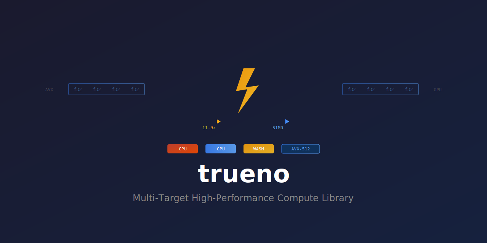

<div align="center">



**Multi-Target High-Performance Compute Library**

[](https://github.com/paiml/trueno/actions)

</div>

---

**trueno** (Spanish: "thunder") provides unified compute primitives across CPU SIMD, GPU, and WebAssembly.

## Features

- **CPU SIMD**: x86 (SSE2/AVX/AVX2/AVX-512), ARM (NEON), WASM (SIMD128)
- **GPU**: Vulkan/Metal/DX12/WebGPU via `wgpu` (matrix multiply only)
- **Auto-dispatch**: Runtime selection of optimal backend
- **Zero unsafe in public API**: Safety via type system

## Installation

```toml
[dependencies]
trueno = "0.8"

# Optional: GPU support for large matrices
trueno = { version = "0.8", features = ["gpu"] }
```

## Quick Start

```rust
use trueno::{Vector, Matrix, SymmetricEigen};

// Vector operations - auto-selects best SIMD backend
let a = Vector::from_slice(&[1.0, 2.0, 3.0, 4.0]);
let b = Vector::from_slice(&[5.0, 6.0, 7.0, 8.0]);

let sum = a.add(&b).unwrap();           // [6.0, 8.0, 10.0, 12.0]
let dot = a.dot(&b).unwrap();           // 70.0
let activated = a.relu().unwrap();      // ReLU activation

// Matrix operations
let m = Matrix::from_vec(2, 2, vec![1.0, 2.0, 3.0, 4.0]).unwrap();
let product = m.matmul(&m).unwrap();    // Matrix multiplication
let transposed = m.transpose();          // Transpose

// Batched matmul for transformers (Q @ K^T pattern)
let batch = 2; let heads = 4; let seq = 8; let dim = 64;
let q: Vec<f32> = vec![0.1; batch * heads * seq * dim];
let kt: Vec<f32> = vec![0.1; batch * heads * dim * seq];
let attn = Matrix::batched_matmul_4d(&q, &kt, batch, heads, seq, dim, seq).unwrap();

// Eigendecomposition (PCA, spectral analysis)
let cov = Matrix::from_vec(2, 2, vec![3.0, 1.0, 1.0, 3.0]).unwrap();
let eigen = SymmetricEigen::new(&cov).unwrap();
let eigenvalues = eigen.eigenvalues();  // [4.0, 2.0]
```

## Performance

| Operation | SIMD Speedup | Notes |
|-----------|--------------|-------|
| Dot product | 6-17x | AVX-512 for compute-bound |
| Matrix multiply | 2-10x | GPU for 500x500+ |
| Reductions (sum, max, min) | 3-12x | AVX-512 optimal |
| Element-wise (add, mul) | 1-2x | Memory-bound |

**GPU Note**: GPU acceleration benefits matrix multiply only. Element-wise operations use CPU SIMD (GPU transfer overhead exceeds compute time).

## Operations

**Vector**: add, sub, mul, div, dot, sum, min, max, argmin, argmax, norm_l1, norm_l2, normalize

**Activations**: relu, leaky_relu, elu, sigmoid, tanh, gelu, swish, softmax, log_softmax

**Matrix**: matmul, batched_matmul, batched_matmul_4d, transpose, matvec, convolve2d

**Statistics**: mean, variance, stddev, covariance, correlation, zscore

**Eigen**: symmetric eigendecomposition (Jacobi algorithm)

## Development

```bash
cargo test                  # Run tests
cargo bench                 # Run benchmarks
make coverage              # Coverage report (requires cargo-llvm-cov)
```

## Ecosystem

Part of the Pragmatic AI Labs stack:
- [trueno-gpu](https://crates.io/crates/trueno-gpu) - Pure Rust PTX generation
- [trueno-db](https://crates.io/crates/trueno-db) - GPU-first analytics database
- [trueno-graph](https://crates.io/crates/trueno-graph) - Graph algorithms
- [trueno-rag](https://crates.io/crates/trueno-rag) - RAG pipeline

## License

MIT - see [LICENSE](LICENSE)
