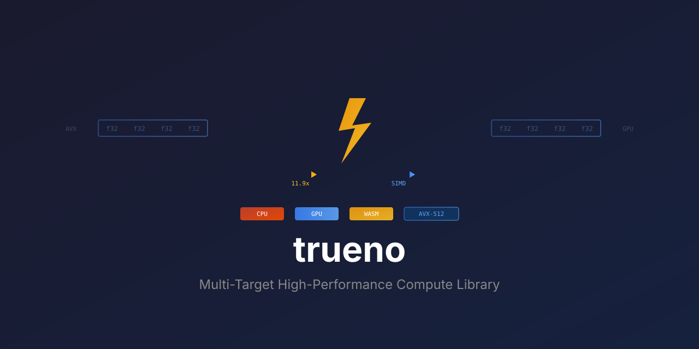

<div align="center">

<p align="center">

</p>

<h1 align="center">trueno</h1>

**Multi-Target High-Performance Compute Library**

[](https://github.com/paiml/trueno/actions)
[](https://github.com/paiml/trueno)
[](https://crates.io/crates/trueno)
[](https://docs.rs/trueno)

</div>

---

**trueno** (Spanish: "thunder") provides unified compute primitives across CPU SIMD, GPU, and WebAssembly.

## Table of Contents

- [Features](#features)
- [Installation](#installation)
- [Quick Start](#quick-start)
- [Performance](#performance)
- [trueno-gpu: Pure Rust CUDA](#trueno-gpu-pure-rust-cuda)
- [Training (WGPU)](#training-wgpu)
- [Operations](#operations)
- [Development](#development)
- [Contributing](#contributing)
- [License](#license)

## Features

- **CPU SIMD**: x86 (SSE2/AVX/AVX2/AVX-512), ARM (NEON), WASM (SIMD128)
- **GPU**: Pure Rust PTX generation via `trueno-gpu` (no nvcc required)
- **Cross-platform GPU**: Vulkan/Metal/DX12/WebGPU via `wgpu`
- **Auto-dispatch**: Runtime selection of optimal backend
- **Zero unsafe in public API**: Safety via type system

## Installation

```toml
[dependencies]
trueno = "0.16"

# Optional: GPU support for large matrices
trueno = { version = "0.16", features = ["gpu"] }

# Optional: Pure Rust CUDA PTX generation
trueno-gpu = "0.4"
```

## Quick Start

```rust
use trueno::{Vector, Matrix, SymmetricEigen};

// Vector operations - auto-selects best SIMD backend
let a = Vector::from_slice(&[1.0, 2.0, 3.0, 4.0]);
let b = Vector::from_slice(&[5.0, 6.0, 7.0, 8.0]);

let sum = a.add(&b).unwrap();           // [6.0, 8.0, 10.0, 12.0]
let dot = a.dot(&b).unwrap();           // 70.0
let activated = a.relu().unwrap();      // ReLU activation

// Matrix operations
let m = Matrix::from_vec(2, 2, vec![1.0, 2.0, 3.0, 4.0]).unwrap();
let product = m.matmul(&m).unwrap();    // Matrix multiplication
let transposed = m.transpose();          // Transpose

// Batched matmul for transformers (Q @ K^T pattern)
let batch = 2; let heads = 4; let seq = 8; let dim = 64;
let q: Vec<f32> = vec![0.1; batch * heads * seq * dim];
let kt: Vec<f32> = vec![0.1; batch * heads * dim * seq];
let attn = Matrix::batched_matmul_4d(&q, &kt, batch, heads, seq, dim, seq).unwrap();

// Eigendecomposition (PCA, spectral analysis)
let cov = Matrix::from_vec(2, 2, vec![3.0, 1.0, 1.0, 3.0]).unwrap();
let eigen = SymmetricEigen::new(&cov).unwrap();
let eigenvalues = eigen.eigenvalues();  // [4.0, 2.0]
```

## Performance

| Operation | SIMD Speedup | Notes |
|-----------|--------------|-------|
| Dot product | 6-17x | AVX-512 for compute-bound |
| Matrix multiply | 2-10x | GPU for 500x500+ |
| Reductions (sum, max, min) | 3-12x | AVX-512 optimal |
| Element-wise (add, mul) | 1-2x | Memory-bound |
| Convolution 2D | 5-8x | AVX2/AVX-512 optimized |

### Benchmark Results (AMD Ryzen 9 7950X)

| Benchmark | Throughput |
|-----------|------------|
| Vector recip (AVX-512, 10K) | 10.0 Gelem/s |
| Vector recip (AVX2, 10K) | 9.7 Gelem/s |
| PTX module emit | 3.1 µs |
| PTX kernel build | 81 ns |
| Launch config | 1.7 ns |

**GPU Note**: GPU acceleration benefits matrix multiply only.
Element-wise operations use CPU SIMD
(GPU transfer overhead exceeds compute time).

## trueno-gpu: Pure Rust CUDA

Generate CUDA PTX kernels without nvcc, LLVM, or external toolchains:

```rust
use trueno_gpu::kernels::{GemmKernel, Kernel, SoftmaxKernel};

// Generate optimized GEMM kernel
let gemm = GemmKernel::tensor_core(1024, 1024, 1024);
let ptx = gemm.emit_ptx();  // Pure Rust PTX generation

// Generate softmax with warp shuffle reduction
let softmax = SoftmaxKernel::new(4096);
let ptx = softmax.emit_ptx();

// Available kernels: GEMM, Softmax, LayerNorm, Attention, Quantize (Q4K/Q5K/Q6K)
```

## Training (WGPU)

trueno now supports **backward pass computation** via WGSL compute shaders, enabling neural network training on AMD, Intel Arc, and Apple Silicon GPUs through Vulkan, Metal, DX12, and WebGPU -- no CUDA required.

**7 backward ops implemented**:
- `silu_backward` -- SiLU activation gradient
- `gemm_backward_a` -- weight gradient (dL/dA)
- `gemm_backward_b` -- input gradient (dL/dB)
- `rmsnorm_backward` -- RMSNorm gradient
- `rope_backward` -- rotary position embedding gradient
- `adamw_step` -- AdamW optimizer parameter update
- `nf4_dequant` -- NF4 4-bit dequantization for QLoRA

All 7 shaders verified on AMD Radeon Pro W5700X via Vulkan with 8 FALSIFY contract tests passing.

```rust
use trueno::backends::gpu::GpuDevice;

let dev = GpuDevice::new()?;

// Backward pass: compute SiLU gradient
dev.silu_backward(&input, &grad_output, &mut grad_input)?;

// Optimizer step: AdamW update
dev.adamw_step(&mut params, &grads, &mut m, &mut v, lr, beta1, beta2, eps, weight_decay, step)?;
```

## Operations

**Vector**: add, sub, mul, div, dot, sum, min, max, argmin,
argmax, norm_l1, norm_l2, normalize, recip, sqrt, abs, clamp

**Activations**: relu, leaky_relu, elu, sigmoid, tanh, gelu, swish, softmax, log_softmax, silu

**Matrix**: matmul, batched_matmul, batched_matmul_4d, transpose, matvec, convolve2d, pooling (max/avg), topk, gather, pad

**Statistics**: mean, variance, stddev, covariance, correlation, zscore

**Eigen**: symmetric eigendecomposition (Jacobi algorithm)

**GPU Kernels**: GEMM (naive/tiled/tensor core), Softmax, LayerNorm, RMSNorm, Attention, GEMV, Quantization

## Development

```bash
cargo test                  # Run tests
cargo bench                 # Run benchmarks
make coverage              # Coverage report (requires cargo-llvm-cov)
cargo run --example backend_detection  # Check available backends
```

## Ecosystem

Part of the Pragmatic AI Labs stack:
- [trueno-gpu](https://crates.io/crates/trueno-gpu) - Pure Rust PTX generation (no nvcc)
[](https://docs.rs/trueno)
- [trueno-db](https://crates.io/crates/trueno-db) - GPU-first analytics database
[](https://docs.rs/trueno)
- [trueno-graph](https://crates.io/crates/trueno-graph) - Graph algorithms
[](https://docs.rs/trueno)
- [trueno-rag](https://crates.io/crates/trueno-rag) - RAG pipeline
[](https://docs.rs/trueno)
- 🤖 [Coursera Hugging Face AI Development Specialization](https://www.coursera.org/specializations/hugging-face-ai-development) - Build Production AI systems with Hugging Face in Pure Rust

## Usage

Add trueno to your `Cargo.toml`:

```toml
[dependencies]
trueno = "0.16"
```

Then use it in your code:

```rust
use trueno::Vector;

let a = Vector::from_slice(&[1.0, 2.0, 3.0]);
let b = Vector::from_slice(&[4.0, 5.0, 6.0]);
let result = a.add(&b).unwrap();
```

The library auto-selects the best SIMD backend at runtime. No configuration needed.

## Contributing

Contributions are welcome. Please ensure:

1. All tests pass: `cargo test --all-features`
2. Coverage stays above 90%: `make coverage`
3. No clippy warnings: `cargo clippy --all-features -- -D warnings`
4. Code is formatted: `cargo fmt`


## MSRV

Minimum Supported Rust Version: **1.89**

## See Also

- [Cookbook](examples/) — 34 runnable examples

## License

MIT - see [LICENSE](LICENSE)
