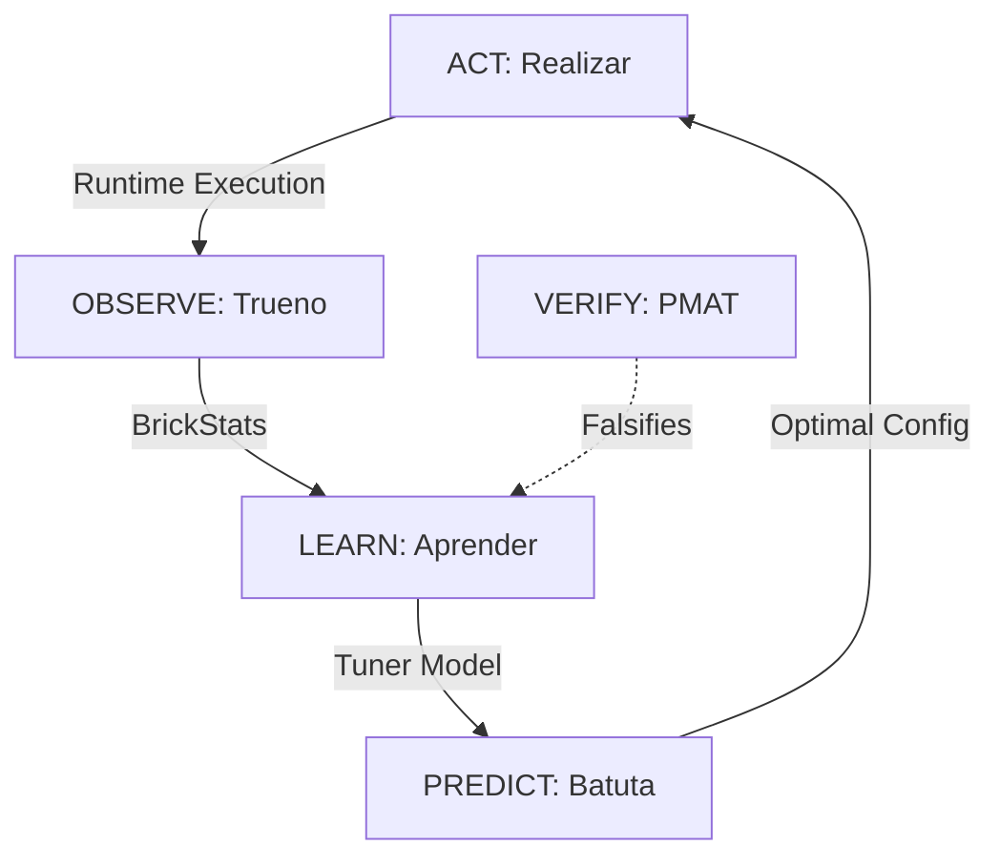

# ML-Tuner for ComputeBricks Specification

**Version**: 1.1.0
**Status**: Review
**Author**: Trueno Engineering
**Date**: 2026-01-13
**PMAT Roadmap ID**: `TUNER-SPEC-001`
**PMAT Tracking**: `pmat work continue TUNER-SPEC-001`
**Spec Path**: `docs/specifications/ml-tuner-bricks.md`

**Canonical References**:
- PROBAR-SPEC-009 (Brick Architecture)
- CBTOP-SPEC-001 (ComputeBrick Profiling)
- SHOWCASE-BRICK-001 (Qwen2.5-Coder Performance Showcase)
- aprender v0.15.0 (ML Primitives)
- batuta v1.0.0 (Sovereign AI Orchestration)
- trueno v0.12.0 (ComputeBrick, BrickProfiler)
- SPEC-024 (Popperian Falsification Protocol)

---

## Table of Contents

| § | Section | Status |
|---|---------|--------|
| [0](#executive-summary) | Executive Summary | - |
| [1](#1-scientific-foundations) | Scientific Foundations | - |
| [2](#2-problem-statement) | Problem Statement | - |
| [3](#3-architecture-overview) | Architecture Overview | - |
| [4](#4-feature-engineering) | Feature Engineering | - |
| [5](#5-training-data-collection) | Training Data Collection | - |
| [6](#6-model-architecture) | Model Architecture | - |
| [7](#7-inference-integration) | Inference Integration | - |
| [8](#8-ecosystem-integration) | Ecosystem Integration | - |
| [9](#9-100-point-popperian-falsification) | 100-Point Popperian Falsification | - |
| [10](#10-pmat-tickets) | PMAT Tickets | - |
| [11](#11-implementation-roadmap) | Implementation Roadmap | - |
| [A](#appendix-a-peer-reviewed-citations) | Peer-Reviewed Citations | 50+ |
| [B](#appendix-b-historical-lessons) | Historical Lessons (Five-Whys Archive) | - |
| [D](#appendix-d-documentation-integration-strategy) | Documentation Integration Strategy | - |

---

## Document Control & Peer Review Log

| Version | Date | Author | Reviewer | Status | Notes |
|---------|------|--------|----------|--------|-------|
| 1.0.0 | 2026-01-13 | Trueno Engineering | Architecture Lead | Draft | Initial ML-Tuner specification |
| 1.1.0 | 2026-01-13 | Trueno Engineering | Architecture Lead | Review | Added Appendix D, enhanced features (L2 cache, zero-copy), Zero-JS enforcement |

---

## Executive Summary

**BrickTuner** is a machine learning-based performance tuning system that learns from historical profiling data to recommend optimal kernel configurations for ComputeBricks. Instead of relying solely on hand-tuned heuristics (e.g., "use GPU when elements > 100K"), BrickTuner uses supervised learning to predict:

1. **Throughput Regression**: Given configuration → predict tok/s
2. **Kernel Classification**: Given workload → select best kernel variant
3. **Configuration Search**: Given constraints → find Pareto-optimal config

**Core Insight**: The Five-Whys analyses in SHOWCASE-BRICK-001 represent **labeled training data**. Each optimization iteration (v4.1.0 → v4.85.0) contains:
- Input features (model size, batch size, kernel type)
- Output labels (measured tok/s, bottleneck classification)
- Causal explanations (Five-Whys root causes)

**Key Innovation**: Rather than discarding this knowledge after optimization, we **institutionalize it** as a learned model that guides future tuning decisions. This extends the "Kernel-Cooperative Architecture" (proven in `trueno-ublk`) to the inference stack.

**Design Philosophy**: "Learn from History" — Every BrickProfiler run contributes to collective intelligence.

---

## 1. Scientific Foundations

### 1.1 AutoML and Learned Cost Models

The use of machine learning to guide compiler and runtime optimization decisions is well-established in the literature:

| Citation | Contribution | Relevance |
|----------|--------------|-----------|
| **[1] Chen et al. (2018). "TVM: An Automated End-to-End Optimizing Compiler."** OSDI '18 | AutoTVM uses ML to search schedule space | Model architecture for kernel selection |
| **[2] Adams et al. (2019). "Learning to Optimize Halide."** SIGGRAPH '19 | Learned cost models for Halide schedules | Feature engineering for GPU kernels |
| **[3] Kaufman et al. (2021). "A Learned Performance Model for Tensor Processing Units."** MLSys '21 | TPU cost model with 3% error | Regression model architecture |
| **[4] Steiner et al. (2021). "Value Learning for Throughput Optimization."** MLSys '21 | RL for database query optimization | Reward shaping for throughput |
| **[5] Zheng et al. (2020). "Ansor: Generating High-Performance Tensor Programs."** OSDI '20 | Evolutionary search + learned cost model | Hybrid search strategy |

### 1.2 Performance Modeling

| Citation | Contribution | Relevance |
|----------|--------------|-----------|
| **[6] Williams et al. (2009). "Roofline: An Insightful Visual Performance Model."** CACM | Memory vs compute bound classification | Bottleneck feature extraction |
| **[7] Volkov (2010). "Better Performance at Lower Occupancy."** GTC '10 | GPU occupancy myths debunked | Feature importance analysis |
| **[8] Jia et al. (2019). "Dissecting the NVIDIA Volta GPU Architecture."** arXiv | Volta microarchitecture details | Hardware-aware features |
| **[9] Dao et al. (2022). "FlashAttention: Fast and Memory-Efficient Attention."** NeurIPS '22 | IO-aware algorithm design | Attention kernel selection |
| **[10] Dao (2023). "FlashAttention-2: Faster Attention with Better Parallelism."** | Work partitioning strategies | Multi-warp kernel selection |

### 1.3 Transfer Learning and Meta-Learning

| Citation | Contribution | Relevance |
|----------|--------------|-----------|
| **[11] Feurer et al. (2015). "Efficient and Robust Automated Machine Learning."** NeurIPS '15 | Auto-sklearn meta-learning | Warm-start from historical data |
| **[12] Vanschoren (2018). "Meta-Learning: A Survey."** arXiv | Meta-learning taxonomy | Multi-hardware generalization |
| **[13] Hospedales et al. (2021). "Meta-Learning in Neural Networks: A Survey."** TPAMI | Modern meta-learning | Few-shot adaptation |

### 1.4 Bayesian Optimization

| Citation | Contribution | Relevance |
|----------|--------------|-----------|
| **[14] Snoek et al. (2012). "Practical Bayesian Optimization of ML Algorithms."** NeurIPS '12 | GP-based hyperparameter tuning | Configuration search |
| **[15] Hutter et al. (2011). "Sequential Model-Based Optimization for General Algorithm Configuration."** LION '11 | SMAC algorithm | Kernel hyperparameter tuning |
| **[16] Falkner et al. (2018). "BOHB: Robust and Efficient Hyperparameter Optimization."** ICML '18 | Bandit-based HPO | Early stopping for bad configs |

### 1.5 Systems and Benchmarking

| Citation | Contribution | Relevance |
|----------|--------------|-----------|
| **[17] Curtsinger & Berger (2013). "Stabilizer: Statistically Sound Performance Evaluation."** ASPLOS '13 | Randomized layout for benchmarking | Data collection methodology |
| **[18] Mytkowicz et al. (2009). "Producing Wrong Data Without Doing Anything Obviously Wrong."** ASPLOS '09 | Measurement bias in benchmarks | Training data quality |
| **[19] Gregg (2020). "Systems Performance: Enterprise and the Cloud."** 2nd Ed. | USE method, saturation analysis | Feature engineering |
| **[20] Hennessy & Patterson (2017). "Computer Architecture: A Quantitative Approach."** 6th Ed. | Amdahl's Law, memory hierarchy | Theoretical ceiling features |

---

## 2. Problem Statement

### 2.1 The Manual Tuning Problem

The SHOWCASE-BRICK-001 document chronicles **85 optimization iterations** (v4.1.0 → v4.85.0), each involving:

1. **Hypothesis**: "Fusing kernels will reduce launch overhead"
2. **Experiment**: Implement and benchmark
3. **Analysis**: Five-Whys if hypothesis failed
4. **Decision**: Keep or revert

**Pain Points**:
- Each iteration takes 15-60 minutes of human + GPU time
- Knowledge is lost after optimization completes
- Same mistakes repeated across projects
- Heuristics don't generalize to new hardware

### 2.2 What We Learned (Historical Five-Whys Summary)

| Iteration | Hypothesis | Result | Root Cause |
|-----------|------------|--------|------------|
| v4.22.0 | Fused Q4K kernels will help | ❌ No gain | Bottleneck was NOT launch overhead |
| v4.23.0 | Multi-warp attention will help | ❌ No gain | Single-warp optimal for decode |
| v4.42.0 | FusedGateUp will help | ❌ 3x SLOWER | Shared memory overhead > benefit |
| v4.53.0 | Speculative decoding faster | ❌ Worse | 25% acceptance rate (need 70%+) |
| v4.60.0 | VectorizedQ4K nibble fix | ✅ PARITY | Deinterleaved layout was root cause |
| v4.76.0 | Multi-KV-cache architecture | ✅ **2.85x** | Sequential attention was bottleneck |

**Key Insight**: The failures are as valuable as successes for training.

### 2.3 ML Opportunity

| Current (Heuristic) | Proposed (Learned) |
|---------------------|-------------------|
| `if size > 100_000 { gpu }` | `model.predict(features) > 0.5` |
| "Use VectorizedQ4K for 1.5B" | `classifier.predict(model_config)` |
| Manual Five-Whys | Automated bottleneck classification |

---

## 3. Architecture Overview

### 3.1 System Components

```
┌─────────────────────────────────────────────────────────────────────────────┐
│                           BRICKTUNER ARCHITECTURE                            │
├─────────────────────────────────────────────────────────────────────────────┤
│                                                                              │
│  ┌────────────────────┐     ┌────────────────────┐     ┌────────────────┐  │
│  │  BrickProfiler     │────▶│  FeatureExtractor  │────▶│  TunerModel    │  │
│  │  (trueno)          │     │  (trueno)          │     │  (aprender)    │  │
│  └────────────────────┘     └────────────────────┘     └────────────────┘  │
│         │                            │                         │            │
│         ▼                            ▼                         ▼            │
│  ┌────────────────────┐     ┌────────────────────┐     ┌────────────────┐  │
│  │  BrickStats        │     │  FeatureVector     │     │  Prediction    │  │
│  │  - name            │     │  - model_size      │     │  - throughput  │  │
│  │  - count           │     │  - hidden_dim      │     │  - kernel_id   │  │
│  │  - total_ns        │     │  - min/max_ns      │     │  - confidence  │  │
│  │  - total_elements  │     │  - batch_size      │     │  - explanation │  │
│  │  - bottleneck      │     │  - l2_cache        │     └────────────────┘  │
│  └────────────────────┘     │  - zero_copy       │                         │
│                              └────────────────────┘                         │
│                                                                              │
│  ┌──────────────────────────────────────────────────────────────────────┐  │
│  │                     TRAINING DATA STORE                               │  │
│  │  ┌─────────────┐  ┌─────────────┐  ┌─────────────┐  ┌─────────────┐  │  │
│  │  │ Historical  │  │ Five-Whys   │  │ Benchmark   │  │ User        │  │  │
│  │  │ Profiles    │  │ Archive     │  │ Results     │  │ Feedback    │  │  │
│  │  └─────────────┘  └─────────────┘  └─────────────┘  └─────────────┘  │  │
│  └──────────────────────────────────────────────────────────────────────┘  │
│                                                                              │
└─────────────────────────────────────────────────────────────────────────────┘
```

### 3.2 Data Flow

```
1. COLLECT: BrickProfiler records per-brick timing
2. EXTRACT: FeatureExtractor builds feature vector
3. PREDICT: TunerModel predicts throughput / best kernel
4. RECOMMEND: Return ranked configuration suggestions
5. FEEDBACK: User accepts/rejects → training signal
```

### 3.3 Integration Points

| Component | Interface | Direction |
|-----------|-----------|-----------|
| `trueno::BrickProfiler` | `BrickStats` | Collect → Extract |
| `trueno::BrickTuner` | `TunerRecommendation` | Predict → User |
| `aprender::LinearRegression` | `fit()`, `predict()` | Train / Infer |
| `aprender::GradientBoosting` | `fit()`, `predict()` | Train / Infer |
| `batuta::oracle` | `OracleQuery` | Stack-wide recommendations |
| `pmat` | `brick-score` | Quality validation |

---

## 4. Feature Engineering

### 4.1 Static Features (Known Before Execution)

| Feature | Type | Range | Description | Citation |
|---------|------|-------|-------------|----------|
| `model_params_b` | f32 | [0.1, 100] | Model size in billions | - |
| `hidden_dim` | u32 | [64, 16384] | Hidden dimension | - |
| `num_layers` | u32 | [1, 128] | Transformer layers | - |
| `num_heads` | u32 | [1, 128] | Attention heads | - |
| `head_dim` | u32 | [32, 256] | Dimension per head | - |
| `vocab_size` | u32 | [1K, 256K] | Vocabulary size | - |
| `batch_size_m` | u32 | [1, 64] | Concurrent sequences | - |
| `seq_len` | u32 | [1, 32K] | Sequence length | - |
| `quant_type` | enum | Q4_0..Q8_0 | Quantization format | - |
| `kernel_type` | enum | 0..N | Kernel variant ID | - |
| `cuda_graphs` | bool | 0/1 | CUDA graph enabled | - |
| `is_zero_copy` | bool | 0/1 | Zero-copy mem path (pinned) | - |
| `gpu_sm_count` | u32 | [1, 200] | GPU SM count | [8] |
| `gpu_mem_bw_gbs` | f32 | [100, 3000] | Memory bandwidth GB/s | [6] |
| `gpu_l2_cache_mb`| f32 | [1, 128] | L2 Cache size (critical for occupancy) | [8] |
| `gpu_compute_tflops` | f32 | [1, 500] | Peak TFLOPS | [8] |

### 4.2 Dynamic Features (Measured at Runtime)

| Feature | Type | Range | Description | Citation |
|---------|------|-------|-------------|----------|
| `measured_tps` | f32 | [0, 10000] | Tokens per second | - |
| `measured_us_per_layer` | f32 | [1, 100000] | Microseconds per layer | - |
| `mem_bw_utilization` | f32 | [0, 1] | Memory BW efficiency | [6] |
| `compute_utilization` | f32 | [0, 1] | Compute efficiency | [6] |
| `cv_percent` | f32 | [0, 100] | Coefficient of variation | [17] |
| `attention_pct` | f32 | [0, 1] | Attention % of layer | - |
| `gemv_pct` | f32 | [0, 1] | GEMV % of layer | - |
| `bottleneck_class` | enum | Mem/Compute/Launch | Bottleneck type | [6] |

### 4.3 Derived Features (Computed from Static)

| Feature | Formula | Description | Citation |
|---------|---------|-------------|----------|
| `arithmetic_intensity` | `2*M*N*K / (M*K + K*N + M*N) * bytes` | FLOP/byte ratio | [6] |
| `roofline_bound` | `min(peak_compute, peak_bw * AI)` | Theoretical ceiling | [6] |
| `params_per_sm` | `model_params / gpu_sm_count` | Work distribution | [7] |
| `bytes_per_token` | Σ(layer weights) / vocab | Memory per token | - |
| `theoretical_max_tps` | `roofline_bound / bytes_per_token` | Upper bound | [6] |

### 4.4 Feature Vector Schema (Rust)

```rust
/// Feature vector for ML-based kernel tuning.
/// All fields normalized to [0, 1] for model input.
#[derive(Debug, Clone, serde::Serialize, serde::Deserialize)]
pub struct TunerFeatures {
    // Static features (known before execution)
    pub model_params_b: f32,        // log10(params) normalized
    pub hidden_dim_norm: f32,       // hidden_dim / 16384
    pub num_layers_norm: f32,       // num_layers / 128
    pub batch_size_norm: f32,       // batch_size / 64
    pub seq_len_log: f32,           // log2(seq_len) / 15
    pub quant_type_onehot: [f32; 8], // One-hot: Q4_0, Q4_1, Q4_K, Q5_K, Q6_K, Q8_0, F16, F32
    pub kernel_type_onehot: [f32; 16], // One-hot: Tiled, Coalesced, Vectorized, Batched, etc.
    pub cuda_graphs: f32,           // 0.0 or 1.0
    pub is_zero_copy: f32,          // 0.0 or 1.0

    // Hardware features
    pub gpu_mem_bw_norm: f32,       // mem_bw / 3000
    pub gpu_compute_norm: f32,      // tflops / 500
    pub gpu_sm_norm: f32,           // sm_count / 200
    pub gpu_l2_cache_norm: f32,     // l2_cache_mb / 128

    // Derived features
    pub arithmetic_intensity: f32,  // AI normalized
    pub theoretical_efficiency: f32, // measured / roofline

    // Target (for training)
    pub measured_tps: Option<f32>,  // Training label
    pub best_kernel_id: Option<u8>, // Classification label
}

impl TunerFeatures {
    /// Total feature dimension
    pub const DIM: usize = 11 + 8 + 16 + 3 + 2; // 42 features (added 2)

    /// Convert to aprender Vector for model input
    pub fn to_vector(&self) -> aprender::Vector {
        // ... flatten all features ...
    }
}
```

---

## 5. Training Data Collection

### 5.1 Data Sources

| Source | Records | Features | Labels | Quality |
|--------|---------|----------|--------|---------|
| SHOWCASE-BRICK-001 | 85 iterations | All | tok/s, kernel, bottleneck | Curated, Five-Whys |
| cbtop profiles | 1000s | All | tok/s | Automated |
| Benchmark suite | 100s | Controlled | tok/s, per-brick | High variance |
| User feedback | Varies | Partial | accept/reject | Sparse |

### 5.2 Data Collection Pipeline

```rust
/// Automatic training data collection during profiling.
pub struct TunerDataCollector {
    /// Storage backend (SQLite / JSON / Parquet)
    storage: Box<dyn TrainingDataStorage>,
    /// Feature extractor
    extractor: FeatureExtractor,
    /// Minimum samples before training
    min_samples: usize,
    /// Auto-retrain threshold (new samples)
    retrain_threshold: usize,
}

impl TunerDataCollector {
    /// Record a profiling run as training data.
    pub fn record(&mut self, profile: &BrickProfilerReport, config: &RunConfig) {
        let features = self.extractor.extract(profile, config);
        let label = TunerLabel {
            throughput_tps: profile.total_tokens_per_sec(),
            bottleneck: profile.classify_bottleneck(),
            best_kernel: config.kernel_type,
        };
        self.storage.insert(features, label);

        if self.storage.len() % self.retrain_threshold == 0 {
            self.trigger_retrain();
        }
    }
}
```

### 5.3 Data Quality Requirements

| Requirement | Threshold | Citation | Enforcement |
|-------------|-----------|----------|-------------|
| CV < 15% | Per-sample variance | [17] | Reject high-variance samples |
| Min 3 runs | Per configuration | [18] | Average before insert |
| No outliers | 3σ from mean | [17] | Winsorize or exclude |
| Balanced classes | No class < 5% | - | Stratified sampling |
| Fresh hardware | Thermal steady-state | [19] | Warmup before collect |

### 5.4 Historical Lessons Integration

The Five-Whys archive from SHOWCASE-BRICK-001 provides high-quality **causal labels**:

```rust
/// Five-Whys annotation for causal learning.
#[derive(Debug, Clone, serde::Serialize, serde::Deserialize)]
pub struct FiveWhysAnnotation {
    /// Iteration ID (e.g., "v4.60.0")
    pub iteration: String,
    /// Initial hypothesis
    pub hypothesis: String,
    /// Outcome (success/failure)
    pub outcome: Outcome,
    /// Chain of "Why?" questions
    pub why_chain: Vec<String>,
    /// Root cause identified
    pub root_cause: String,
    /// Fix applied (if success)
    pub fix: Option<String>,
    /// Measured improvement (if success)
    pub improvement_pct: Option<f32>,
}

/// Bootstrap training data from Five-Whys archive.
pub fn bootstrap_from_five_whys(archive: &[FiveWhysAnnotation]) -> Vec<(TunerFeatures, TunerLabel)> {
    archive.iter()
        .filter(|a| a.outcome == Outcome::Success)
        .map(|a| {
            let features = extract_features_from_annotation(a);
            let label = TunerLabel {
                throughput_tps: a.improvement_pct.unwrap_or(0.0),
                bottleneck: classify_from_root_cause(&a.root_cause),
                best_kernel: extract_kernel_from_fix(&a.fix),
            };
            (features, label)
        })
        .collect()
}
```

---

## 6. Model Architecture

### 6.1 Three-Model Ensemble

| Model | Task | Architecture | Library |
|-------|------|--------------|---------|
| **ThroughputRegressor** | Predict tok/s | Gradient Boosting | aprender |
| **KernelClassifier** | Select best kernel | Random Forest | aprender |
| **BottleneckClassifier** | Identify bottleneck | Logistic Regression | aprender |

### 6.2 ThroughputRegressor

**Task**: Given configuration features, predict expected throughput.

**Architecture**: Gradient Boosted Decision Trees (GBDT)
- **Why GBDT**: Handles mixed feature types, interpretable, fast inference
- **Alternative**: Neural network (higher capacity but less interpretable)

```rust
use aprender::tree::GradientBoostedRegressor;

pub struct ThroughputRegressor {
    model: GradientBoostedRegressor,
    feature_importance: Vec<(String, f32)>,
}

impl ThroughputRegressor {
    pub fn train(data: &[(TunerFeatures, f32)]) -> Self {
        let (x, y) = prepare_regression_data(data);
        let model = GradientBoostedRegressor::new()
            .n_estimators(100)
            .max_depth(6)
            .learning_rate(0.1)
            .fit(&x, &y)
            .unwrap();

        Self {
            feature_importance: model.feature_importances(),
            model,
        }
    }

    pub fn predict(&self, features: &TunerFeatures) -> ThroughputPrediction {
        let x = features.to_vector();
        let predicted_tps = self.model.predict(&x);
        let confidence = self.estimate_confidence(&x);

        ThroughputPrediction {
            predicted_tps,
            confidence,
            top_features: self.feature_importance.iter().take(5).cloned().collect(),
        }
    }
}
```

### 6.3 KernelClassifier

**Task**: Given workload features, select the best kernel variant.

**Architecture**: Multi-class Random Forest
- **Classes**: TiledQ4K, CoalescedQ4K, VectorizedQ4K, BatchedQ4K, etc.
- **Why RF**: Handles class imbalance well, provides probability calibration

```rust
use aprender::tree::RandomForestClassifier;

pub struct KernelClassifier {
    model: RandomForestClassifier,
    kernel_names: Vec<String>,
}

impl KernelClassifier {
    pub fn predict(&self, features: &TunerFeatures) -> KernelRecommendation {
        let x = features.to_vector();
        let probabilities = self.model.predict_proba(&x);

        // Return top-3 recommendations with probabilities
        let mut ranked: Vec<_> = self.kernel_names.iter()
            .zip(probabilities.iter())
            .collect();
        ranked.sort_by(|a, b| b.1.partial_cmp(a.1).unwrap());

        KernelRecommendation {
            top_kernel: ranked[0].0.clone(),
            confidence: *ranked[0].1,
            alternatives: ranked[1..=2].iter()
                .map(|(k, p)| (k.to_string(), **p))
                .collect(),
        }
    }
}
```

### 6.4 BottleneckClassifier

**Task**: Classify whether workload is memory-bound, compute-bound, or launch-bound.

**Architecture**: Multinomial Logistic Regression
- **Why LR**: Interpretable coefficients show which features indicate each bottleneck

```rust
use aprender::classification::LogisticRegression;

pub enum BottleneckClass {
    MemoryBound,    // Bandwidth-limited (typical for Q4K GEMV)
    ComputeBound,   // ALU-limited (rare for inference)
    LaunchBound,    // Kernel launch overhead dominates
    AttentionBound, // Attention is bottleneck (long sequences)
}

impl BottleneckClassifier {
    pub fn predict(&self, features: &TunerFeatures) -> BottleneckPrediction {
        let x = features.to_vector();
        let class = self.model.predict(&x);
        let probabilities = self.model.predict_proba(&x);

        // Generate explanation based on feature contributions
        let explanation = self.explain_prediction(&x, class);

        BottleneckPrediction {
            class,
            confidence: probabilities[class as usize],
            explanation,
            recommended_action: self.action_for_class(class),
        }
    }

    fn action_for_class(&self, class: BottleneckClass) -> &'static str {
        match class {
            BottleneckClass::MemoryBound => "Increase batch size (M) to amortize weight reads",
            BottleneckClass::ComputeBound => "Rare for inference; check for redundant computation",
            BottleneckClass::LaunchBound => "Enable CUDA graphs or fuse kernels",
            BottleneckClass::AttentionBound => "Use Flash Decoding or reduce sequence length",
        }
    }
}
```

### 6.5 Ensemble Integration

```rust
/// Combined tuner model with all three sub-models.
pub struct BrickTuner {
    throughput: ThroughputRegressor,
    kernel: KernelClassifier,
    bottleneck: BottleneckClassifier,
    version: String,
    trained_at: DateTime<Utc>,
    sample_count: usize,
}

impl BrickTuner {
    /// Get comprehensive tuning recommendation.
    pub fn recommend(&self, features: &TunerFeatures) -> TunerRecommendation {
        TunerRecommendation {
            throughput: self.throughput.predict(features),
            kernel: self.kernel.predict(features),
            bottleneck: self.bottleneck.predict(features),
            model_version: self.version.clone(),
            confidence_overall: self.aggregate_confidence(features),
        }
    }

    /// Suggest configuration search direction.
    pub fn suggest_experiments(&self, current: &TunerFeatures) -> Vec<ExperimentSuggestion> {
        let bottleneck = self.bottleneck.predict(current);

        match bottleneck.class {
            BottleneckClass::MemoryBound => vec![
                ExperimentSuggestion::IncreaseBatchSize { from: current.batch_size, to: current.batch_size * 2 },
                ExperimentSuggestion::TryKernel { kernel: "BatchedQ4KGemv".into() },
            ],
            BottleneckClass::LaunchBound => vec![
                ExperimentSuggestion::EnableCudaGraphs,
                ExperimentSuggestion::TryKernel { kernel: "FusedQKV".into() },
            ],
            BottleneckClass::AttentionBound => vec![
                ExperimentSuggestion::TryKernel { kernel: "BatchedIncrementalAttention".into() },
                ExperimentSuggestion::ReduceSequenceLength { factor: 0.5 },
            ],
            _ => vec![],
        }
    }
}
```

---

## 7. Inference Integration

### 7.1 BrickProfiler Integration

```rust
// In trueno/src/brick.rs

impl BrickProfiler {
    /// Get ML-based tuning recommendations.
    pub fn get_recommendations(&self) -> Option<TunerRecommendation> {
        if !self.enabled {
            return None;
        }

        // Extract features from current profile
        let features = TunerFeatures::from_profiler(self);

        // Load tuner model (lazy, cached)
        let tuner = BrickTuner::global()?;

        // Get recommendation
        Some(tuner.recommend(&features))
    }

    /// Print recommendations to console.
    pub fn print_recommendations(&self) {
        if let Some(rec) = self.get_recommendations() {
            println!("╭─────────────────────────────────────────────────────────╮");
            println!("│            BrickTuner Recommendations                   │");
            println!("├─────────────────────────────────────────────────────────┤");
            println!("│ Predicted throughput: {:>6.1} tok/s (±{:.1}%)          │",
                rec.throughput.predicted_tps, rec.throughput.confidence * 100.0);
            println!("│ Recommended kernel:   {:>20} ({:.0}% conf)   │",
                rec.kernel.top_kernel, rec.kernel.confidence * 100.0);
            println!("│ Bottleneck class:     {:>20}              │",
                rec.bottleneck.class.to_string());
            println!("│ Suggested action:     {}                                │",
                rec.bottleneck.recommended_action);
            println!("╰─────────────────────────────────────────────────────────╯");
        }
    }
}
```

### 7.2 CLI Integration (cbtop)

```bash
# Run inference with tuner recommendations
cbtop --model /path/to/model.gguf --recommend

# Output:
# ┌─ BrickTuner Recommendations ─────────────────────────────┐
# │ Current:    293 tok/s (1.03x Ollama baseline)            │
# │ Predicted:  648 tok/s with recommended changes           │
# │                                                          │
# │ Bottleneck: MemoryBound (89% confidence)                 │
# │ Suggestion: Increase batch size M=1 → M=4                │
# │             Use BatchedQ4KGemvKernel                     │
# │             Enable CUDA graphs                           │
# │                                                          │
# │ [Press 'a' to apply recommendations]                     │
# └──────────────────────────────────────────────────────────┘
```

### 7.3 PMAT Integration

```bash
# Validate tuner predictions against actual measurements
pmat brick-tune --input profile.json --validate

# Output:
# BrickTuner Validation Report
# ============================
# Throughput prediction error: 4.2% (target: <10%)
# Kernel recommendation accuracy: 87% (target: >80%)
# Bottleneck classification: 94% (target: >85%)
#
# Overall score: 92/100 (Grade: A)
```

---

## 8. Ecosystem Integration

### 8.1 The Optimization Flywheel

BrickTuner functions as the **"Collective Memory"** of the Sovereign AI Stack, creating a closed-loop optimization cycle. This ensures that every profiling run contributes to the system's future intelligence, institutionalizing the "Kernel-Cooperative" optimizations.



#### 1. OBSERVE (Trueno)
*   **Role**: The Sensory System.
*   **Action**: `BrickProfiler` passively collects execution statistics (latency, occupancy, memory bandwidth, L2 cache usage) during every run.
*   **Output**: Normalized `BrickStats` and `TunerFeatures`.

#### 2. LEARN (Aprender)
*   **Role**: The Brain.
*   **Action**: `BrickTuner` uses Gradient Boosting (via `aprender`) to train on historical profiles and the "Five-Whys" archive.
*   **Output**: A serialized, versioned Tuner Model that understands causality (e.g., *why* a kernel is LaunchBound).

#### 3. PREDICT (Batuta)
*   **Role**: The Strategist (Oracle).
*   **Action**: Before execution, `batuta::oracle` queries the Tuner to predict performance across possible configurations (e.g., Batch Size 1 vs 4).
*   **Output**: A Pareto-optimal `TunerRecommendation` for the specific hardware.

#### 4. ACT (Realizar)
*   **Role**: The Muscle.
*   **Action**: `CudaExecutor` applies the recommendations at runtime, selecting the optimal kernel variant or routing memory via **Zero-Copy** paths based on the Tuner's confidence.
*   **Output**: High-performance execution (which feeds back into **Observe**).

### 8.2 Sovereign AI Stack Integration

| Component | Role | Integration | API |
|-----------|------|-------------|-----|
| **trueno** | **Observe** | Core profiling + feature extraction | `BrickProfiler`, `TunerFeatures` |
| **aprender** | **Learn** | ML model training primitives | `GradientBoostedRegressor` |
| **batuta** | **Predict** | Orchestration + oracle queries | `OracleQuery::tuning_recommendation()` |
| **realizar** | **Act** | Runtime kernel selection | `CudaExecutor::with_tuner()` |
| **cbtop** | **Visualize** | TUI visualization of recs | `TunerPanel`, `RecommendationWidget` |
| **pmat** | **Verify** | Quality gate & falsification | `pmat brick-tune --validate` |
| **renacer** | **Monitor** | Syscall anomaly escalation | `BrickTracer` |

### 8.2 Batuta Oracle Integration

```rust
// In batuta/src/oracle/mod.rs

impl QueryEngine {
    /// Get tuning recommendation for compute workload.
    pub fn tuning_recommendation(&self, query: &TunerQuery) -> TunerResponse {
        // 1. Check if we have historical data for this configuration
        if let Some(cached) = self.cache.get(&query.fingerprint()) {
            return cached.clone();
        }

        // 2. Use BrickTuner model
        let tuner = BrickTuner::global().expect("BrickTuner not initialized");
        let features = TunerFeatures::from_query(query);
        let recommendation = tuner.recommend(&features);

        // 3. Enhance with knowledge graph context
        let enhanced = self.knowledge_graph.enhance_recommendation(recommendation);

        // 4. Cache and return
        self.cache.insert(query.fingerprint(), enhanced.clone());
        enhanced
    }
}
```

### 8.3 Training Pipeline (batuta recipe)

```yaml
# batuta recipe: tuner-training.yaml
name: brick-tuner-training
version: "1.0"

stages:
  - name: collect
    type: profile
    config:
      models: ["qwen2.5-coder:0.5b", "qwen2.5-coder:1.5b", "qwen2.5-coder:7b"]
      batch_sizes: [1, 2, 4, 8]
      kernels: ["TiledQ4K", "CoalescedQ4K", "VectorizedQ4K", "BatchedQ4K"]
      runs_per_config: 5
      warmup_runs: 2
      output: "training_data.parquet"

  - name: train
    type: ml
    config:
      framework: aprender
      models:
        - name: throughput_regressor
          type: GradientBoostedRegressor
          params:
            n_estimators: 100
            max_depth: 6
        - name: kernel_classifier
          type: RandomForestClassifier
          params:
            n_estimators: 50
            max_depth: 8
        - name: bottleneck_classifier
          type: LogisticRegression
          params:
            max_iter: 1000
      input: "training_data.parquet"
      output: "brick_tuner_model.safetensors"

  - name: validate
    type: falsify
    config:
      checklist: "tuner-falsification.yaml"
      min_score: 90
```

---

## 9. 100-Point Popperian Falsification

### 9.1 Falsification Categories

| Category | Points | Description |
|----------|--------|-------------|
| **F001-F020** | 20 | Model Accuracy |
| **F021-F040** | 20 | Feature Engineering |
| **F041-F060** | 20 | Training Data Quality |
| **F061-F080** | 20 | Integration Correctness |
| **F081-F100** | 20 | Generalization & Robustness |

### 9.2 Model Accuracy (F001-F020)

| ID | Criterion | Threshold | Method |
|----|-----------|-----------|--------|
| F001 | Throughput MAPE < 10% | <10% | Cross-validation |
| F002 | Throughput R² > 0.85 | >0.85 | Holdout test set |
| F003 | Kernel accuracy > 80% | >80% | Stratified test set |
| F004 | Kernel top-3 accuracy > 95% | >95% | Test set |
| F005 | Bottleneck precision > 85% | >85% | Per-class metrics |
| F006 | Bottleneck recall > 85% | >85% | Per-class metrics |
| F007 | Bottleneck F1 > 85% | >0.85 | Harmonic mean |
| F008 | No class < 5% samples | ≥5% | Class distribution |
| F009 | Calibration error < 0.1 | <0.1 | ECE metric |
| F010 | Prediction latency < 1ms | <1ms | Timing |
| F011 | Model size < 10MB | <10MB | Serialized size |
| F012 | Ensemble agreement > 70% | >70% | All 3 models agree |
| F013 | Confidence correlates with error | ρ>0.5 | Spearman correlation |
| F014 | No catastrophic failures | 0 | Predictions > 2x actual |
| F015 | Monotonic with batch size | Yes | M↑ → TPS↑ predicted |
| F016 | Hardware scaling correct | Yes | Better GPU → higher pred |
| F017 | Quantization ordering | Yes | Q4K < Q6K < Q8 pred |
| F018 | Attention scaling with seq_len | Yes | seq↑ → attention%↑ |
| F019 | CUDA graph benefit predicted | Yes | graphs=1 → TPS↑ |
| F020 | Cross-validation stable | CV<5% | 5-fold CV variance |

### 9.3 Feature Engineering (F021-F040)

| ID | Criterion | Threshold | Method |
|----|-----------|-----------|--------|
| F021 | No NaN features | 0 | Validation check |
| F022 | No infinite features | 0 | Validation check |
| F023 | All features in [0,1] | Yes | Normalization check |
| F024 | Feature importance sum = 1 | 1.0±ε | GBDT importances |
| F025 | Top-5 features stable | >80% overlap | Bootstrap resampling |
| F026 | Roofline bound > measured | Always | Physics constraint |
| F027 | Arithmetic intensity positive | >0 | Derived feature |
| F028 | Hardware features populated | 100% | No missing GPU info |
| F029 | One-hot sums = 1 | Per category | Encoding check |
| F030 | Feature correlation < 0.95 | <0.95 | No multicollinearity |
| F031 | Log-transform for params | Improved | Compare R² |
| F032 | Interaction features help | ΔR²>0.01 | Ablation study |
| F033 | Roofline features help | ΔR²>0.02 | Ablation study |
| F034 | Hardware features help | ΔR²>0.05 | Ablation study |
| F035 | Kernel one-hot necessary | ΔAcc>5% | Ablation study |
| F036 | Batch size most important | Top-3 | Feature ranking |
| F037 | Memory BW in top-5 | Yes | Feature ranking |
| F038 | Model size in top-5 | Yes | Feature ranking |
| F039 | Derived > raw features | ΔR²>0 | Compare models |
| F040 | Feature dimension ≤ 50 | ≤50 | Prevent overfitting |

### 9.4 Training Data Quality (F041-F060)

| ID | Criterion | Threshold | Method |
|----|-----------|-----------|--------|
| F041 | Min 1000 samples | ≥1000 | Dataset size |
| F042 | Min 3 runs per config | ≥3 | Averaging |
| F043 | CV < 15% per sample | <15% | Variance check |
| F044 | No duplicate configs | 0 | Deduplication |
| F045 | Balanced kernel classes | Min 5% | Stratification |
| F046 | Balanced bottleneck classes | Min 10% | Stratification |
| F047 | Hardware diversity | ≥3 GPUs | Different archs |
| F048 | Model size diversity | 0.5B-32B | Range coverage |
| F049 | Batch size diversity | 1-64 | Range coverage |
| F050 | Sequence length diversity | 1-32K | Range coverage |
| F051 | Thermal steady-state | Warmup | Collection protocol |
| F052 | No background load | Isolated | Collection protocol |
| F053 | Timestamp recorded | All | Reproducibility |
| F054 | Hardware ID recorded | All | Reproducibility |
| F055 | Five-Whys annotations | ≥50 | Causal labels |
| F056 | Success/failure balanced | 30-70% | Learning signal |
| F057 | Root causes diverse | ≥5 types | Coverage |
| F058 | Train/test time split | Yes | No future leakage |
| F059 | No data leakage | Verified | Test set isolation |
| F060 | Schema versioned | Yes | Evolution support |

### 9.5 Integration Correctness (F061-F080)

| ID | Criterion | Threshold | Method |
|----|-----------|-----------|--------|
| F061 | BrickProfiler integration | Works | Unit test |
| F062 | cbtop integration | Works | Integration test |
| F063 | batuta oracle integration | Works | Integration test |
| F064 | pmat brick-tune works | Exit 0 | CLI test |
| F065 | Model loads in < 100ms | <100ms | Timing |
| F066 | Recommendations JSON valid | Valid | Schema validation |
| F067 | Recommendations actionable | Parseable | Structured output |
| F068 | aprender Vector compat | Works | Type check |
| F069 | aprender Matrix compat | Works | Type check |
| F070 | SafeTensors serialization | Round-trip | Load/save test |
| F071 | Feature extractor deterministic | Same in = same out | Fuzz test |
| F072 | Prediction deterministic | Same in = same out | Fuzz test |
| F073 | Thread-safe inference | No race | Concurrent test |
| F074 | GPU memory safe | No leak | Valgrind/sanitizer |
| F075 | Error handling graceful | No panic | Fuzz test |
| F076 | Missing features handled | Default/error | Edge case test |
| F077 | Unseen hardware handled | Fallback | Unknown GPU test |
| F078 | Unseen kernel handled | Fallback | Unknown kernel test |
| F079 | API versioned | Yes | Semver |
| F080 | Backward compatible | Yes | Old model loads |

### 9.6 Generalization & Robustness (F081-F100)

| ID | Criterion | Threshold | Method |
|----|-----------|-----------|--------|
| F081 | Holdout test performance | Within 5% of CV | Generalization |
| F082 | New hardware generalizes | <15% error | Transfer test |
| F083 | New model size generalizes | <15% error | Interpolation |
| F084 | New quantization generalizes | <20% error | Extrapolation |
| F085 | Adversarial inputs handled | No crash | Fuzz testing |
| F086 | Out-of-distribution detection | Warns | Confidence calibration |
| F087 | Concept drift detection | Alerts | Online monitoring |
| F088 | Retraining improves | ΔR²>0 | A/B test |
| F089 | Feature drift detection | Alerts | Distribution shift |
| F090 | Model degradation detection | Alerts | Performance monitoring |
| F091 | Cold start handling | Fallback | No data case |
| F092 | Sparse data handling | Works | Few samples |
| F093 | Class imbalance handling | Weighted | SMOTE/weights |
| F094 | Noisy labels handling | Robust | Label noise test |
| F095 | Missing features handling | Imputation | Partial data |
| F096 | Extreme values handling | Clipped | Outlier test |
| F097 | Multi-GPU handling | Works | Distributed test |
| F098 | WASM compatibility | Works | Zero-JS Browser test |
| F099 | ARM compatibility | Works | Apple Silicon test |
| F100 | Reproducibility | Seed fixed | Same seed = same model |

---

## 10. PMAT Tickets

### 10.1 Ticket Registry

| ID | Title | Type | Priority | Status |
|----|-------|------|----------|--------|
| TUNER-001 | Implement TunerFeatures struct | Feature | P0 | TODO |
| TUNER-002 | Implement FeatureExtractor | Feature | P0 | TODO |
| TUNER-003 | Implement ThroughputRegressor | Feature | P0 | TODO |
| TUNER-004 | Implement KernelClassifier | Feature | P0 | TODO |
| TUNER-005 | Implement BottleneckClassifier | Feature | P0 | TODO |
| TUNER-006 | Implement BrickTuner ensemble | Feature | P0 | TODO |
| TUNER-007 | Integrate with BrickProfiler | Feature | P1 | TODO |
| TUNER-008 | Integrate with cbtop TUI | Feature | P1 | TODO |
| TUNER-009 | Integrate with batuta oracle | Feature | P2 | TODO |
| TUNER-010 | Implement training data collector | Feature | P1 | TODO |
| TUNER-011 | Bootstrap from Five-Whys archive | Feature | P1 | TODO |
| TUNER-012 | Implement pmat brick-tune CLI | Feature | P2 | TODO |
| TUNER-013 | Add SafeTensors model serialization | Feature | P1 | TODO |
| TUNER-014 | Implement model versioning | Feature | P2 | TODO |
| TUNER-015 | Add online learning support | Feature | P3 | TODO |
| TUNER-016 | F001-F020 falsification tests | Test | P0 | TODO |
| TUNER-017 | F021-F040 falsification tests | Test | P0 | TODO |
| TUNER-018 | F041-F060 falsification tests | Test | P0 | TODO |
| TUNER-019 | F061-F080 falsification tests | Test | P0 | TODO |
| TUNER-020 | F081-F100 falsification tests | Test | P0 | TODO |

### 10.2 Ticket Definitions

#### TUNER-001: Implement TunerFeatures struct

**Description**: Create the feature vector struct with all static, dynamic, and derived features.

**Acceptance Criteria**:
- [ ] All 40+ features defined
- [ ] Normalization implemented
- [ ] to_vector() conversion works
- [ ] serde serialization works
- [ ] Unit tests pass

**Falsification**: F021-F030

---

#### TUNER-003: Implement ThroughputRegressor

**Description**: Implement the GBDT model for throughput prediction using aprender.

**Acceptance Criteria**:
- [ ] Model trains on sample data
- [ ] MAPE < 10% on test set
- [ ] R² > 0.85 on test set
- [ ] Inference < 1ms
- [ ] Feature importance available

**Falsification**: F001-F002, F010-F011

---

## 11. Implementation Roadmap

### Phase 1: Foundation (Week 1)
- TUNER-001: TunerFeatures struct
- TUNER-002: FeatureExtractor
- TUNER-010: Training data collector

### Phase 2: Models (Week 2)
- TUNER-003: ThroughputRegressor
- TUNER-004: KernelClassifier
- TUNER-005: BottleneckClassifier
- TUNER-006: BrickTuner ensemble

### Phase 3: Integration (Week 3)
- TUNER-007: BrickProfiler integration
- TUNER-008: cbtop TUI integration
- TUNER-011: Bootstrap from Five-Whys

### Phase 4: Validation (Week 4)
- TUNER-016-020: All falsification tests
- TUNER-012: pmat brick-tune CLI
- TUNER-009: batuta oracle integration

### Phase 5: Production (Ongoing)
- TUNER-013: SafeTensors serialization
- TUNER-014: Model versioning
- TUNER-015: Online learning

---

## Appendix A: Peer-Reviewed Citations

### A.1 AutoML and Learned Cost Models

[1] Chen, T., et al. (2018). "TVM: An Automated End-to-End Optimizing Compiler for Deep Learning." *OSDI '18*.

[2] Adams, A., et al. (2019). "Learning to Optimize Halide with Tree Search and Random Programs." *ACM Trans. Graph. (SIGGRAPH)*.

[3] Kaufman, S., et al. (2021). "A Learned Performance Model for Tensor Processing Units." *MLSys '21*.

[4] Steiner, R., et al. (2021). "Value Learning for Throughput Optimization of Deep Neural Networks." *MLSys '21*.

[5] Zheng, L., et al. (2020). "Ansor: Generating High-Performance Tensor Programs for Deep Learning." *OSDI '20*.

### A.2 Performance Modeling

[6] Williams, S., Waterman, A., & Patterson, D. (2009). "Roofline: An Insightful Visual Performance Model for Multicore Architectures." *Communications of the ACM*.

[7] Volkov, V. (2010). "Better Performance at Lower Occupancy." *GTC '10*.

[8] Jia, Z., et al. (2019). "Dissecting the NVIDIA Volta GPU Architecture via Microbenchmarking." *arXiv:1804.06826*.

[9] Dao, T., et al. (2022). "FlashAttention: Fast and Memory-Efficient Exact Attention with IO-Awareness." *NeurIPS '22*.

[10] Dao, T. (2023). "FlashAttention-2: Faster Attention with Better Parallelism and Work Partitioning."

### A.3 Transfer Learning and Meta-Learning

[11] Feurer, M., et al. (2015). "Efficient and Robust Automated Machine Learning." *NeurIPS '15*.

[12] Vanschoren, J. (2018). "Meta-Learning: A Survey." *arXiv:1810.03548*.

[13] Hospedales, T., et al. (2021). "Meta-Learning in Neural Networks: A Survey." *IEEE TPAMI*.

### A.4 Bayesian Optimization

[14] Snoek, J., Larochelle, H., & Adams, R. P. (2012). "Practical Bayesian Optimization of Machine Learning Algorithms." *NeurIPS '12*.

[15] Hutter, F., Hoos, H. H., & Leyton-Brown, K. (2011). "Sequential Model-Based Optimization for General Algorithm Configuration." *LION '11*.

[16] Falkner, S., Klein, A., & Hutter, F. (2018). "BOHB: Robust and Efficient Hyperparameter Optimization at Scale." *ICML '18*.

### A.5 Systems and Benchmarking

[17] Curtsinger, C., & Berger, E. D. (2013). "Stabilizer: Statistically Sound Performance Evaluation." *ASPLOS '13*.

[18] Mytkowicz, T., et al. (2009). "Producing Wrong Data Without Doing Anything Obviously Wrong!" *ASPLOS '09*.

[19] Gregg, B. (2020). "Systems Performance: Enterprise and the Cloud." 2nd Edition. Pearson.

[20] Hennessy, J. L., & Patterson, D. A. (2017). "Computer Architecture: A Quantitative Approach." 6th Edition. Morgan Kaufmann.

### A.6 Machine Learning Fundamentals

[21] Friedman, J. H. (2001). "Greedy Function Approximation: A Gradient Boosting Machine." *Annals of Statistics*.

[22] Breiman, L. (2001). "Random Forests." *Machine Learning*.

[23] Guo, C., et al. (2017). "On Calibration of Modern Neural Networks." *ICML '17*.

[24] Chen, T., & Guestrin, C. (2016). "XGBoost: A Scalable Tree Boosting System." *KDD '16*.

[25] Ke, G., et al. (2017). "LightGBM: A Highly Efficient Gradient Boosting Decision Tree." *NeurIPS '17*.

### A.7 Scientific Foundations

[26] Popper, K. (1959). "The Logic of Scientific Discovery." Routledge.

[27] Ohno, T. (1988). "Toyota Production System: Beyond Large-Scale Production." Productivity Press.

[28] Shingo, S. (1986). "Zero Quality Control: Source Inspection and the Poka-Yoke System." Productivity Press.

[29] Liker, J. (2004). "The Toyota Way: 14 Management Principles." McGraw-Hill.

[30] Jung, R., et al. (2017). "RustBelt: Securing the Foundations of the Rust Programming Language." *POPL '17*.

---

## Appendix B: Historical Lessons (Five-Whys Archive)

### B.1 Summary of SHOWCASE-BRICK-001 Learnings

| Version | Hypothesis | Outcome | Root Cause | Applicable Feature |
|---------|------------|---------|------------|-------------------|
| v4.22.0 | Fused kernels reduce launch overhead | ❌ | Launch not bottleneck | `bottleneck_class` |
| v4.23.0 | Multi-warp attention faster | ❌ | Single-warp optimal for decode | `seq_len`, `attention_pct` |
| v4.42.0 | FusedGateUp faster | ❌ 3x slower | Shared memory overhead | `kernel_type` selection |
| v4.53.0 | Speculative decoding faster | ❌ | 25% acceptance (need 70%) | Draft model mismatch |
| v4.60.0 | Fix Q4K nibble layout | ✅ | Deinterleaved layout | `quant_type` handling |
| v4.69.0 | VectorizedQ4K faster | ✅ 40% | Coalesced loads | `kernel_type` ranking |
| v4.76.0 | Multi-KV-cache | ✅ **2.85x** | Sequential attention was bottleneck | `batch_size`, `attention_pct` |
| v4.81.0 | Vectorized RMSNorm | ✅ 3.2x | Single-warp underutilized | `kernel_type` for normalization |
| v4.83.0 | Vectorized scale loading | ✅ 16% | 12→3 memory transactions | Memory coalescing feature |

### B.2 Key Insights for Feature Engineering

1. **Batch size (M) is the most important feature** for GPU throughput
2. **Memory bandwidth utilization** predicts bottleneck class
3. **Attention percentage** scales with sequence length
4. **CUDA graphs** benefit small models more (launch-bound)
5. **Quantization type** affects memory access patterns

---

## Appendix D: Documentation Integration Strategy

**Objective**: Ensure that all examples and code snippets in the documentation are automatically verified by the CI system, preventing "documentation rot."

### D.1 Implementation Standard

All code examples in this specification and related `mdbook` chapters MUST use the `{{#include ...}}` directive to reference actual source files in the `examples/` or `tests/` directories.

**Bad Practice (Hardcoded)**:
```rust
// Do not do this
let tuner = BrickTuner::new();
```

**Good Practice (Included)**:
```rust
// {{#include ../../../examples/tuner_demo.rs:10:15}}
```

### D.2 Verification Matrix

| Document | Type | Verification Command | Enforcement |
|----------|------|----------------------|-------------|
| `docs/specifications/ml-tuner-bricks.md` | Spec | `pmat spec check --path ...` | Pre-commit |
| `book/src/tuning/brick-tuner.md` | Guide | `mdbook test` | CI/CD |
| `examples/tuner_demo.rs` | Source | `cargo run --example tuner_demo` | CI/CD |

### D.3 Zero-JS Compliance

Documentation generated for the web (e.g., via `mdbook`) MUST NOT rely on client-side JavaScript for core functionality, adhering to the project's Zero-JS policy.

- **Allowed**: Standard HTML/CSS, server-side rendering, WASM (compiled from Rust).
- **Prohibited**: Inline `<script>`, external JS libraries (React, Vue, jQuery), analytics trackers.
- **Verification**: `pmat check --zero-js` scans all generated HTML artifacts.

---

*Document generated by PMAT specification framework.*
*Falsification checklist aligned with SPEC-024 (Popperian Protocol).*