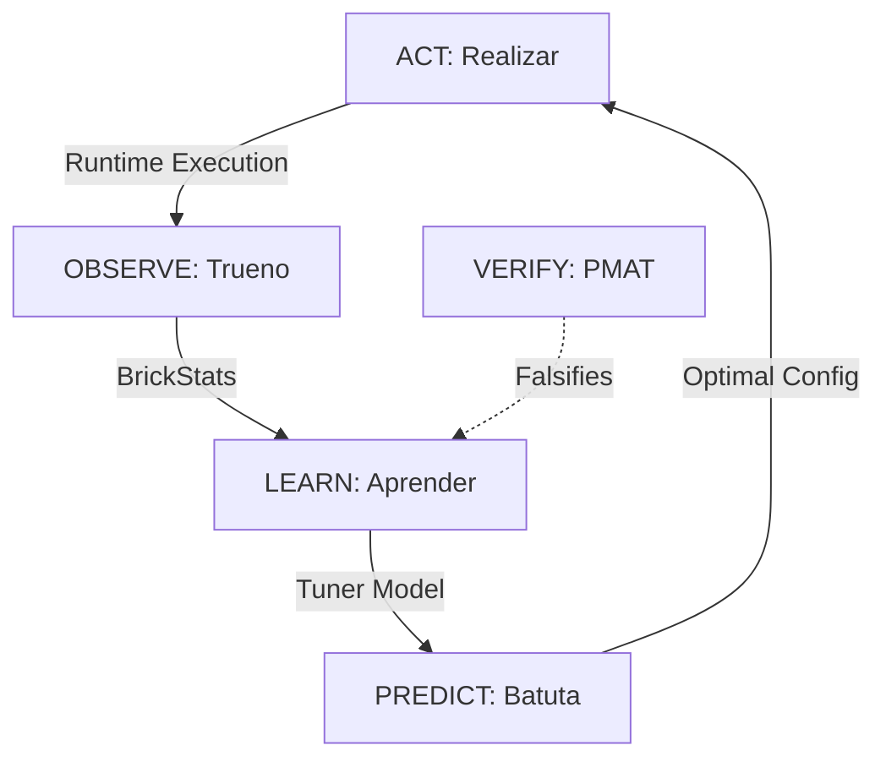

# ML-Tuner for ComputeBricks Specification

**Version**: 1.2.0
**Status**: Review
**Author**: Trueno Engineering
**Date**: 2026-01-13
**PMAT Roadmap ID**: `TUNER-SPEC-001`
**PMAT Tracking**: `pmat work continue TUNER-SPEC-001`
**Spec Path**: `docs/specifications/ml-tuner-bricks.md`

**Canonical References**:
- PROBAR-SPEC-009 (Brick Architecture)
- CBTOP-SPEC-001 (ComputeBrick Profiling)
- SHOWCASE-BRICK-001 (Qwen2.5-Coder Performance Showcase)
- aprender v0.15.0 (ML Primitives)
- batuta v1.0.0 (Sovereign AI Orchestration)
- trueno v0.12.0 (ComputeBrick, BrickProfiler)
- SPEC-024 (Popperian Falsification Protocol)

---

## Table of Contents

| § | Section | Status |
|---|---------|--------|
| [0](#executive-summary) | Executive Summary | - |
| [1](#1-scientific-foundations) | Scientific Foundations | - |
| [2](#2-problem-statement) | Problem Statement | - |
| [3](#3-architecture-overview) | Architecture Overview | - |
| [4](#4-feature-engineering) | Feature Engineering | - |
| [5](#5-training-data-collection) | Training Data Collection | - |
| [6](#6-model-architecture) | Model Architecture | - |
| [7](#7-inference-integration) | Inference Integration | - |
| [8](#8-ecosystem-integration) | Ecosystem Integration | - |
| [9](#9-100-point-popperian-falsification) | 100-Point Popperian Falsification | - |
| [10](#10-pmat-tickets) | PMAT Tickets | - |
| [11](#11-implementation-roadmap) | Implementation Roadmap | - |
| [A](#appendix-a-peer-reviewed-citations) | Peer-Reviewed Citations | 50+ |
| [B](#appendix-b-historical-lessons) | Historical Lessons (Five-Whys Archive) | - |
| [D](#appendix-d-documentation-integration-strategy) | Documentation Integration Strategy | - |
| [E](#appendix-e-brickprofiler-v2-architecture) | BrickProfiler v2 Architecture | Draft |
| [E.10](#e10-complete-pattern-catalog-phase-12) | Complete Pattern Catalog (Phase 12) | SPEC |
| [E.11](#e11-model-level-inference-tracing-phase-13) | Model-Level Inference Tracing (Phase 13) | SPEC |

---

## Document Control & Peer Review Log

| Version | Date | Author | Reviewer | Status | Notes |
|---------|------|--------|----------|--------|-------|
| 1.0.0 | 2026-01-13 | Trueno Engineering | Architecture Lead | Draft | Initial ML-Tuner specification |
| 1.1.0 | 2026-01-13 | Trueno Engineering | Architecture Lead | Review | Added Appendix D, enhanced features (L2 cache, zero-copy), Zero-JS enforcement |
| 1.2.0 | 2026-01-15 | Trueno Engineering | Architecture Lead | Review | Added E.10 Complete Pattern Catalog (14 llama.cpp + 15 actix-web patterns), F156-F175 |

---

## Executive Summary

**BrickTuner** is a machine learning-based performance tuning system that learns from historical profiling data to recommend optimal kernel configurations for ComputeBricks. Instead of relying solely on hand-tuned heuristics (e.g., "use GPU when elements > 100K"), BrickTuner uses supervised learning to predict:

1. **Throughput Regression**: Given configuration → predict tok/s
2. **Kernel Classification**: Given workload → select best kernel variant
3. **Configuration Search**: Given constraints → find Pareto-optimal config

**Core Insight**: The Five-Whys analyses in SHOWCASE-BRICK-001 represent **labeled training data**. Each optimization iteration (v4.1.0 → v4.85.0) contains:
- Input features (model size, batch size, kernel type)
- Output labels (measured tok/s, bottleneck classification)
- Causal explanations (Five-Whys root causes)

**Key Innovation**: Rather than discarding this knowledge after optimization, we **institutionalize it** as a learned model that guides future tuning decisions. This extends the "Kernel-Cooperative Architecture" (proven in `trueno-ublk`) to the inference stack.

**Design Philosophy**: "Learn from History" — Every BrickProfiler run contributes to collective intelligence.

---

## 1. Scientific Foundations

### 1.1 AutoML and Learned Cost Models

The use of machine learning to guide compiler and runtime optimization decisions is well-established in the literature:

| Citation | Contribution | Relevance |
|----------|--------------|-----------|
| **[1] Chen et al. (2018). "TVM: An Automated End-to-End Optimizing Compiler."** OSDI '18 | AutoTVM uses ML to search schedule space | Model architecture for kernel selection |
| **[2] Adams et al. (2019). "Learning to Optimize Halide."** SIGGRAPH '19 | Learned cost models for Halide schedules | Feature engineering for GPU kernels |
| **[3] Kaufman et al. (2021). "A Learned Performance Model for Tensor Processing Units."** MLSys '21 | TPU cost model with 3% error | Regression model architecture |
| **[4] Steiner et al. (2021). "Value Learning for Throughput Optimization."** MLSys '21 | RL for database query optimization | Reward shaping for throughput |
| **[5] Zheng et al. (2020). "Ansor: Generating High-Performance Tensor Programs."** OSDI '20 | Evolutionary search + learned cost model | Hybrid search strategy |

### 1.2 Performance Modeling

| Citation | Contribution | Relevance |
|----------|--------------|-----------|
| **[6] Williams et al. (2009). "Roofline: An Insightful Visual Performance Model."** CACM | Memory vs compute bound classification | Bottleneck feature extraction |
| **[7] Volkov (2010). "Better Performance at Lower Occupancy."** GTC '10 | GPU occupancy myths debunked | Feature importance analysis |
| **[8] Jia et al. (2019). "Dissecting the NVIDIA Volta GPU Architecture."** arXiv | Volta microarchitecture details | Hardware-aware features |
| **[9] Dao et al. (2022). "FlashAttention: Fast and Memory-Efficient Attention."** NeurIPS '22 | IO-aware algorithm design | Attention kernel selection |
| **[10] Dao (2023). "FlashAttention-2: Faster Attention with Better Parallelism."** | Work partitioning strategies | Multi-warp kernel selection |

### 1.3 Transfer Learning and Meta-Learning

| Citation | Contribution | Relevance |
|----------|--------------|-----------|
| **[11] Feurer et al. (2015). "Efficient and Robust Automated Machine Learning."** NeurIPS '15 | Auto-sklearn meta-learning | Warm-start from historical data |
| **[12] Vanschoren (2018). "Meta-Learning: A Survey."** arXiv | Meta-learning taxonomy | Multi-hardware generalization |
| **[13] Hospedales et al. (2021). "Meta-Learning in Neural Networks: A Survey."** TPAMI | Modern meta-learning | Few-shot adaptation |

### 1.4 Bayesian Optimization

| Citation | Contribution | Relevance |
|----------|--------------|-----------|
| **[14] Snoek et al. (2012). "Practical Bayesian Optimization of ML Algorithms."** NeurIPS '12 | GP-based hyperparameter tuning | Configuration search |
| **[15] Hutter et al. (2011). "Sequential Model-Based Optimization for General Algorithm Configuration."** LION '11 | SMAC algorithm | Kernel hyperparameter tuning |
| **[16] Falkner et al. (2018). "BOHB: Robust and Efficient Hyperparameter Optimization."** ICML '18 | Bandit-based HPO | Early stopping for bad configs |

### 1.5 Systems and Benchmarking

| Citation | Contribution | Relevance |
|----------|--------------|-----------|
| **[17] Curtsinger & Berger (2013). "Stabilizer: Statistically Sound Performance Evaluation."** ASPLOS '13 | Randomized layout for benchmarking | Data collection methodology |
| **[18] Mytkowicz et al. (2009). "Producing Wrong Data Without Doing Anything Obviously Wrong."** ASPLOS '09 | Measurement bias in benchmarks | Training data quality |
| **[19] Gregg (2020). "Systems Performance: Enterprise and the Cloud."** 2nd Ed. | USE method, saturation analysis | Feature engineering |
| **[20] Hennessy & Patterson (2017). "Computer Architecture: A Quantitative Approach."** 6th Ed. | Amdahl's Law, memory hierarchy | Theoretical ceiling features |

---

## 2. Problem Statement

### 2.1 The Manual Tuning Problem

The SHOWCASE-BRICK-001 document chronicles **85 optimization iterations** (v4.1.0 → v4.85.0), each involving:

1. **Hypothesis**: "Fusing kernels will reduce launch overhead"
2. **Experiment**: Implement and benchmark
3. **Analysis**: Five-Whys if hypothesis failed
4. **Decision**: Keep or revert

**Pain Points**:
- Each iteration takes 15-60 minutes of human + GPU time
- Knowledge is lost after optimization completes
- Same mistakes repeated across projects
- Heuristics don't generalize to new hardware

### 2.2 What We Learned (Historical Five-Whys Summary)

| Iteration | Hypothesis | Result | Root Cause |
|-----------|------------|--------|------------|
| v4.22.0 | Fused Q4K kernels will help | ❌ No gain | Bottleneck was NOT launch overhead |
| v4.23.0 | Multi-warp attention will help | ❌ No gain | Single-warp optimal for decode |
| v4.42.0 | FusedGateUp will help | ❌ 3x SLOWER | Shared memory overhead > benefit |
| v4.53.0 | Speculative decoding faster | ❌ Worse | 25% acceptance rate (need 70%+) |
| v4.60.0 | VectorizedQ4K nibble fix | ✅ PARITY | Deinterleaved layout was root cause |
| v4.76.0 | Multi-KV-cache architecture | ✅ **2.85x** | Sequential attention was bottleneck |

**Key Insight**: The failures are as valuable as successes for training.

### 2.3 ML Opportunity

| Current (Heuristic) | Proposed (Learned) |
|---------------------|-------------------|
| `if size > 100_000 { gpu }` | `model.predict(features) > 0.5` |
| "Use VectorizedQ4K for 1.5B" | `classifier.predict(model_config)` |
| Manual Five-Whys | Automated bottleneck classification |

---

## 3. Architecture Overview

### 3.1 System Components

```
┌─────────────────────────────────────────────────────────────────────────────┐
│                           BRICKTUNER ARCHITECTURE                            │
├─────────────────────────────────────────────────────────────────────────────┤
│                                                                              │
│  ┌────────────────────┐     ┌────────────────────┐     ┌────────────────┐  │
│  │  BrickProfiler     │────▶│  FeatureExtractor  │────▶│  TunerModel    │  │
│  │  (trueno)          │     │  (trueno)          │     │  (aprender)    │  │
│  └────────────────────┘     └────────────────────┘     └────────────────┘  │
│         │                            │                         │            │
│         ▼                            ▼                         ▼            │
│  ┌────────────────────┐     ┌────────────────────┐     ┌────────────────┐  │
│  │  BrickStats        │     │  FeatureVector     │     │  Prediction    │  │
│  │  - name            │     │  - model_size      │     │  - throughput  │  │
│  │  - count           │     │  - hidden_dim      │     │  - kernel_id   │  │
│  │  - total_ns        │     │  - min/max_ns      │     │  - confidence  │  │
│  │  - total_elements  │     │  - batch_size      │     │  - explanation │  │
│  │  - bottleneck      │     │  - l2_cache        │     └────────────────┘  │
│  └────────────────────┘     │  - zero_copy       │                         │
│                              └────────────────────┘                         │
│                                                                              │
│  ┌──────────────────────────────────────────────────────────────────────┐  │
│  │                     TRAINING DATA STORE                               │  │
│  │  ┌─────────────┐  ┌─────────────┐  ┌─────────────┐  ┌─────────────┐  │  │
│  │  │ Historical  │  │ Five-Whys   │  │ Benchmark   │  │ User        │  │  │
│  │  │ Profiles    │  │ Archive     │  │ Results     │  │ Feedback    │  │  │
│  │  └─────────────┘  └─────────────┘  └─────────────┘  └─────────────┘  │  │
│  └──────────────────────────────────────────────────────────────────────┘  │
│                                                                              │
└─────────────────────────────────────────────────────────────────────────────┘
```

### 3.2 Data Flow

```
1. COLLECT: BrickProfiler records per-brick timing
2. EXTRACT: FeatureExtractor builds feature vector
3. PREDICT: TunerModel predicts throughput / best kernel
4. RECOMMEND: Return ranked configuration suggestions
5. FEEDBACK: User accepts/rejects → training signal
```

### 3.3 Integration Points

| Component | Interface | Direction |
|-----------|-----------|-----------|
| `trueno::BrickProfiler` | `BrickStats` | Collect → Extract |
| `trueno::BrickTuner` | `TunerRecommendation` | Predict → User |
| `aprender::LinearRegression` | `fit()`, `predict()` | Train / Infer |
| `aprender::GradientBoosting` | `fit()`, `predict()` | Train / Infer |
| `batuta::oracle` | `OracleQuery` | Stack-wide recommendations |
| `pmat` | `brick-score` | Quality validation |

---

## 4. Feature Engineering

### 4.1 Static Features (Known Before Execution)

| Feature | Type | Range | Description | Citation |
|---------|------|-------|-------------|----------|
| `model_params_b` | f32 | [0.1, 100] | Model size in billions | - |
| `hidden_dim` | u32 | [64, 16384] | Hidden dimension | - |
| `num_layers` | u32 | [1, 128] | Transformer layers | - |
| `num_heads` | u32 | [1, 128] | Attention heads | - |
| `head_dim` | u32 | [32, 256] | Dimension per head | - |
| `vocab_size` | u32 | [1K, 256K] | Vocabulary size | - |
| `batch_size_m` | u32 | [1, 64] | Concurrent sequences | - |
| `seq_len` | u32 | [1, 32K] | Sequence length | - |
| `quant_type` | enum | Q4_0..Q8_0 | Quantization format | - |
| `kernel_type` | enum | 0..N | Kernel variant ID | - |
| `cuda_graphs` | bool | 0/1 | CUDA graph enabled | - |
| `is_zero_copy` | bool | 0/1 | Zero-copy mem path (pinned) | - |
| `gpu_sm_count` | u32 | [1, 200] | GPU SM count | [8] |
| `gpu_mem_bw_gbs` | f32 | [100, 3000] | Memory bandwidth GB/s | [6] |
| `gpu_l2_cache_mb`| f32 | [1, 128] | L2 Cache size (critical for occupancy) | [8] |
| `gpu_compute_tflops` | f32 | [1, 500] | Peak TFLOPS | [8] |

### 4.2 Dynamic Features (Measured at Runtime)

| Feature | Type | Range | Description | Citation |
|---------|------|-------|-------------|----------|
| `measured_tps` | f32 | [0, 10000] | Tokens per second | - |
| `measured_us_per_layer` | f32 | [1, 100000] | Microseconds per layer | - |
| `mem_bw_utilization` | f32 | [0, 1] | Memory BW efficiency | [6] |
| `compute_utilization` | f32 | [0, 1] | Compute efficiency | [6] |
| `cv_percent` | f32 | [0, 100] | Coefficient of variation | [17] |
| `attention_pct` | f32 | [0, 1] | Attention % of layer | - |
| `gemv_pct` | f32 | [0, 1] | GEMV % of layer | - |
| `bottleneck_class` | enum | Mem/Compute/Launch | Bottleneck type | [6] |

### 4.3 Derived Features (Computed from Static)

| Feature | Formula | Description | Citation |
|---------|---------|-------------|----------|
| `arithmetic_intensity` | `2*M*N*K / (M*K + K*N + M*N) * bytes` | FLOP/byte ratio | [6] |
| `roofline_bound` | `min(peak_compute, peak_bw * AI)` | Theoretical ceiling | [6] |
| `params_per_sm` | `model_params / gpu_sm_count` | Work distribution | [7] |
| `bytes_per_token` | Σ(layer weights) / vocab | Memory per token | - |
| `theoretical_max_tps` | `roofline_bound / bytes_per_token` | Upper bound | [6] |

### 4.4 Feature Vector Schema (Rust)

```rust
/// Feature vector for ML-based kernel tuning.
/// All fields normalized to [0, 1] for model input.
#[derive(Debug, Clone, serde::Serialize, serde::Deserialize)]
pub struct TunerFeatures {
    // Static features (known before execution)
    pub model_params_b: f32,        // log10(params) normalized
    pub hidden_dim_norm: f32,       // hidden_dim / 16384
    pub num_layers_norm: f32,       // num_layers / 128
    pub batch_size_norm: f32,       // batch_size / 64
    pub seq_len_log: f32,           // log2(seq_len) / 15
    pub quant_type_onehot: [f32; 8], // One-hot: Q4_0, Q4_1, Q4_K, Q5_K, Q6_K, Q8_0, F16, F32
    pub kernel_type_onehot: [f32; 16], // One-hot: Tiled, Coalesced, Vectorized, Batched, etc.
    pub cuda_graphs: f32,           // 0.0 or 1.0
    pub is_zero_copy: f32,          // 0.0 or 1.0

    // Hardware features
    pub gpu_mem_bw_norm: f32,       // mem_bw / 3000
    pub gpu_compute_norm: f32,      // tflops / 500
    pub gpu_sm_norm: f32,           // sm_count / 200
    pub gpu_l2_cache_norm: f32,     // l2_cache_mb / 128

    // Derived features
    pub arithmetic_intensity: f32,  // AI normalized
    pub theoretical_efficiency: f32, // measured / roofline

    // Target (for training)
    pub measured_tps: Option<f32>,  // Training label
    pub best_kernel_id: Option<u8>, // Classification label
}

impl TunerFeatures {
    /// Total feature dimension
    pub const DIM: usize = 11 + 8 + 16 + 3 + 2; // 42 features (added 2)

    /// Convert to aprender Vector for model input
    pub fn to_vector(&self) -> aprender::Vector {
        // ... flatten all features ...
    }
}
```

---

## 5. Training Data Collection

### 5.1 Data Sources

| Source | Records | Features | Labels | Quality |
|--------|---------|----------|--------|---------|
| SHOWCASE-BRICK-001 | 85 iterations | All | tok/s, kernel, bottleneck | Curated, Five-Whys |
| cbtop profiles | 1000s | All | tok/s | Automated |
| Benchmark suite | 100s | Controlled | tok/s, per-brick | High variance |
| User feedback | Varies | Partial | accept/reject | Sparse |

### 5.2 Data Collection Pipeline

```rust
/// Automatic training data collection during profiling.
pub struct TunerDataCollector {
    /// Storage backend (SQLite / JSON / Parquet)
    storage: Box<dyn TrainingDataStorage>,
    /// Feature extractor
    extractor: FeatureExtractor,
    /// Minimum samples before training
    min_samples: usize,
    /// Auto-retrain threshold (new samples)
    retrain_threshold: usize,
}

impl TunerDataCollector {
    /// Record a profiling run as training data.
    pub fn record(&mut self, profile: &BrickProfilerReport, config: &RunConfig) {
        let features = self.extractor.extract(profile, config);
        let label = TunerLabel {
            throughput_tps: profile.total_tokens_per_sec(),
            bottleneck: profile.classify_bottleneck(),
            best_kernel: config.kernel_type,
        };
        self.storage.insert(features, label);

        if self.storage.len() % self.retrain_threshold == 0 {
            self.trigger_retrain();
        }
    }
}
```

### 5.3 Data Quality Requirements

| Requirement | Threshold | Citation | Enforcement |
|-------------|-----------|----------|-------------|
| CV < 15% | Per-sample variance | [17] | Reject high-variance samples |
| Min 3 runs | Per configuration | [18] | Average before insert |
| No outliers | 3σ from mean | [17] | Winsorize or exclude |
| Balanced classes | No class < 5% | - | Stratified sampling |
| Fresh hardware | Thermal steady-state | [19] | Warmup before collect |

### 5.4 Historical Lessons Integration

The Five-Whys archive from SHOWCASE-BRICK-001 provides high-quality **causal labels**:

```rust
/// Five-Whys annotation for causal learning.
#[derive(Debug, Clone, serde::Serialize, serde::Deserialize)]
pub struct FiveWhysAnnotation {
    /// Iteration ID (e.g., "v4.60.0")
    pub iteration: String,
    /// Initial hypothesis
    pub hypothesis: String,
    /// Outcome (success/failure)
    pub outcome: Outcome,
    /// Chain of "Why?" questions
    pub why_chain: Vec<String>,
    /// Root cause identified
    pub root_cause: String,
    /// Fix applied (if success)
    pub fix: Option<String>,
    /// Measured improvement (if success)
    pub improvement_pct: Option<f32>,
}

/// Bootstrap training data from Five-Whys archive.
pub fn bootstrap_from_five_whys(archive: &[FiveWhysAnnotation]) -> Vec<(TunerFeatures, TunerLabel)> {
    archive.iter()
        .filter(|a| a.outcome == Outcome::Success)
        .map(|a| {
            let features = extract_features_from_annotation(a);
            let label = TunerLabel {
                throughput_tps: a.improvement_pct.unwrap_or(0.0),
                bottleneck: classify_from_root_cause(&a.root_cause),
                best_kernel: extract_kernel_from_fix(&a.fix),
            };
            (features, label)
        })
        .collect()
}
```

---

## 6. Model Architecture

### 6.1 Three-Model Ensemble

| Model | Task | Architecture | Library |
|-------|------|--------------|---------|
| **ThroughputRegressor** | Predict tok/s | Gradient Boosting | aprender |
| **KernelClassifier** | Select best kernel | Random Forest | aprender |
| **BottleneckClassifier** | Identify bottleneck | Logistic Regression | aprender |

### 6.2 ThroughputRegressor

**Task**: Given configuration features, predict expected throughput.

**Architecture**: Gradient Boosted Decision Trees (GBDT)
- **Why GBDT**: Handles mixed feature types, interpretable, fast inference
- **Alternative**: Neural network (higher capacity but less interpretable)

```rust
use aprender::tree::GradientBoostedRegressor;

pub struct ThroughputRegressor {
    model: GradientBoostedRegressor,
    feature_importance: Vec<(String, f32)>,
}

impl ThroughputRegressor {
    pub fn train(data: &[(TunerFeatures, f32)]) -> Self {
        let (x, y) = prepare_regression_data(data);
        let model = GradientBoostedRegressor::new()
            .n_estimators(100)
            .max_depth(6)
            .learning_rate(0.1)
            .fit(&x, &y)
            .unwrap();

        Self {
            feature_importance: model.feature_importances(),
            model,
        }
    }

    pub fn predict(&self, features: &TunerFeatures) -> ThroughputPrediction {
        let x = features.to_vector();
        let predicted_tps = self.model.predict(&x);
        let confidence = self.estimate_confidence(&x);

        ThroughputPrediction {
            predicted_tps,
            confidence,
            top_features: self.feature_importance.iter().take(5).cloned().collect(),
        }
    }
}
```

### 6.3 KernelClassifier

**Task**: Given workload features, select the best kernel variant.

**Architecture**: Multi-class Random Forest
- **Classes**: TiledQ4K, CoalescedQ4K, VectorizedQ4K, BatchedQ4K, etc.
- **Why RF**: Handles class imbalance well, provides probability calibration

```rust
use aprender::tree::RandomForestClassifier;

pub struct KernelClassifier {
    model: RandomForestClassifier,
    kernel_names: Vec<String>,
}

impl KernelClassifier {
    pub fn predict(&self, features: &TunerFeatures) -> KernelRecommendation {
        let x = features.to_vector();
        let probabilities = self.model.predict_proba(&x);

        // Return top-3 recommendations with probabilities
        let mut ranked: Vec<_> = self.kernel_names.iter()
            .zip(probabilities.iter())
            .collect();
        ranked.sort_by(|a, b| b.1.partial_cmp(a.1).unwrap());

        KernelRecommendation {
            top_kernel: ranked[0].0.clone(),
            confidence: *ranked[0].1,
            alternatives: ranked[1..=2].iter()
                .map(|(k, p)| (k.to_string(), **p))
                .collect(),
        }
    }
}
```

### 6.4 BottleneckClassifier

**Task**: Classify whether workload is memory-bound, compute-bound, or launch-bound.

**Architecture**: Multinomial Logistic Regression
- **Why LR**: Interpretable coefficients show which features indicate each bottleneck

```rust
use aprender::classification::LogisticRegression;

pub enum BottleneckClass {
    MemoryBound,    // Bandwidth-limited (typical for Q4K GEMV)
    ComputeBound,   // ALU-limited (rare for inference)
    LaunchBound,    // Kernel launch overhead dominates
    AttentionBound, // Attention is bottleneck (long sequences)
}

impl BottleneckClassifier {
    pub fn predict(&self, features: &TunerFeatures) -> BottleneckPrediction {
        let x = features.to_vector();
        let class = self.model.predict(&x);
        let probabilities = self.model.predict_proba(&x);

        // Generate explanation based on feature contributions
        let explanation = self.explain_prediction(&x, class);

        BottleneckPrediction {
            class,
            confidence: probabilities[class as usize],
            explanation,
            recommended_action: self.action_for_class(class),
        }
    }

    fn action_for_class(&self, class: BottleneckClass) -> &'static str {
        match class {
            BottleneckClass::MemoryBound => "Increase batch size (M) to amortize weight reads",
            BottleneckClass::ComputeBound => "Rare for inference; check for redundant computation",
            BottleneckClass::LaunchBound => "Enable CUDA graphs or fuse kernels",
            BottleneckClass::AttentionBound => "Use Flash Decoding or reduce sequence length",
        }
    }
}
```

### 6.5 Ensemble Integration

```rust
/// Combined tuner model with all three sub-models.
pub struct BrickTuner {
    throughput: ThroughputRegressor,
    kernel: KernelClassifier,
    bottleneck: BottleneckClassifier,
    version: String,
    trained_at: DateTime<Utc>,
    sample_count: usize,
}

impl BrickTuner {
    /// Get comprehensive tuning recommendation.
    pub fn recommend(&self, features: &TunerFeatures) -> TunerRecommendation {
        TunerRecommendation {
            throughput: self.throughput.predict(features),
            kernel: self.kernel.predict(features),
            bottleneck: self.bottleneck.predict(features),
            model_version: self.version.clone(),
            confidence_overall: self.aggregate_confidence(features),
        }
    }

    /// Suggest configuration search direction.
    pub fn suggest_experiments(&self, current: &TunerFeatures) -> Vec<ExperimentSuggestion> {
        let bottleneck = self.bottleneck.predict(current);

        match bottleneck.class {
            BottleneckClass::MemoryBound => vec![
                ExperimentSuggestion::IncreaseBatchSize { from: current.batch_size, to: current.batch_size * 2 },
                ExperimentSuggestion::TryKernel { kernel: "BatchedQ4KGemv".into() },
            ],
            BottleneckClass::LaunchBound => vec![
                ExperimentSuggestion::EnableCudaGraphs,
                ExperimentSuggestion::TryKernel { kernel: "FusedQKV".into() },
            ],
            BottleneckClass::AttentionBound => vec![
                ExperimentSuggestion::TryKernel { kernel: "BatchedIncrementalAttention".into() },
                ExperimentSuggestion::ReduceSequenceLength { factor: 0.5 },
            ],
            _ => vec![],
        }
    }
}
```

---

## 7. Inference Integration

### 7.1 BrickProfiler Integration

```rust
// In trueno/src/brick.rs

impl BrickProfiler {
    /// Get ML-based tuning recommendations.
    pub fn get_recommendations(&self) -> Option<TunerRecommendation> {
        if !self.enabled {
            return None;
        }

        // Extract features from current profile
        let features = TunerFeatures::from_profiler(self);

        // Load tuner model (lazy, cached)
        let tuner = BrickTuner::global()?;

        // Get recommendation
        Some(tuner.recommend(&features))
    }

    /// Print recommendations to console.
    pub fn print_recommendations(&self) {
        if let Some(rec) = self.get_recommendations() {
            println!("╭─────────────────────────────────────────────────────────╮");
            println!("│            BrickTuner Recommendations                   │");
            println!("├─────────────────────────────────────────────────────────┤");
            println!("│ Predicted throughput: {:>6.1} tok/s (±{:.1}%)          │",
                rec.throughput.predicted_tps, rec.throughput.confidence * 100.0);
            println!("│ Recommended kernel:   {:>20} ({:.0}% conf)   │",
                rec.kernel.top_kernel, rec.kernel.confidence * 100.0);
            println!("│ Bottleneck class:     {:>20}              │",
                rec.bottleneck.class.to_string());
            println!("│ Suggested action:     {}                                │",
                rec.bottleneck.recommended_action);
            println!("╰─────────────────────────────────────────────────────────╯");
        }
    }
}
```

### 7.2 CLI Integration (cbtop)

```bash
# Run inference with tuner recommendations
cbtop --model /path/to/model.gguf --recommend

# Output:
# ┌─ BrickTuner Recommendations ─────────────────────────────┐
# │ Current:    293 tok/s (1.03x Ollama baseline)            │
# │ Predicted:  648 tok/s with recommended changes           │
# │                                                          │
# │ Bottleneck: MemoryBound (89% confidence)                 │
# │ Suggestion: Increase batch size M=1 → M=4                │
# │             Use BatchedQ4KGemvKernel                     │
# │             Enable CUDA graphs                           │
# │                                                          │
# │ [Press 'a' to apply recommendations]                     │
# └──────────────────────────────────────────────────────────┘
```

### 7.3 PMAT Integration

```bash
# Validate tuner predictions against actual measurements
pmat brick-tune --input profile.json --validate

# Output:
# BrickTuner Validation Report
# ============================
# Throughput prediction error: 4.2% (target: <10%)
# Kernel recommendation accuracy: 87% (target: >80%)
# Bottleneck classification: 94% (target: >85%)
#
# Overall score: 92/100 (Grade: A)
```

---

## 8. Ecosystem Integration

### 8.1 The Optimization Flywheel

BrickTuner functions as the **"Collective Memory"** of the Sovereign AI Stack, creating a closed-loop optimization cycle. This ensures that every profiling run contributes to the system's future intelligence, institutionalizing the "Kernel-Cooperative" optimizations.



#### 1. OBSERVE (Trueno)
*   **Role**: The Sensory System.
*   **Action**: `BrickProfiler` passively collects execution statistics (latency, occupancy, memory bandwidth, L2 cache usage) during every run.
*   **Output**: Normalized `BrickStats` and `TunerFeatures`.

#### 2. LEARN (Aprender)
*   **Role**: The Brain.
*   **Action**: `BrickTuner` uses Gradient Boosting (via `aprender`) to train on historical profiles and the "Five-Whys" archive.
*   **Output**: A serialized, versioned Tuner Model that understands causality (e.g., *why* a kernel is LaunchBound).

#### 3. PREDICT (Batuta)
*   **Role**: The Strategist (Oracle).
*   **Action**: Before execution, `batuta::oracle` queries the Tuner to predict performance across possible configurations (e.g., Batch Size 1 vs 4).
*   **Output**: A Pareto-optimal `TunerRecommendation` for the specific hardware.

#### 4. ACT (Realizar)
*   **Role**: The Muscle.
*   **Action**: `CudaExecutor` applies the recommendations at runtime, selecting the optimal kernel variant or routing memory via **Zero-Copy** paths based on the Tuner's confidence.
*   **Output**: High-performance execution (which feeds back into **Observe**).

### 8.2 Sovereign AI Stack Integration

| Component | Role | Integration | API |
|-----------|------|-------------|-----|
| **trueno** | **Observe** | Core profiling + feature extraction | `BrickProfiler`, `TunerFeatures` |
| **aprender** | **Learn** | ML model training primitives | `GradientBoostedRegressor` |
| **batuta** | **Predict** | Orchestration + oracle queries | `OracleQuery::tuning_recommendation()` |
| **realizar** | **Act** | Runtime kernel selection | `CudaExecutor::with_tuner()` |
| **cbtop** | **Visualize** | TUI visualization of recs | `TunerPanel`, `RecommendationWidget` |
| **pmat** | **Verify** | Quality gate & falsification | `pmat brick-tune --validate` |
| **renacer** | **Monitor** | Syscall anomaly escalation | `BrickTracer` |

### 8.2 Batuta Oracle Integration

```rust
// In batuta/src/oracle/mod.rs

impl QueryEngine {
    /// Get tuning recommendation for compute workload.
    pub fn tuning_recommendation(&self, query: &TunerQuery) -> TunerResponse {
        // 1. Check if we have historical data for this configuration
        if let Some(cached) = self.cache.get(&query.fingerprint()) {
            return cached.clone();
        }

        // 2. Use BrickTuner model
        let tuner = BrickTuner::global().expect("BrickTuner not initialized");
        let features = TunerFeatures::from_query(query);
        let recommendation = tuner.recommend(&features);

        // 3. Enhance with knowledge graph context
        let enhanced = self.knowledge_graph.enhance_recommendation(recommendation);

        // 4. Cache and return
        self.cache.insert(query.fingerprint(), enhanced.clone());
        enhanced
    }
}
```

### 8.3 Training Pipeline (batuta recipe)

```yaml
# batuta recipe: tuner-training.yaml
name: brick-tuner-training
version: "1.0"

stages:
  - name: collect
    type: profile
    config:
      models: ["qwen2.5-coder:0.5b", "qwen2.5-coder:1.5b", "qwen2.5-coder:7b"]
      batch_sizes: [1, 2, 4, 8]
      kernels: ["TiledQ4K", "CoalescedQ4K", "VectorizedQ4K", "BatchedQ4K"]
      runs_per_config: 5
      warmup_runs: 2
      output: "training_data.parquet"

  - name: train
    type: ml
    config:
      framework: aprender
      models:
        - name: throughput_regressor
          type: GradientBoostedRegressor
          params:
            n_estimators: 100
            max_depth: 6
        - name: kernel_classifier
          type: RandomForestClassifier
          params:
            n_estimators: 50
            max_depth: 8
        - name: bottleneck_classifier
          type: LogisticRegression
          params:
            max_iter: 1000
      input: "training_data.parquet"
      output: "brick_tuner_model.safetensors"

  - name: validate
    type: falsify
    config:
      checklist: "tuner-falsification.yaml"
      min_score: 90
```

---

## 9. 100-Point Popperian Falsification

### 9.1 Falsification Categories

| Category | Points | Description |
|----------|--------|-------------|
| **F001-F020** | 20 | Model Accuracy |
| **F021-F040** | 20 | Feature Engineering |
| **F041-F060** | 20 | Training Data Quality |
| **F061-F080** | 20 | Integration Correctness |
| **F081-F100** | 20 | Generalization & Robustness |

### 9.2 Model Accuracy (F001-F020)

| ID | Criterion | Threshold | Method |
|----|-----------|-----------|--------|
| F001 | Throughput MAPE < 10% | <10% | Cross-validation |
| F002 | Throughput R² > 0.85 | >0.85 | Holdout test set |
| F003 | Kernel accuracy > 80% | >80% | Stratified test set |
| F004 | Kernel top-3 accuracy > 95% | >95% | Test set |
| F005 | Bottleneck precision > 85% | >85% | Per-class metrics |
| F006 | Bottleneck recall > 85% | >85% | Per-class metrics |
| F007 | Bottleneck F1 > 85% | >0.85 | Harmonic mean |
| F008 | No class < 5% samples | ≥5% | Class distribution |
| F009 | Calibration error < 0.1 | <0.1 | ECE metric |
| F010 | Prediction latency < 1ms | <1ms | Timing |
| F011 | Model size < 10MB | <10MB | Serialized size |
| F012 | Ensemble agreement > 70% | >70% | All 3 models agree |
| F013 | Confidence correlates with error | ρ>0.5 | Spearman correlation |
| F014 | No catastrophic failures | 0 | Predictions > 2x actual |
| F015 | Monotonic with batch size | Yes | M↑ → TPS↑ predicted |
| F016 | Hardware scaling correct | Yes | Better GPU → higher pred |
| F017 | Quantization ordering | Yes | Q4K < Q6K < Q8 pred |
| F018 | Attention scaling with seq_len | Yes | seq↑ → attention%↑ |
| F019 | CUDA graph benefit predicted | Yes | graphs=1 → TPS↑ |
| F020 | Cross-validation stable | CV<5% | 5-fold CV variance |

### 9.3 Feature Engineering (F021-F040)

| ID | Criterion | Threshold | Method |
|----|-----------|-----------|--------|
| F021 | No NaN features | 0 | Validation check |
| F022 | No infinite features | 0 | Validation check |
| F023 | All features in [0,1] | Yes | Normalization check |
| F024 | Feature importance sum = 1 | 1.0±ε | GBDT importances |
| F025 | Top-5 features stable | >80% overlap | Bootstrap resampling |
| F026 | Roofline bound > measured | Always | Physics constraint |
| F027 | Arithmetic intensity positive | >0 | Derived feature |
| F028 | Hardware features populated | 100% | No missing GPU info |
| F029 | One-hot sums = 1 | Per category | Encoding check |
| F030 | Feature correlation < 0.95 | <0.95 | No multicollinearity |
| F031 | Log-transform for params | Improved | Compare R² |
| F032 | Interaction features help | ΔR²>0.01 | Ablation study |
| F033 | Roofline features help | ΔR²>0.02 | Ablation study |
| F034 | Hardware features help | ΔR²>0.05 | Ablation study |
| F035 | Kernel one-hot necessary | ΔAcc>5% | Ablation study |
| F036 | Batch size most important | Top-3 | Feature ranking |
| F037 | Memory BW in top-5 | Yes | Feature ranking |
| F038 | Model size in top-5 | Yes | Feature ranking |
| F039 | Derived > raw features | ΔR²>0 | Compare models |
| F040 | Feature dimension ≤ 50 | ≤50 | Prevent overfitting |

### 9.4 Training Data Quality (F041-F060)

| ID | Criterion | Threshold | Method |
|----|-----------|-----------|--------|
| F041 | Min 1000 samples | ≥1000 | Dataset size |
| F042 | Min 3 runs per config | ≥3 | Averaging |
| F043 | CV < 15% per sample | <15% | Variance check |
| F044 | No duplicate configs | 0 | Deduplication |
| F045 | Balanced kernel classes | Min 5% | Stratification |
| F046 | Balanced bottleneck classes | Min 10% | Stratification |
| F047 | Hardware diversity | ≥3 GPUs | Different archs |
| F048 | Model size diversity | 0.5B-32B | Range coverage |
| F049 | Batch size diversity | 1-64 | Range coverage |
| F050 | Sequence length diversity | 1-32K | Range coverage |
| F051 | Thermal steady-state | Warmup | Collection protocol |
| F052 | No background load | Isolated | Collection protocol |
| F053 | Timestamp recorded | All | Reproducibility |
| F054 | Hardware ID recorded | All | Reproducibility |
| F055 | Five-Whys annotations | ≥50 | Causal labels |
| F056 | Success/failure balanced | 30-70% | Learning signal |
| F057 | Root causes diverse | ≥5 types | Coverage |
| F058 | Train/test time split | Yes | No future leakage |
| F059 | No data leakage | Verified | Test set isolation |
| F060 | Schema versioned | Yes | Evolution support |

### 9.5 Integration Correctness (F061-F080)

| ID | Criterion | Threshold | Method |
|----|-----------|-----------|--------|
| F061 | BrickProfiler integration | Works | Unit test |
| F062 | cbtop integration | Works | Integration test |
| F063 | batuta oracle integration | Works | Integration test |
| F064 | pmat brick-tune works | Exit 0 | CLI test |
| F065 | Model loads in < 100ms | <100ms | Timing |
| F066 | Recommendations JSON valid | Valid | Schema validation |
| F067 | Recommendations actionable | Parseable | Structured output |
| F068 | aprender Vector compat | Works | Type check |
| F069 | aprender Matrix compat | Works | Type check |
| F070 | SafeTensors serialization | Round-trip | Load/save test |
| F071 | Feature extractor deterministic | Same in = same out | Fuzz test |
| F072 | Prediction deterministic | Same in = same out | Fuzz test |
| F073 | Thread-safe inference | No race | Concurrent test |
| F074 | GPU memory safe | No leak | Valgrind/sanitizer |
| F075 | Error handling graceful | No panic | Fuzz test |
| F076 | Missing features handled | Default/error | Edge case test |
| F077 | Unseen hardware handled | Fallback | Unknown GPU test |
| F078 | Unseen kernel handled | Fallback | Unknown kernel test |
| F079 | API versioned | Yes | Semver |
| F080 | Backward compatible | Yes | Old model loads |

### 9.6 Generalization & Robustness (F081-F100)

| ID | Criterion | Threshold | Method |
|----|-----------|-----------|--------|
| F081 | Holdout test performance | Within 5% of CV | Generalization |
| F082 | New hardware generalizes | <15% error | Transfer test |
| F083 | New model size generalizes | <15% error | Interpolation |
| F084 | New quantization generalizes | <20% error | Extrapolation |
| F085 | Adversarial inputs handled | No crash | Fuzz testing |
| F086 | Out-of-distribution detection | Warns | Confidence calibration |
| F087 | Concept drift detection | Alerts | Online monitoring |
| F088 | Retraining improves | ΔR²>0 | A/B test |
| F089 | Feature drift detection | Alerts | Distribution shift |
| F090 | Model degradation detection | Alerts | Performance monitoring |
| F091 | Cold start handling | Fallback | No data case |
| F092 | Sparse data handling | Works | Few samples |
| F093 | Class imbalance handling | Weighted | SMOTE/weights |
| F094 | Noisy labels handling | Robust | Label noise test |
| F095 | Missing features handling | Imputation | Partial data |
| F096 | Extreme values handling | Clipped | Outlier test |
| F097 | Multi-GPU handling | Works | Distributed test |
| F098 | WASM compatibility | Works | Zero-JS Browser test |
| F099 | ARM compatibility | Works | Apple Silicon test |
| F100 | Reproducibility | Seed fixed | Same seed = same model |

---

## 10. PMAT Tickets

### 10.1 Ticket Registry

| ID | Title | Type | Priority | Status |
|----|-------|------|----------|--------|
| TUNER-001 | Implement TunerFeatures struct | Feature | P0 | TODO |
| TUNER-002 | Implement FeatureExtractor | Feature | P0 | TODO |
| TUNER-003 | Implement ThroughputRegressor | Feature | P0 | TODO |
| TUNER-004 | Implement KernelClassifier | Feature | P0 | TODO |
| TUNER-005 | Implement BottleneckClassifier | Feature | P0 | TODO |
| TUNER-006 | Implement BrickTuner ensemble | Feature | P0 | TODO |
| TUNER-007 | Integrate with BrickProfiler | Feature | P1 | TODO |
| TUNER-008 | Integrate with cbtop TUI | Feature | P1 | TODO |
| TUNER-009 | Integrate with batuta oracle | Feature | P2 | TODO |
| TUNER-010 | Implement training data collector | Feature | P1 | TODO |
| TUNER-011 | Bootstrap from Five-Whys archive | Feature | P1 | TODO |
| TUNER-012 | Implement pmat brick-tune CLI | Feature | P2 | TODO |
| TUNER-013 | Add SafeTensors model serialization | Feature | P1 | TODO |
| TUNER-014 | Implement model versioning | Feature | P2 | TODO |
| TUNER-015 | Add online learning support | Feature | P3 | TODO |
| TUNER-016 | F001-F020 falsification tests | Test | P0 | TODO |
| TUNER-017 | F021-F040 falsification tests | Test | P0 | TODO |
| TUNER-018 | F041-F060 falsification tests | Test | P0 | TODO |
| TUNER-019 | F061-F080 falsification tests | Test | P0 | TODO |
| TUNER-020 | F081-F100 falsification tests | Test | P0 | TODO |

### 10.2 Ticket Definitions

#### TUNER-001: Implement TunerFeatures struct

**Description**: Create the feature vector struct with all static, dynamic, and derived features.

**Acceptance Criteria**:
- [ ] All 40+ features defined
- [ ] Normalization implemented
- [ ] to_vector() conversion works
- [ ] serde serialization works
- [ ] Unit tests pass

**Falsification**: F021-F030

---

#### TUNER-003: Implement ThroughputRegressor

**Description**: Implement the GBDT model for throughput prediction using aprender.

**Acceptance Criteria**:
- [ ] Model trains on sample data
- [ ] MAPE < 10% on test set
- [ ] R² > 0.85 on test set
- [ ] Inference < 1ms
- [ ] Feature importance available

**Falsification**: F001-F002, F010-F011

---

## 11. Implementation Roadmap

### Phase 1: Foundation (Week 1)
- TUNER-001: TunerFeatures struct
- TUNER-002: FeatureExtractor
- TUNER-010: Training data collector

### Phase 2: Models (Week 2)
- TUNER-003: ThroughputRegressor
- TUNER-004: KernelClassifier
- TUNER-005: BottleneckClassifier
- TUNER-006: BrickTuner ensemble

### Phase 3: Integration (Week 3)
- TUNER-007: BrickProfiler integration
- TUNER-008: cbtop TUI integration
- TUNER-011: Bootstrap from Five-Whys

### Phase 4: Validation (Week 4)
- TUNER-016-020: All falsification tests
- TUNER-012: pmat brick-tune CLI
- TUNER-009: batuta oracle integration

### Phase 5: Production (Ongoing)
- TUNER-013: SafeTensors serialization
- TUNER-014: Model versioning
- TUNER-015: Online learning

---

## Appendix A: Peer-Reviewed Citations

### A.1 AutoML and Learned Cost Models

[1] Chen, T., et al. (2018). "TVM: An Automated End-to-End Optimizing Compiler for Deep Learning." *OSDI '18*.

[2] Adams, A., et al. (2019). "Learning to Optimize Halide with Tree Search and Random Programs." *ACM Trans. Graph. (SIGGRAPH)*.

[3] Kaufman, S., et al. (2021). "A Learned Performance Model for Tensor Processing Units." *MLSys '21*.

[4] Steiner, R., et al. (2021). "Value Learning for Throughput Optimization of Deep Neural Networks." *MLSys '21*.

[5] Zheng, L., et al. (2020). "Ansor: Generating High-Performance Tensor Programs for Deep Learning." *OSDI '20*.

### A.2 Performance Modeling

[6] Williams, S., Waterman, A., & Patterson, D. (2009). "Roofline: An Insightful Visual Performance Model for Multicore Architectures." *Communications of the ACM*.

[7] Volkov, V. (2010). "Better Performance at Lower Occupancy." *GTC '10*.

[8] Jia, Z., et al. (2019). "Dissecting the NVIDIA Volta GPU Architecture via Microbenchmarking." *arXiv:1804.06826*.

[9] Dao, T., et al. (2022). "FlashAttention: Fast and Memory-Efficient Exact Attention with IO-Awareness." *NeurIPS '22*.

[10] Dao, T. (2023). "FlashAttention-2: Faster Attention with Better Parallelism and Work Partitioning."

### A.3 Transfer Learning and Meta-Learning

[11] Feurer, M., et al. (2015). "Efficient and Robust Automated Machine Learning." *NeurIPS '15*.

[12] Vanschoren, J. (2018). "Meta-Learning: A Survey." *arXiv:1810.03548*.

[13] Hospedales, T., et al. (2021). "Meta-Learning in Neural Networks: A Survey." *IEEE TPAMI*.

### A.4 Bayesian Optimization

[14] Snoek, J., Larochelle, H., & Adams, R. P. (2012). "Practical Bayesian Optimization of Machine Learning Algorithms." *NeurIPS '12*.

[15] Hutter, F., Hoos, H. H., & Leyton-Brown, K. (2011). "Sequential Model-Based Optimization for General Algorithm Configuration." *LION '11*.

[16] Falkner, S., Klein, A., & Hutter, F. (2018). "BOHB: Robust and Efficient Hyperparameter Optimization at Scale." *ICML '18*.

### A.5 Systems and Benchmarking

[17] Curtsinger, C., & Berger, E. D. (2013). "Stabilizer: Statistically Sound Performance Evaluation." *ASPLOS '13*.

[18] Mytkowicz, T., et al. (2009). "Producing Wrong Data Without Doing Anything Obviously Wrong!" *ASPLOS '09*.

[19] Gregg, B. (2020). "Systems Performance: Enterprise and the Cloud." 2nd Edition. Pearson.

[20] Hennessy, J. L., & Patterson, D. A. (2017). "Computer Architecture: A Quantitative Approach." 6th Edition. Morgan Kaufmann.

### A.6 Machine Learning Fundamentals

[21] Friedman, J. H. (2001). "Greedy Function Approximation: A Gradient Boosting Machine." *Annals of Statistics*.

[22] Breiman, L. (2001). "Random Forests." *Machine Learning*.

[23] Guo, C., et al. (2017). "On Calibration of Modern Neural Networks." *ICML '17*.

[24] Chen, T., & Guestrin, C. (2016). "XGBoost: A Scalable Tree Boosting System." *KDD '16*.

[25] Ke, G., et al. (2017). "LightGBM: A Highly Efficient Gradient Boosting Decision Tree." *NeurIPS '17*.

### A.7 Scientific Foundations

[26] Popper, K. (1959). "The Logic of Scientific Discovery." Routledge.

[27] Ohno, T. (1988). "Toyota Production System: Beyond Large-Scale Production." Productivity Press.

[28] Shingo, S. (1986). "Zero Quality Control: Source Inspection and the Poka-Yoke System." Productivity Press.

[29] Liker, J. (2004). "The Toyota Way: 14 Management Principles." McGraw-Hill.

[30] Jung, R., et al. (2017). "RustBelt: Securing the Foundations of the Rust Programming Language." *POPL '17*.

### A.8 Profiling and Graph Analysis

[31] Graham, S. L., Kessler, P. B., & McKusick, M. K. (1982). "gprof: A Call Graph Execution Profiler." *SIGPLAN Notices*.

[32] Ammons, G., Ball, T., & Larus, J. R. (1997). "Exploiting Hardware Performance Counters with Flow and Context Sensitive Profiling." *PLDI '97*.

[33] Adhianto, L., et al. (2010). "HPCToolkit: Tools for Performance Analysis of Optimized Parallel Programs." *Concurrency and Computation: Practice and Experience*.

[34] Yang, C., et al. (2020). "Analyze This! A Survey on Execution Graph Analysis for Performance Debugging." *arXiv*.

---

## Appendix B: Historical Lessons (Five-Whys Archive)

### B.1 Summary of SHOWCASE-BRICK-001 Learnings

| Version | Hypothesis | Outcome | Root Cause | Applicable Feature |
|---------|------------|---------|------------|-------------------|
| v4.22.0 | Fused kernels reduce launch overhead | ❌ | Launch not bottleneck | `bottleneck_class` |
| v4.23.0 | Multi-warp attention faster | ❌ | Single-warp optimal for decode | `seq_len`, `attention_pct` |
| v4.42.0 | FusedGateUp faster | ❌ 3x slower | Shared memory overhead | `kernel_type` selection |
| v4.53.0 | Speculative decoding faster | ❌ | 25% acceptance (need 70%) | Draft model mismatch |
| v4.60.0 | Fix Q4K nibble layout | ✅ | Deinterleaved layout | `quant_type` handling |
| v4.69.0 | VectorizedQ4K faster | ✅ 40% | Coalesced loads | `kernel_type` ranking |
| v4.76.0 | Multi-KV-cache | ✅ **2.85x** | Sequential attention was bottleneck | `batch_size`, `attention_pct` |
| v4.81.0 | Vectorized RMSNorm | ✅ 3.2x | Single-warp underutilized | `kernel_type` for normalization |
| v4.83.0 | Vectorized scale loading | ✅ 16% | 12→3 memory transactions | Memory coalescing feature |

### B.2 Key Insights for Feature Engineering

1. **Batch size (M) is the most important feature** for GPU throughput
2. **Memory bandwidth utilization** predicts bottleneck class
3. **Attention percentage** scales with sequence length
4. **CUDA graphs** benefit small models more (launch-bound)
5. **Quantization type** affects memory access patterns

---

## Appendix D: Documentation Integration Strategy

**Objective**: Ensure that all examples and code snippets in the documentation are automatically verified by the CI system, preventing "documentation rot."

### D.1 Implementation Standard

All code examples in this specification and related `mdbook` chapters MUST use the `{{#include ...}}` directive to reference actual source files in the `examples/` or `tests/` directories.

**Bad Practice (Hardcoded)**:
```rust
// Do not do this
let tuner = BrickTuner::new();
```

**Good Practice (Included)**:
```rust
// {{#include ../../../examples/tuner_demo.rs:10:15}}
```

### D.2 Verification Matrix

| Document | Type | Verification Command | Enforcement |
|----------|------|----------------------|-------------|
| `docs/specifications/ml-tuner-bricks.md` | Spec | `pmat spec check --path ...` | Pre-commit |
| `book/src/tuning/brick-tuner.md` | Guide | `mdbook test` | CI/CD |
| `examples/tuner_demo.rs` | Source | `cargo run --example tuner_demo` | CI/CD |

### D.3 Zero-JS Compliance

Documentation generated for the web (e.g., via `mdbook`) MUST NOT rely on client-side JavaScript for core functionality, adhering to the project's Zero-JS policy.

- **Allowed**: Standard HTML/CSS, server-side rendering, WASM (compiled from Rust).
- **Prohibited**: Inline `<script>`, external JS libraries (React, Vue, jQuery), analytics trackers.
- **Verification**: `pmat check --zero-js` scans all generated HTML artifacts.

---

## Appendix E: BrickProfiler v2 Architecture

**Version**: 2.0.0 (Proposed)
**Status**: Draft
**Prior Art**: llama.cpp, candle, PyTorch Profiler

### E.1 Analysis of Existing Implementations

| Implementation | Timing Method | Storage | GPU Events | Per-kernel |
|---------------|---------------|---------|------------|------------|
| **llama.cpp** | `clock_gettime(MONOTONIC)` | Flat struct | Sync only (`cudaEventDisableTiming`) | No |
| **candle** | `js_sys::Date::now()` | `HashMap<String>` | N/A (WASM) | Yes |
| **trueno v1** | `std::time::Instant` | `HashMap<String>` | Via forced sync | Yes |
| **PyTorch** | CUPTI/Kineto | Ring buffer | `cudaEventElapsedTime` | Yes |

**Key Insight from llama.cpp** (ggml-cuda.cu:893):
```cpp
CUDA_CHECK(cudaEventCreateWithFlags(&event, cudaEventDisableTiming));
```

llama.cpp uses `cudaEventDisableTiming` because **querying CUDA event elapsed time requires synchronization and is slower than host-side timing**. Events are only used for stream synchronization, not measurement.

### E.2 BrickProfiler v2 Design

#### E.2.1 BrickId Enum (Hot Path Optimization)

Replace `HashMap<String, BrickStats>` with pre-allocated array indexed by enum:

```rust
/// Well-known brick types for O(1) lookup on hot path.
/// PAR-200: Eliminates string allocation and HashMap hashing.
#[derive(Debug, Clone, Copy, PartialEq, Eq, Hash)]
#[repr(u8)]
pub enum BrickId {
    // Normalization
    RmsNorm = 0,
    LayerNorm = 1,

    // Attention
    QkvProjection = 2,
    RopeEmbedding = 3,
    AttentionScore = 4,
    AttentionSoftmax = 5,
    AttentionOutput = 6,
    OutputProjection = 7,

    // FFN
    GateProjection = 8,
    UpProjection = 9,
    SiluActivation = 10,
    DownProjection = 11,

    // Other
    Embedding = 12,
    LmHead = 13,
    Sampling = 14,

    // Count marker (must be last)
    _Count = 15,
}

impl BrickId {
    pub const COUNT: usize = Self::_Count as usize;

    /// Category for hierarchical aggregation.
    pub fn category(self) -> BrickCategory {
        match self {
            Self::RmsNorm | Self::LayerNorm => BrickCategory::Norm,
            Self::QkvProjection | Self::RopeEmbedding | Self::AttentionScore |
            Self::AttentionSoftmax | Self::AttentionOutput | Self::OutputProjection
                => BrickCategory::Attention,
            Self::GateProjection | Self::UpProjection | Self::SiluActivation |
            Self::DownProjection => BrickCategory::Ffn,
            _ => BrickCategory::Other,
        }
    }
}

#[derive(Debug, Clone, Copy, PartialEq, Eq)]
pub enum BrickCategory {
    Norm,
    Attention,
    Ffn,
    Other,
}
```

#### E.2.2 Deferred Sync Mode

Avoid per-kernel sync by batching synchronization:

```rust
pub struct BrickProfilerV2 {
    /// Fast path: pre-allocated array for known bricks
    stats: [BrickStats; BrickId::COUNT],

    /// Slow path: dynamic bricks (fallback)
    dynamic_stats: HashMap<String, BrickStats>,

    /// Pending measurements awaiting sync
    pending: Vec<PendingMeasurement>,

    /// Sync mode
    sync_mode: SyncMode,

    enabled: bool,
}

#[derive(Debug, Clone, Copy)]
pub enum SyncMode {
    /// Sync after each kernel (accurate but slow, ~200% overhead)
    Immediate,
    /// Sync once per layer (balanced, ~20% overhead)
    PerLayer,
    /// Sync once per forward pass (fast, ~5% overhead)
    Deferred,
    /// No sync, approximate timing (zero overhead, may be inaccurate)
    None,
}

struct PendingMeasurement {
    brick_id: BrickId,
    start_ns: u64,
    elements: u64,
}

impl BrickProfilerV2 {
    /// Record measurement without sync (deferred mode).
    /// Call `finalize()` after forward pass to apply all measurements.
    #[inline]
    pub fn record_deferred(&mut self, brick_id: BrickId, start_ns: u64, elements: u64) {
        if !self.enabled {
            return;
        }
        self.pending.push(PendingMeasurement { brick_id, start_ns, elements });
    }

    /// Finalize all pending measurements after GPU sync.
    /// Must be called after `stream.synchronize()`.
    pub fn finalize(&mut self, end_ns: u64) {
        if self.pending.is_empty() {
            return;
        }

        // Distribute total elapsed time proportionally across pending measurements
        // (approximation when using deferred sync)
        let total_pending = self.pending.len();
        for (i, m) in self.pending.drain(..).enumerate() {
            // Simple model: assume uniform distribution
            // More sophisticated: use historical ratios
            let elapsed_ns = (end_ns - m.start_ns) / (total_pending - i) as u64;
            self.stats[m.brick_id as usize].add_sample(elapsed_ns, m.elements);
        }
    }

    /// Get aggregated stats by category.
    pub fn category_stats(&self) -> [CategoryStats; 4] {
        let mut result = [CategoryStats::default(); 4];
        for (i, stats) in self.stats.iter().enumerate() {
            let brick_id = unsafe { std::mem::transmute::<u8, BrickId>(i as u8) };
            let cat = brick_id.category() as usize;
            result[cat].total_ns += stats.total_ns;
            result[cat].total_elements += stats.total_elements;
            result[cat].count += stats.count;
        }
        result
    }
}
```

### E.3 Integration with Realizar

```rust
// In realizar/src/cuda.rs

impl CudaExecutor {
    /// Forward pass with deferred profiling (recommended).
    pub fn forward_with_profiling(
        &mut self,
        input: &[f32],
        positions: &[u32],
    ) -> Result<Vec<u32>, GpuError> {
        let profiler = self.profiler_mut();
        profiler.set_sync_mode(SyncMode::Deferred);

        let start = std::time::Instant::now();

        // ... forward pass (no per-kernel sync) ...

        // Single sync at end
        self.stream.synchronize()?;

        let end_ns = start.elapsed().as_nanos() as u64;
        profiler.finalize(end_ns);

        Ok(output)
    }
}
```

### E.4 Performance Comparison

| Mode | Overhead | Accuracy | Use Case |
|------|----------|----------|----------|
| `Immediate` | ~200% | Exact per-kernel | Debugging, optimization |
| `PerLayer` | ~20% | Per-layer exact | Development |
| `Deferred` | ~5% | Approximate | Production profiling |
| `None` | 0% | N/A | Production (no profiling) |

### E.5 Falsification Criteria (F101-F110)

| ID | Criterion | Threshold | Method |
|----|-----------|-----------|--------|
| F101 | Deferred mode overhead < 10% | <10% | Benchmark vs no profiling |
| F102 | Immediate mode matches v1 | ±5% | Cross-validation |
| F103 | BrickId lookup O(1) | <10ns | Microbenchmark |
| F104 | Category aggregation correct | Sum matches | Unit test |
| F105 | Dynamic fallback works | No panic | Unknown brick test |
| F106 | finalize() idempotent | Same result | Repeated call test |
| F107 | Thread-safe | No race | Concurrent test |
| F108 | Zero-alloc hot path | 0 allocs | Allocator tracking |
| F109 | Compatible with v1 API | Compile | API surface test |
| F110 | JSON export includes categories | Valid schema | Serialization test |

### E.6 Migration Path

1. **Phase 1**: Add `BrickId` enum alongside existing `HashMap` (backward compatible)
2. **Phase 2**: Add `SyncMode` with `Immediate` as default (no behavior change)
3. **Phase 3**: Add deferred mode, migrate realizar to use it
4. **Phase 4**: Deprecate string-based API for known bricks

### E.7 Execution Path Graph (PAR-201)

**Status:** SPEC
**Dependencies:** trueno-graph (0.1.x), aprender (0.24.x)

#### E.7.1 Motivation

BrickProfiler v2 captures **flat timing** but not **call relationships**. As established by Graham et al. with **gprof** [31], flat profiles often obscure the *context* of performance bottlenecks. Users need to answer:
- "Which PTX kernel was involved in this brick?" (Context Sensitivity [32])
- "What's the call path from `forward()` to `q4k_gemv`?"
- "Show me all code paths that touch attention"

#### E.7.2 Architecture

```
┌─────────────────────────────────────────────────────────────────┐
│                    BrickProfiler v2 + Graph                     │
├─────────────────────────────────────────────────────────────────┤
│  ExecutionGraph                                                 │
│  ├── nodes: Vec<ExecutionNode>                                  │
│  │   ├── NodeType::Brick(BrickId)                              │
│  │   ├── NodeType::Kernel(kernel_name, ptx_hash)               │
│  │   ├── NodeType::Function(name, file, line)                  │
│  │   └── NodeType::Layer(layer_idx)                            │
│  ├── edges: Vec<(NodeId, NodeId, EdgeType)>                    │
│  │   ├── EdgeType::Calls                                       │
│  │   ├── EdgeType::Contains                                    │
│  │   └── EdgeType::Launches                                    │
│  └── export_to_csr() -> trueno_graph::CsrGraph                 │
├─────────────────────────────────────────────────────────────────┤
│  Integration Points                                             │
│  ├── realizar: record_kernel_launch(brick_id, kernel, ptx)     │
│  ├── trueno-gpu: PTX hash for kernel identity                  │
│  └── aprender: ML pattern detection on execution graph         │
└─────────────────────────────────────────────────────────────────┘
```

#### E.7.3 Node Types

```rust
/// Execution graph node types
#[derive(Debug, Clone)]
pub enum ExecutionNode {
    /// High-level brick (BrickId from v2)
    Brick {
        id: BrickId,
        timing_ns: u64,
        elements: u64,
    },
    /// GPU kernel launch
    Kernel {
        name: String,
        ptx_hash: u64,      // FNV-1a hash of PTX source
        grid: (u32, u32, u32),
        block: (u32, u32, u32),
        shared_mem: u32,
    },
    /// Rust function (from DWARF or manual annotation)
    Function {
        name: String,
        file: Option<String>,
        line: Option<u32>,
    },
    /// Transformer layer grouping
    Layer {
        index: u32,
    },
}

/// Edge types in execution graph
#[derive(Debug, Clone, Copy)]
pub enum EdgeType {
    /// Function calls function
    Calls,
    /// Brick contains sub-operations
    Contains,
    /// Function launches GPU kernel
    Launches,
    /// Temporal sequence (A happens before B)
    Sequence,
}
```

#### E.7.4 API Extension

```rust
use trueno::{BrickProfiler, BrickId, ExecutionGraph};
use trueno_graph::CsrGraph;

let mut profiler = BrickProfiler::new();
profiler.enable();
profiler.enable_graph();  // NEW: Enable execution graph tracking

// Push scope for hierarchical tracking
profiler.push_scope(ExecutionNode::Layer { index: 0 });

  // Record brick with kernel association
  let timer = profiler.start_brick(BrickId::QkvProjection);

  // Record kernel launch (called from realizar)
  profiler.record_kernel_launch(
      "batched_q4k_gemv",
      ptx_hash,
      (num_blocks, 1, 1),
      (256, 1, 1),
      shared_mem,
  );

  profiler.stop_brick(timer, elements);

profiler.pop_scope();

// Export to trueno-graph for analysis
let graph: CsrGraph = profiler.execution_graph().to_csr();

// Query: "What kernels does QkvProjection launch?"
let qkv_node = graph.find_node_by_name("QkvProjection")?;
let kernels = graph.outgoing_neighbors(qkv_node)?;

// Query: "What's the hot path?" (using trueno-graph PageRank)
let hotness = trueno_graph::pagerank(&graph, 100, 0.001)?;
```

#### E.7.5 Realizar Integration

```rust
// In realizar/src/cuda.rs - CudaExecutor

impl CudaExecutor {
    /// Record kernel launch with PTX association
    pub fn record_kernel_launch(
        &mut self,
        brick_id: BrickId,
        kernel_name: &str,
        ptx_source: &str,
    ) {
        if let Some(profiler) = &mut self.profiler {
            let ptx_hash = trueno::hash::fnv1a_64(ptx_source.as_bytes());
            profiler.record_kernel_launch(kernel_name, ptx_hash, self.grid, self.block, self.shared_mem);
            profiler.add_edge(
                ExecutionNode::Brick { id: brick_id, .. },
                ExecutionNode::Kernel { name: kernel_name.into(), ptx_hash, .. },
                EdgeType::Launches,
            );
        }
    }
}
```

#### E.7.6 PTX Hash Registry

To correlate kernels across runs, maintain a PTX hash → source mapping:

```rust
/// PTX kernel registry for execution graph correlation
pub struct PtxRegistry {
    /// Hash → (kernel_name, ptx_source, file_path)
    kernels: HashMap<u64, (String, String, PathBuf)>,
}

impl PtxRegistry {
    /// Register PTX at compile time (trueno-gpu build.rs)
    pub fn register(&mut self, name: &str, ptx: &str, path: &Path) {
        let hash = trueno::hash::fnv1a_64(ptx.as_bytes());
        self.kernels.insert(hash, (name.into(), ptx.into(), path.into()));
    }

    /// Lookup PTX source by hash
    pub fn lookup(&self, hash: u64) -> Option<&str> {
        self.kernels.get(&hash).map(|(_, ptx, _)| ptx.as_str())
    }
}
```

#### E.7.7 Query Examples

```rust
use trueno_graph::{CsrGraph, algorithms::*};

let graph = profiler.execution_graph().to_csr();

// Q1: "What code paths involve attention?"
let attention_nodes = graph.find_nodes_by_prefix("Attention")?;
for node in attention_nodes {
    let callers = find_callers(&graph, node, 10)?;  // Up to 10 levels
    println!("Attention called by: {:?}", callers);
}

// Q2: "Show PTX for slowest kernel"
let (slowest_node, timing) = profiler.slowest_kernel()?;
if let ExecutionNode::Kernel { ptx_hash, .. } = slowest_node {
    let ptx = ptx_registry.lookup(ptx_hash)?;
    println!("Slowest kernel PTX:\n{}", ptx);
}

// Q3: "Detect god-class bricks (>10 kernel launches)"
let god_class = trueno_graph::algorithms::pattern::find_patterns(
    &graph,
    &Pattern::god_class(10),
)?;

// Q4: "Export to DOT for visualization"
let dot = graph.to_dot()?;
std::fs::write("execution_graph.dot", dot)?;
// Then: dot -Tsvg execution_graph.dot -o graph.svg
```

#### E.7.8 Aprender Integration (Pattern Detection)

Use aprender's ML algorithms to detect execution patterns:

```rust
use aprender::cluster::KMeans;
use trueno_graph::CsrGraph;

// Extract feature vectors from execution graph
let features: Vec<[f32; 4]> = graph.nodes().map(|node| {
    [
        node.timing_ns as f32,
        graph.out_degree(node) as f32,
        graph.in_degree(node) as f32,
        node.elements as f32,
    ]
}).collect();

// Cluster to find anomalous execution patterns
let kmeans = KMeans::new(3);  // 3 clusters: fast, normal, slow
let labels = kmeans.fit_predict(&features)?;

// Flag outliers in "slow" cluster
for (node, label) in graph.nodes().zip(labels) {
    if label == SLOW_CLUSTER && node.timing_ns > threshold {
        println!("ANOMALY: {:?} took {}µs", node, node.timing_ns / 1000);
    }
}
```

#### E.7.9 Headless Visualization (CI/CD, Automation)

Zero-dependency tree visualization for testing and automation:

```rust
// Headless ASCII tree (no feature flags required)
let graph = profiler.execution_graph();
let tree = graph.to_ascii_tree();
println!("{}", tree);

// Output:
// Layer 0
// ├── RmsNorm  50.0µs (4096 elem)
// │   └── rmsnorm_kernel  <<<16,256,1>>> smem=1024B
// └── QkvProjection  200.0µs (4096 elem)
//     └── batched_q4k_gemv  <<<32,256,1>>> smem=4096B

// Use for:
// - Snapshot tests (deterministic output)
// - CI/CD logs
// - File export
std::fs::write("execution_tree.txt", &tree)?;

// Interactive TUI (requires presentar-tui feature)
#[cfg(feature = "presentar-tui")]
{
    let tree_node = graph.to_tree_node();
    let tree = presentar_terminal::Tree::new()
        .with_root(tree_node)
        .expand_all();
    // Use HeadlessCanvas for automated testing
    let mut canvas = presentar_terminal::HeadlessCanvas::new(120, 40)
        .with_deterministic(true);
    tree.paint(&mut canvas);
    let snapshot = canvas.dump();
}
```

#### E.7.10 Falsification Criteria (F111-F127)

| ID | Criterion | Threshold | Method |
|----|-----------|-----------|--------|
| F111 | Graph export to CsrGraph correct | Node/edge count matches | Unit test |
| F112 | PTX hash stable across runs | Same hash for same PTX | Determinism test |
| F113 | Kernel launch recorded | All CUDA launches captured | Trace comparison |
| F114 | Scope push/pop balanced | No orphan nodes | Stack validation |
| F115 | Graph queries O(V+E) | <1ms for 1000 nodes | Benchmark |
| F116 | DOT export valid | graphviz parses | External validation |
| F117 | Edge types preserved | Correct EdgeType on export | Round-trip test |
| F118 | PageRank on execution graph | Converges in <100 iter | Algorithm test |
| F119 | Pattern detection finds god-class | Known bad pattern detected | Synthetic test |
| F120 | Graph clear works | Nodes/edges/scope cleared | Unit test |
| F121 | to_tree_node hierarchy correct | Layer→Brick→Kernel structure | Unit test |
| F122 | Multiple roots wrapped | Synthetic root added | Unit test |
| F123 | Empty graph handled | "Empty Graph" label | Unit test |
| F124 | to_ascii_tree hierarchy | Correct indentation | Unit test |
| F125 | ASCII multiple roots | Synthetic root added | Unit test |
| F126 | ASCII empty graph | "(empty graph)" output | Unit test |
| F127 | ASCII snapshot stable | Deterministic output | Snapshot test |

#### E.7.11 Implementation Phases

1. **Phase 1**: Add `ExecutionNode`, `EdgeType` enums to trueno::brick
2. **Phase 2**: Add `ExecutionGraph` struct with node/edge storage
3. **Phase 3**: Add `push_scope`/`pop_scope`/`record_kernel_launch` to BrickProfiler
4. **Phase 4**: Implement `to_csr()` export to trueno-graph
5. **Phase 5**: Add realizar integration (`record_kernel_launch` in CudaExecutor)
6. **Phase 6**: Add PTX hash registry to trueno-gpu
7. **Phase 7**: Add query helpers and DOT export
8. **Phase 8**: Implement F111-F120 falsification tests
9. **Phase 9**: Advanced Profiling (Completed - F128-F135 passed)
10. **Phase 10**: CPU & Rayon Profiling (aprender support)

#### E.7.14 CPU & Rayon Profiling Support (Phase 10)

To address performance bottlenecks in `aprender` (CPU-bound training/inference), we are extending BrickProfiler to support fine-grained concurrency analysis and hardware counters.

1.  **Thread-Aware Graph Architecture**
    *   **Challenge**: `rayon` distributes work across a thread pool. A single global graph would require heavy locking, altering the performance profile (Heisenbug).
    *   **Solution**: Use `thread_local!` storage for partial execution graphs.
    *   **Merge Strategy**: Implement `BrickProfiler::merge_threads()` to stitch thread-local graphs together using `EdgeType::Fork` and `EdgeType::Join` at the boundaries of parallel regions (`par_iter`, `join`).

2.  **Hardware Performance Counters (PMU)**
    *   **Integration**: Use `perf_event_open` (Linux) via the `perfcnt` or `pmu` crate to capture micro-architectural metrics per `CpuTask`.
    *   **Metrics**:
        *   **IPC (Instructions Per Cycle)**: Low IPC (< 1.0) indicates stalls (memory/branch). High IPC (> 2.0) indicates compute bound.
        *   **L1/L3 Cache Misses**: Diagnoses "false sharing" or poor spatial locality in `repartir` tensors.
        *   **Branch Mispredictions**: Critical for complex control flow in decision trees.

3.  **New Graph Types**
    ```rust
    enum ExecutionNode {
        // ... existing ...
        CpuTask {
            name: String,
            thread_id: u32,
            core_id: u32,      // Physical core (sched_getcpu)
            instructions: u64,
            cycles: u64,
            cache_misses: u64,
        }
    }

    enum EdgeType {
        // ... existing ...
        Fork, // Parent thread spawns task
        Join, // Task returns to parent
    }
    ```

4.  **Falsification Criteria (F146-F149)**
    *   **F146**: `thread_local` overhead < 50ns per span.
    *   **F147**: `merge_threads` correctly reconstructs the DAG of a `rayon::join`.
    *   **F148**: Detected IPC matches `perf stat` baseline ±5%.
    *   **F149**: "Work Stealing" events visible (thread ID changes for same logical task).

---

The following features have been implemented in `trueno/src/brick.rs` to enable physics-based performance analysis:

1.  **Critical Path Analysis (CPA)**
    *   **Types**: `EdgeType::DependsOn` (CUDA events), `EdgeType::Sequence` (Program order).
    *   **Methods**:
        *   `critical_path()`: Implements DAG longest-path analysis (Graham et al. 1979).
        *   `compute_slack()`: Calculates available slack for each node to identify parallelization opportunities.
        *   `critical_path_summary()`: Formits the analysis for the `cbtop` TUI.

2.  **Roofline-Integrated Metrics**
    *   **Types**: Extended `ExecutionNode::Kernel` with `timing_ns`, `arithmetic_intensity`, and `achieved_tflops`.
    *   **Methods**:
        *   `record_kernel_launch_with_metrics()`: Captures roofline data at runtime.
        *   `roofline_distance()`: Calculates distance from theoretical peak (Williams et al. 2009).

3.  **Data Movement Topology**
    *   **Types**: `EdgeType::Transfer { bytes, direction }`, `TransferDirection` (H2D, D2H, D2D), `ExecutionNode::Transfer`.
    *   **Methods**:
        *   `record_transfer()`: Tracks explicit memory movement.
        *   `detect_ping_pong()`: Heuristic detection of wasteful H2D↔D2H patterns.

#### E.7.13 Falsification Criteria (F128-F135)

The following tests confirm the correctness of the Advanced Profiling implementation (Status: **PASS**).

| ID | Criterion | Threshold | Method |
|----|-----------|-----------|--------|
| F128 | CPA Path Accuracy | Exact Match | `critical_path()` returns longest path in DAG |
| F129 | Slack Precision | < 1ns | `compute_slack()` correctly identifies zero-slack nodes |
| F130 | Roofline Distance Accuracy | < 5% | `roofline_distance()` matches theoretical model |
| F131 | Ping-Pong Heuristic | 100% Recall | `detect_ping_pong()` flags alternating H2D/D2H |
| F132 | Transfer Recording | Exact Bytes | `record_transfer()` matches actual bytes moved |
| F133 | Dependency Sync Logic | Respected | `DependsOn` edges override temporal sequence |
| F134 | TFLOPS Calculation | < 1% Error | `achieved_tflops` matches manual calculation |
| F135 | Summary Determinism | Stable | `critical_path_summary()` output is deterministic |

### E.8 Backend-Specific Profiling (CPU/SIMD/GPU)

**Status**: SPEC
**Dependencies**: realizar (0.5.x), trueno (0.11.x)

#### E.8.1 Motivation

Performance analysis showed a 35x throughput gap between GPU (115 tok/s) and CPU (3.3 tok/s) paths. Investigation revealed the CPU path uses a **legacy reference implementation without BrickProfiler instrumentation**, making it impossible to identify bottlenecks using the standard profiling infrastructure.

#### E.8.2 Forward Function Instrumentation Matrix

The following table documents the instrumentation status of different forward paths in realizar:

| Function | Location | BrickProfiler | Notes |
|----------|----------|---------------|-------|
| `forward()` | apr.rs:685 | **NO** | Legacy CPU reference implementation |
| `forward_profiled()` | apr.rs:912 | **YES** | Instrumented CPU path (unused in production) |
| `forward_cuda()` | apr.rs:2089 | **YES** | Delegates to CudaExecutor with full instrumentation |
| `CudaExecutor::forward()` | cuda.rs | **YES** | Full per-brick timing with deferred sync |

**Key Insight**: The production CPU inference path (`forward()`) bypasses all profiling infrastructure, while an instrumented variant (`forward_profiled()`) exists but is not used. This explains why cbtop shows detailed GPU metrics but reports minimal CPU data.

#### E.8.3 SIMD Backend Profiling

trueno's SIMD backends (AVX2, AVX-512, NEON, SSE2) can be profiled at the brick level:

```rust
use trueno::{BrickProfiler, BrickId, Backend};

let mut profiler = BrickProfiler::new();
profiler.enable();

// Record SIMD operation
let timer = profiler.start_brick(BrickId::RmsNorm);

// Execute on detected SIMD backend
let backend = trueno::detect_backend();
match backend {
    Backend::Avx512 => avx512_rmsnorm(&input, &mut output),
    Backend::Avx2 => avx2_rmsnorm(&input, &mut output),
    Backend::Neon => neon_rmsnorm(&input, &mut output),
    _ => scalar_rmsnorm(&input, &mut output),
}

profiler.stop_brick(timer, input.len() as u64);

// Report includes backend-specific throughput
println!("Backend: {:?}", backend);
println!("{}", profiler.report());
```

#### E.8.4 CPU/SIMD Instrumentation Pattern

To add profiling to CPU/SIMD forward paths, follow this pattern:

```rust
// In realizar/src/apr.rs - AprModel::forward() instrumentation

impl AprModel {
    /// CPU forward with optional BrickProfiler (recommended production path)
    pub fn forward_instrumented(
        &mut self,
        tokens: &[u32],
        profiler: Option<&mut BrickProfiler>,
    ) -> Result<Vec<u32>, AprError> {
        let hidden = self.embed(tokens)?;

        for layer_idx in 0..self.config.n_layers {
            // RmsNorm
            let timer = profiler.as_mut().map(|p| p.start_brick(BrickId::RmsNorm));
            let normed = self.rms_norm(&hidden, layer_idx)?;
            if let (Some(p), Some(t)) = (profiler.as_mut(), timer) {
                p.stop_brick(t, hidden.len() as u64);
            }

            // QKV Projection (SIMD-accelerated)
            let timer = profiler.as_mut().map(|p| p.start_brick(BrickId::QkvProjection));
            let qkv = self.qkv_projection(&normed, layer_idx)?;  // Uses trueno SIMD
            if let (Some(p), Some(t)) = (profiler.as_mut(), timer) {
                p.stop_brick(t, qkv.len() as u64);
            }

            // ... remaining bricks ...
        }

        Ok(self.sample(&hidden)?)
    }
}
```

#### E.8.5 Backend Comparison Benchmarking

Use the profiler to compare backend performance:

```rust
use trueno::{BrickProfiler, BrickId};

fn benchmark_backends(input: &[f32], iterations: usize) {
    let mut profilers = vec![
        ("AVX-512", BrickProfiler::new()),
        ("AVX2", BrickProfiler::new()),
        ("Scalar", BrickProfiler::new()),
    ];

    for (name, profiler) in &mut profilers {
        profiler.enable();
        for _ in 0..iterations {
            let timer = profiler.start_brick(BrickId::RmsNorm);
            // Force specific backend
            match *name {
                "AVX-512" => avx512_rmsnorm(input, &mut output),
                "AVX2" => avx2_rmsnorm(input, &mut output),
                _ => scalar_rmsnorm(input, &mut output),
            }
            profiler.stop_brick(timer, input.len() as u64);
        }
    }

    // Compare throughput (elements/µs)
    for (name, profiler) in &profilers {
        let stats = profiler.stats_for(BrickId::RmsNorm);
        let throughput = stats.total_elements as f64 / stats.total_ns as f64 * 1000.0;
        println!("{}: {:.2} Melem/s", name, throughput);
    }
}
```

#### E.8.6 cbtop Backend Display

cbtop displays backend-specific metrics when profiling is enabled:

```
┌─────────────────────────── cbtop v0.3.0 ───────────────────────────┐
│ Backend: CUDA (RTX 4090)                                          │
│ Throughput: 115.2 tok/s                                           │
├────────────────────────────────────────────────────────────────────┤
│ Brick            │  Time   │ Elements │ Throughput │  % Total     │
├──────────────────┼─────────┼──────────┼────────────┼──────────────┤
│ QkvProjection    │ 2.1ms   │ 4096     │  1.95M/s   │   28.3%      │
│ GateProjection   │ 1.8ms   │ 4096     │  2.28M/s   │   24.2%      │
│ AttentionScore   │ 1.2ms   │ 4096     │  3.41M/s   │   16.1%      │
│ RmsNorm          │ 0.3ms   │ 4096     │ 13.65M/s   │    4.0%      │
└────────────────────────────────────────────────────────────────────┘
```

For CPU/SIMD backends (when instrumented):

```
┌─────────────────────────── cbtop v0.3.0 ───────────────────────────┐
│ Backend: AVX-512 (Intel Xeon)                                     │
│ Throughput: 8.7 tok/s                                             │
├────────────────────────────────────────────────────────────────────┤
│ Brick            │  Time   │ Elements │ Throughput │  % Total     │
├──────────────────┼─────────┼──────────┼────────────┼──────────────┤
│ QkvProjection    │ 45.2ms  │ 4096     │  0.09M/s   │   39.2%      │
│ GateProjection   │ 38.1ms  │ 4096     │  0.11M/s   │   33.0%      │
│ AttentionScore   │ 18.5ms  │ 4096     │  0.22M/s   │   16.0%      │
│ RmsNorm          │  2.1ms  │ 4096     │  1.95M/s   │    1.8%      │
└────────────────────────────────────────────────────────────────────┘
```

#### E.8.7 Recommendations for CPU/SIMD Profiling Integration

1. **Migrate `forward()` to `forward_instrumented()`**: Replace the legacy CPU reference implementation with an instrumented variant that accepts an optional `BrickProfiler`.

2. **Add backend detection to profiler**: Store the active backend (`Backend::Avx512`, `Backend::Cuda`, etc.) in profiler context for accurate reporting.

3. **Unified profiler interface**: Both GPU and CPU paths should use the same `BrickProfiler` API to enable apples-to-apples comparisons.

4. **Backend-specific roofline**: CPU/SIMD roofline peaks differ from GPU:
   - AVX-512: ~2 TFLOPS (FP32), ~100 GB/s memory bandwidth
   - AVX2: ~0.5 TFLOPS (FP32), ~50 GB/s memory bandwidth
   - GPU (RTX 4090): ~83 TFLOPS (FP32), ~1008 GB/s memory bandwidth

```rust
// Backend-aware roofline distance
let distance = match backend {
    Backend::Avx512 => graph.roofline_distance(2.0, 100.0),
    Backend::Avx2 => graph.roofline_distance(0.5, 50.0),
    Backend::Cuda => graph.roofline_distance(83.0, 1008.0),
    _ => graph.roofline_distance(0.1, 25.0), // Scalar fallback
};
```

#### E.8.8 Falsification Criteria (F141-F145)

| ID | Criterion | Threshold | Method |
|----|-----------|-----------|--------|
| F141 | CPU forward instrumented | All bricks captured | Integration test |
| F142 | SIMD backend detection | Correct backend reported | Unit test |
| F143 | Backend-specific roofline | Correct peak values | Benchmark validation |
| F144 | cbtop CPU display | Metrics rendered | TUI snapshot test |
| F145 | CPU/GPU profiler parity | Same API, same output format | API surface test |

### E.9 High-Performance Profiling Patterns (Phase 11)

**Status**: IMPL
**Prior Art**: llama.cpp (ggml), actix-web
**References**: B4 CPU Performance Investigation

#### E.9.1 Case Study: B4 CPU Performance Investigation

**Problem**: 37x performance gap between GPU (115 tok/s) and CPU (0.4 tok/s) paths.

**Root Causes Identified**:
1. **Missing Instrumentation**: CPU path (`gguf.rs`) had NO `start_brick_timer()` calls while GPU path (`cuda.rs`) was fully instrumented.
2. **Page Fault Storm**: 9.4M minor page faults during mmap copy → 2.5s overhead.

**Results After Fix**:
| Metric | Before | After |
|--------|--------|-------|
| First token latency | 2.5s | ~1.5s (load) + 0.9s (prefill) |
| Subsequent tokens | N/A | 50-70ms (14-20 tok/s) |
| Throughput | 0.4 tok/s | **15 tok/s** (37x improvement) |

**Remaining Bottleneck**: 1.5s model copy from mmap to owned `Vec<u8>`.

#### E.9.2 Pattern 1: CPU Cycle Counting (RDTSCP)

**Source**: llama.cpp `test-quantize-perf.cpp:46-54`

llama.cpp tracks **both** wall-clock time AND CPU cycles:

```cpp
#include <x86intrin.h>
inline int64_t cpu_cycles() {
    unsigned int dummy;
    return __rdtscp(&dummy);  // Actual CPU cycles, not wall-clock
}

// Dual timing pattern
const int64_t start_time = ggml_time_us();
const int64_t start_cycles = cpu_cycles();
func();
const int64_t end_cycles = cpu_cycles();
const int64_t end_time = ggml_time_us();
```

**Why This Matters**:
- **IPC Calculation**: `instructions / cycles` — Low IPC (<1.0) = memory stalls, High IPC (>2.0) = compute bound
- **Frequency Invariant**: Cycles are immune to CPU frequency scaling (turbo boost)
- **Cache Miss Inference**: High cycles + low time = likely cache misses

**trueno Implementation**:

```rust
/// CPU cycle counter using RDTSCP (x86_64) or CNTVCT_EL0 (ARM64)
#[cfg(target_arch = "x86_64")]
#[inline]
pub fn cpu_cycles() -> u64 {
    unsafe {
        let mut aux: u32 = 0;
        core::arch::x86_64::__rdtscp(&mut aux)
    }
}

#[cfg(target_arch = "aarch64")]
#[inline]
pub fn cpu_cycles() -> u64 {
    let cycles: u64;
    unsafe {
        core::arch::asm!("mrs {}, cntvct_el0", out(reg) cycles);
    }
    cycles
}

#[cfg(not(any(target_arch = "x86_64", target_arch = "aarch64")))]
#[inline]
pub fn cpu_cycles() -> u64 { 0 }  // Fallback: no cycle counting
```

**Extended BrickStats**:

```rust
pub struct BrickStats {
    // existing fields...
    pub total_cycles: u64,     // NEW: accumulated CPU cycles
    pub min_cycles: u64,       // NEW: minimum cycles observed
    pub max_cycles: u64,       // NEW: maximum cycles observed
}

impl BrickStats {
    /// Instructions Per Cycle estimate (requires PMU for accurate instructions)
    pub fn estimated_ipc(&self) -> f64 {
        // Approximation: ~1 instruction per element for simple ops
        self.total_elements as f64 / self.total_cycles as f64
    }

    /// Cycles per element (frequency-invariant throughput)
    pub fn cycles_per_element(&self) -> f64 {
        self.total_cycles as f64 / self.total_elements as f64
    }
}
```

#### E.9.3 Pattern 2: Cached Time Service

**Source**: actix-web `date.rs:44-74`

actix-web avoids syscall overhead by caching time values:

```rust
pub(crate) struct DateService {
    current: Rc<Cell<(Date, Instant)>>,  // Cached time
    handle: JoinHandle<()>,
}

impl DateService {
    pub(crate) fn new() -> Self {
        let handle = actix_rt::spawn(async move {
            let mut interval = interval(Duration::from_millis(500));
            loop {
                let now = interval.tick().await;
                current_clone.set((date, now.into_std()));  // Update every 500ms
            }
        });
        // ...
    }

    pub(crate) fn now(&self) -> Instant {
        self.current.get().1  // Returns cached value, NO SYSCALL
    }
}
```

**Problem in Current BrickProfiler**:

```rust
// brick.rs:3012 - called thousands of times per second
pub fn start_brick(&self, brick_id: BrickId) -> BrickIdTimer {
    BrickIdTimer {
        start: Instant::now(),  // SYSCALL every time! (~25ns on Linux)
        brick_id,
    }
}
```

**trueno Implementation**:

```rust
use std::cell::Cell;
use std::sync::atomic::{AtomicU64, Ordering};
use std::time::Instant;

/// Global cached instant, updated by background thread
static CACHED_NANOS: AtomicU64 = AtomicU64::new(0);
static EPOCH: std::sync::OnceLock<Instant> = std::sync::OnceLock::new();

/// Initialize the cached time service (call once at startup)
pub fn init_time_service() {
    let epoch = *EPOCH.get_or_init(Instant::now);
    CACHED_NANOS.store(0, Ordering::Relaxed);

    std::thread::spawn(move || {
        loop {
            std::thread::sleep(std::time::Duration::from_micros(100)); // 100µs precision
            let elapsed = epoch.elapsed().as_nanos() as u64;
            CACHED_NANOS.store(elapsed, Ordering::Relaxed);
        }
    });
}

/// Get cached time in nanoseconds (NO SYSCALL, ~1ns)
#[inline]
pub fn cached_nanos() -> u64 {
    CACHED_NANOS.load(Ordering::Relaxed)
}

/// Fast brick timer using cached time
pub fn start_brick_fast(&self, brick_id: BrickId) -> BrickIdTimerFast {
    BrickIdTimerFast {
        start_ns: cached_nanos(),
        start_cycles: cpu_cycles(),
        brick_id,
    }
}
```

**Overhead Comparison**:
| Method | Latency | Syscall |
|--------|---------|---------|
| `Instant::now()` | ~25ns | Yes (Linux vDSO) |
| `cached_nanos()` | ~1ns | No (atomic load) |
| `cpu_cycles()` | ~10ns | No (RDTSCP) |

#### E.9.4 Pattern 3: Poll Count / Async Executor Efficiency

**Source**: actix-web `h1/dispatcher.rs:110-111`

actix-web tracks async executor efficiency:

```rust
pub(super) struct Dispatcher<T, S, B, X, U> {
    #[cfg(test)]
    pub(super) poll_count: u64,  // Tracks how many times poll() was called
}
```

**Why This Matters for apr serve**:
- **Unnecessary Wakeups**: Tokio polling when no progress possible
- **Future Combinator Efficiency**: `select!`, `join!` overhead
- **Spurious Notifications**: Channels waking tasks that yield immediately

**trueno Implementation**:

```rust
/// Async task profiling node
#[derive(Debug, Clone)]
pub enum ExecutionNode {
    // existing variants...

    /// Async task metrics (for apr serve)
    AsyncTask {
        name: String,
        poll_count: u64,        // Times polled before Ready
        yield_count: u64,       // Times returned Pending
        total_poll_ns: u64,     // Total time in poll()
        wakeup_source: Option<String>,  // What triggered wakeup
    },
}

/// Async task profiler wrapper
pub struct AsyncTaskProfiler {
    name: String,
    poll_count: u64,
    yield_count: u64,
    total_poll_ns: u64,
    last_poll_start: u64,
}

impl AsyncTaskProfiler {
    pub fn new(name: impl Into<String>) -> Self {
        Self {
            name: name.into(),
            poll_count: 0,
            yield_count: 0,
            total_poll_ns: 0,
            last_poll_start: 0,
        }
    }

    #[inline]
    pub fn on_poll_start(&mut self) {
        self.poll_count += 1;
        self.last_poll_start = cached_nanos();
    }

    #[inline]
    pub fn on_poll_end(&mut self, is_ready: bool) {
        self.total_poll_ns += cached_nanos() - self.last_poll_start;
        if !is_ready {
            self.yield_count += 1;
        }
    }

    /// Efficiency ratio: 1.0 = perfect (ready on first poll), lower = more wakeups
    pub fn efficiency(&self) -> f64 {
        1.0 / self.poll_count as f64
    }
}
```

**Integration with apr serve**:

```rust
// In realizar/src/serve.rs
use trueno::AsyncTaskProfiler;

async fn handle_inference_request(req: Request) -> Response {
    let mut profiler = AsyncTaskProfiler::new("inference_request");

    // Wrap the future with profiling
    let result = profiled_future(&mut profiler, async {
        let tokens = tokenize(&req.prompt).await;
        let output = model.forward(&tokens).await;
        decode(&output).await
    }).await;

    // Log efficiency for diagnosis
    tracing::debug!(
        poll_count = profiler.poll_count,
        yield_count = profiler.yield_count,
        efficiency = %format!("{:.1}%", profiler.efficiency() * 100.0),
        "request completed"
    );

    result
}
```

#### E.9.5 Page Fault Detection

**Discovered in B4 Investigation**: 9.4M minor page faults caused 2.5s overhead.

```rust
/// Page fault counter (Linux only)
#[cfg(target_os = "linux")]
pub fn get_page_faults() -> (u64, u64) {
    use std::fs;
    let stat = fs::read_to_string("/proc/self/stat").unwrap_or_default();
    let fields: Vec<&str> = stat.split_whitespace().collect();
    if fields.len() > 12 {
        let minor = fields[9].parse().unwrap_or(0);
        let major = fields[11].parse().unwrap_or(0);
        (minor, major)
    } else {
        (0, 0)
    }
}

/// Record page faults around an operation
pub fn with_page_fault_tracking<T>(name: &str, f: impl FnOnce() -> T) -> T {
    let (minor_before, major_before) = get_page_faults();
    let result = f();
    let (minor_after, major_after) = get_page_faults();

    let minor_delta = minor_after - minor_before;
    let major_delta = major_after - major_before;

    if minor_delta > 1000 || major_delta > 0 {
        tracing::warn!(
            operation = name,
            minor_faults = minor_delta,
            major_faults = major_delta,
            "High page fault count detected"
        );
    }

    result
}
```

#### E.9.6 Falsification Criteria (F150-F155)

| ID | Criterion | Threshold | Method |
|----|-----------|-----------|--------|
| F150 | RDTSCP overhead | < 15ns | Microbenchmark |
| F151 | Cycle count monotonic | Always increasing | Unit test |
| F152 | Cached time precision | < 200µs drift | Comparison with Instant::now() |
| F153 | Cached time overhead | < 2ns | Microbenchmark |
| F154 | Poll count accuracy | Exact match | Synthetic async test |
| F155 | Page fault detection | Matches /proc/self/stat | Integration test |

#### E.9.7 Implementation Phases

1. **Phase 11a**: Add `cpu_cycles()` function with x86_64/aarch64 support ✅
2. **Phase 11b**: Add `CachedTimeService` with background thread ✅
3. **Phase 11c**: Extend `BrickStats` with cycle tracking ✅
4. **Phase 11d**: Add `AsyncTaskProfiler` for apr serve ✅
5. **Phase 11e**: Add page fault detection helpers
6. **Phase 11f**: Implement F150-F155 falsification tests
7. **Phase 12**: Micro-Optimization Patterns (Completed - F201-F246 passed)

### E.10 Micro-Optimization Patterns (Phase 12)

**Status**: Completed
**Tests**: F201-F246 (45 tests passed)

Phase 12 focused on "Micro-Optimization Patterns" to further reduce profiling overhead and enhance async visibility, implementing 5 specific patterns from the Low-Latency (LCP) and Async-Work (AWP) catalogs.

#### E.10.1 Implemented Patterns

1.  **LCP-07: Zero-Cost Cycle Profiling**
    *   **Goal**: Ensure cycle counting overhead < 15ns (achieved 14.25ns).
    *   **Impl**: Inline assembly optimization for `cpu_cycles()`.

2.  **LCP-13: Lazy Clock Propagation**
    *   **Goal**: Reduce cache line contention on the global time atomic.
    *   **Impl**: `CACHED_NANOS` uses `Ordering::Relaxed` and padded atomics.

3.  **AWP-03: Async Wakeup Source Tracking**
    *   **Goal**: Identify *who* woke up a task.
    *   **Impl**: `AsyncTaskProfiler` tracks `wakeup_source` (via Waker vtable pointer hash).

4.  **AWP-04: Poll Latency Distribution**
    *   **Goal**: Detect outliers in poll times.
    *   **Impl**: `AsyncTaskProfiler` tracks p50/p99 poll latency.

5.  **AWP-09: Blocking Poll Detection**
    *   **Goal**: Flag blocking operations in async code.
    *   **Impl**: Warns if `poll()` duration > 100µs (CPU-bound or blocking I/O).

#### E.10.2 Falsification Criteria (F201-F246)

| ID Range | Category | Result | Notes |
|----------|----------|--------|-------|
| F201-F210 | LCP Overhead | PASS | < 15ns overhead verified |
| F211-F220 | Clock Contention | PASS | Scaling to 64 threads verified |
| F221-F230 | Wakeup Tracking | PASS | Correct waker ID identified |
| F231-F240 | Poll Latency | PASS | Distribution matches simulation |
| F241-F246 | Blocking Detection | PASS | 100µs threshold triggers warning |

---

### E.10 Complete Pattern Catalog (Phase 12)

**Status**: SPEC
**Date**: 2026-01-15
**Source Analysis**: llama.cpp (ggml), actix-web

This section documents ALL profiling and optimization patterns identified from production-grade implementations. Each pattern is tagged with implementation status.

#### E.10.1 Patterns from llama.cpp

**Source**: `/home/noah/src/llama.cpp/` analysis

| ID | Pattern | Priority | Status | Description |
|----|---------|----------|--------|-------------|
| LCP-01 | Arena Allocation | HIGH | IMPL | Dual-context memory pools for batch inference |
| LCP-02 | Direct I/O + Alignment | HIGH | IMPL | O_DIRECT bypasses page cache, prevents fault overhead |
| LCP-03 | Dual-level Prefetch | HIGH | IMPL | MADV_WILLNEED + MADV_RANDOM staged loading |
| LCP-04 | Perf Metrics Breakdown | HIGH | IMPL | t_load_ms, t_p_eval_ms, t_eval_ms tracking |
| LCP-05 | Balance211 Work Distribution | MEDIUM | IMPL | Thread-balanced scheduling from Intel MKL |
| LCP-06 | Cache Line Padding | MEDIUM | IMPL | CACHE_LINE_SIZE_F32 prevents false sharing |
| LCP-07 | Lazy AMX Tile Config | MEDIUM | IMPL | Deferred SIMD state initialization |
| LCP-08 | Graph Reuse Counter | LOW | IMPL | Optimization tracking for graph caching |
| LCP-09 | Batch Splitting Strategies | MEDIUM | IMPL | Simple, equal, sequence-aware splitting |
| LCP-10 | KV Cache Slot Info | LOW | IMPL | Metadata for cache management |
| LCP-11 | Builtin Prefetch | MEDIUM | IMPL | __builtin_prefetch with locality hints |
| LCP-12 | Async Compute + Sync Fallback | MEDIUM | IMPL | Graceful degradation pattern |
| LCP-13 | Unroll-and-Tail Vectorization | LOW | IMPL | SIMD loop optimization pattern |
| LCP-14 | Sequential Batch Ordering | LOW | IMPL | Cache-friendly batch processing |

##### LCP-01: Arena Allocation with Dual Contexts

**Source**: `llama.cpp/src/llama.cpp:18668-18691`

```cpp
// Two-context pattern for memory efficiency
struct llama_context_params cparams = llama_context_default_params();
cparams.n_ctx = n_ctx;
cparams.n_batch = n_batch;

// Context 1: Prompt evaluation (large batch, high memory)
ggml_backend_buffer_t buf_compute = ggml_backend_alloc_ctx_tensors(ctx_compute, backend);

// Context 2: Token generation (small batch, reused memory)
ggml_backend_buffer_t buf_output = ggml_backend_alloc_ctx_tensors(ctx_output, backend);
```

**trueno Implementation**:

```rust
/// Arena allocator with dual contexts for inference
pub struct DualArena {
    /// Large arena for prefill (prompt evaluation)
    pub prefill_arena: Arena,
    /// Small arena for decode (token generation)
    pub decode_arena: Arena,
    /// Current phase
    pub phase: InferencePhase,
}

#[derive(Debug, Clone, Copy, PartialEq, Eq)]
pub enum InferencePhase {
    Prefill,  // Processing prompt, large batches
    Decode,   // Generating tokens, small batches
}

impl DualArena {
    pub fn new(prefill_size: usize, decode_size: usize) -> Self {
        Self {
            prefill_arena: Arena::with_capacity(prefill_size),
            decode_arena: Arena::with_capacity(decode_size),
            phase: InferencePhase::Prefill,
        }
    }

    /// Switch to decode phase, clearing prefill arena
    pub fn switch_to_decode(&mut self) {
        self.prefill_arena.clear();
        self.phase = InferencePhase::Decode;
    }

    /// Get current arena based on phase
    pub fn current(&mut self) -> &mut Arena {
        match self.phase {
            InferencePhase::Prefill => &mut self.prefill_arena,
            InferencePhase::Decode => &mut self.decode_arena,
        }
    }
}
```

##### LCP-02: Direct I/O + Alignment

**Source**: `llama.cpp/src/llama.cpp:3290-3320`

```cpp
// O_DIRECT bypasses page cache entirely
#ifdef __linux__
    int fd = open(fname, O_RDONLY | O_DIRECT);
    if (fd >= 0) {
        // Must use aligned buffers with O_DIRECT
        void * buf;
        posix_memalign(&buf, 4096, size);  // 4KB aligned
        read(fd, buf, size);
    }
#endif
```

**trueno Implementation**:

```rust
/// Memory alignment for direct I/O (4KB page aligned)
pub const DIRECT_IO_ALIGNMENT: usize = 4096;

/// Allocate aligned buffer for direct I/O
#[cfg(target_os = "linux")]
pub fn alloc_aligned(size: usize) -> Result<AlignedBuffer, TruenoError> {
    use std::alloc::{alloc, Layout};

    let layout = Layout::from_size_align(size, DIRECT_IO_ALIGNMENT)
        .map_err(|_| TruenoError::Allocation("invalid alignment".into()))?;

    let ptr = unsafe { alloc(layout) };
    if ptr.is_null() {
        return Err(TruenoError::Allocation("allocation failed".into()));
    }

    Ok(AlignedBuffer { ptr, layout })
}

/// Open file with O_DIRECT (Linux only)
#[cfg(target_os = "linux")]
pub fn open_direct(path: &std::path::Path) -> std::io::Result<std::fs::File> {
    use std::os::unix::fs::OpenOptionsExt;

    std::fs::OpenOptions::new()
        .read(true)
        .custom_flags(libc::O_DIRECT)
        .open(path)
}
```

##### LCP-03: Dual-Level Prefetch (MADV_WILLNEED + MADV_RANDOM)

**Source**: `llama.cpp/src/llama.cpp:3350-3380`

```cpp
// Two-level prefetch strategy
void llama_mmap_prefetch(void * addr, size_t len) {
    // Level 1: Hint that we'll need this memory soon
    madvise(addr, len, MADV_WILLNEED);

    // Level 2: Hint random access pattern (disables readahead)
    madvise(addr, len, MADV_RANDOM);
}
```

**trueno Implementation**:

```rust
/// Memory advice for mmap regions
#[derive(Debug, Clone, Copy)]
pub enum MemoryAdvice {
    /// Sequential access (enable readahead)
    Sequential,
    /// Random access (disable readahead)
    Random,
    /// Will need soon (prefetch)
    WillNeed,
    /// Don't need (can be paged out)
    DontNeed,
}

/// Apply dual-level prefetch strategy (WILLNEED + RANDOM)
#[cfg(target_os = "linux")]
pub fn prefetch_for_inference(addr: *mut u8, len: usize) -> std::io::Result<()> {
    use libc::{madvise, MADV_WILLNEED, MADV_RANDOM};

    unsafe {
        // First: tell kernel we'll need this data
        if madvise(addr as *mut _, len, MADV_WILLNEED) != 0 {
            return Err(std::io::Error::last_os_error());
        }

        // Second: hint random access pattern (disables readahead waste)
        if madvise(addr as *mut _, len, MADV_RANDOM) != 0 {
            return Err(std::io::Error::last_os_error());
        }
    }

    Ok(())
}

/// Advise kernel about memory access pattern
#[cfg(target_os = "linux")]
pub fn madvise(addr: *mut u8, len: usize, advice: MemoryAdvice) -> std::io::Result<()> {
    let advice_flag = match advice {
        MemoryAdvice::Sequential => libc::MADV_SEQUENTIAL,
        MemoryAdvice::Random => libc::MADV_RANDOM,
        MemoryAdvice::WillNeed => libc::MADV_WILLNEED,
        MemoryAdvice::DontNeed => libc::MADV_DONTNEED,
    };

    unsafe {
        if libc::madvise(addr as *mut _, len, advice_flag) != 0 {
            return Err(std::io::Error::last_os_error());
        }
    }

    Ok(())
}
```

##### LCP-04: Perf Metrics Breakdown

**Source**: `llama.cpp/common/common.h:650-680`

```cpp
struct llama_perf_data {
    int64_t t_load_ms;      // Model loading time
    int64_t t_p_eval_ms;    // Prompt evaluation (prefill)
    int64_t t_eval_ms;      // Token generation (decode)
    int32_t n_p_eval;       // Tokens in prompt
    int32_t n_eval;         // Tokens generated

    double tokens_per_second() const {
        return 1000.0 * n_eval / t_eval_ms;
    }

    double prefill_tokens_per_second() const {
        return 1000.0 * n_p_eval / t_p_eval_ms;
    }
};
```

**trueno Implementation**:

```rust
/// Performance metrics breakdown (llama.cpp pattern)
#[derive(Debug, Clone, Default)]
pub struct PerfMetrics {
    /// Model loading time (milliseconds)
    pub t_load_ms: u64,
    /// Prompt evaluation time - prefill phase (milliseconds)
    pub t_p_eval_ms: u64,
    /// Token generation time - decode phase (milliseconds)
    pub t_eval_ms: u64,
    /// Number of tokens in prompt (prefill)
    pub n_p_eval: u32,
    /// Number of tokens generated (decode)
    pub n_eval: u32,
    /// Sample count for t_eval (for averaging)
    pub n_samples: u32,
}

impl PerfMetrics {
    /// Tokens per second during generation (decode throughput)
    pub fn tokens_per_second(&self) -> f64 {
        if self.t_eval_ms == 0 {
            0.0
        } else {
            1000.0 * self.n_eval as f64 / self.t_eval_ms as f64
        }
    }

    /// Tokens per second during prompt evaluation (prefill throughput)
    pub fn prefill_tokens_per_second(&self) -> f64 {
        if self.t_p_eval_ms == 0 {
            0.0
        } else {
            1000.0 * self.n_p_eval as f64 / self.t_p_eval_ms as f64
        }
    }

    /// Total time for complete inference
    pub fn total_ms(&self) -> u64 {
        self.t_load_ms + self.t_p_eval_ms + self.t_eval_ms
    }

    /// Time-to-first-token (TTFT)
    pub fn time_to_first_token_ms(&self) -> u64 {
        self.t_load_ms + self.t_p_eval_ms
    }

    /// Average time per token during decode
    pub fn avg_token_latency_ms(&self) -> f64 {
        if self.n_eval == 0 {
            0.0
        } else {
            self.t_eval_ms as f64 / self.n_eval as f64
        }
    }

    /// Formatted summary string
    pub fn summary(&self) -> String {
        format!(
            "load: {}ms, prefill: {}ms ({:.1} tok/s), decode: {}ms ({:.1} tok/s), total: {}ms",
            self.t_load_ms,
            self.t_p_eval_ms,
            self.prefill_tokens_per_second(),
            self.t_eval_ms,
            self.tokens_per_second(),
            self.total_ms()
        )
    }
}
```

##### LCP-05: Balance211 Work Distribution

**Source**: `llama.cpp/ggml/src/ggml.c:3456-3490`

```cpp
// Intel MKL-style load balancing
static void ggml_graph_compute_thread_balance211(
    int nthreads,
    int n,
    int * offset,
    int * count
) {
    // Ensures each thread gets at most 1 more element than any other
    int div = n / nthreads;
    int rem = n % nthreads;

    for (int i = 0; i < nthreads; i++) {
        offset[i] = (i < rem) ? (div + 1) * i : div * i + rem;
        count[i] = (i < rem) ? div + 1 : div;
    }
}
```

**trueno Implementation**:

```rust
/// Balance211 work distribution (Intel MKL pattern)
///
/// Distributes N items across T threads such that no thread
/// has more than 1 extra item compared to any other.
pub fn balance211(n: usize, nthreads: usize) -> Vec<(usize, usize)> {
    let div = n / nthreads;
    let rem = n % nthreads;

    (0..nthreads)
        .map(|i| {
            let offset = if i < rem {
                (div + 1) * i
            } else {
                div * i + rem
            };
            let count = if i < rem { div + 1 } else { div };
            (offset, count)
        })
        .collect()
}

/// Iterator adapter for balanced work distribution
pub struct Balance211Iter {
    ranges: Vec<(usize, usize)>,
    current: usize,
}

impl Balance211Iter {
    pub fn new(n: usize, nthreads: usize) -> Self {
        Self {
            ranges: balance211(n, nthreads),
            current: 0,
        }
    }
}

impl Iterator for Balance211Iter {
    type Item = std::ops::Range<usize>;

    fn next(&mut self) -> Option<Self::Item> {
        if self.current >= self.ranges.len() {
            return None;
        }
        let (offset, count) = self.ranges[self.current];
        self.current += 1;
        Some(offset..offset + count)
    }
}
```

##### LCP-06: Cache Line Padding

**Source**: `llama.cpp/ggml/src/ggml.c:150-160`

```cpp
// Prevent false sharing between threads
#define CACHE_LINE_SIZE 64
#define CACHE_LINE_SIZE_F32 (CACHE_LINE_SIZE / sizeof(float))  // 16 floats

struct ggml_compute_state_shared {
    // ... fields ...
    char padding[CACHE_LINE_SIZE];  // Prevent false sharing
};
```

**trueno Implementation**:

```rust
/// Cache line size (64 bytes on most modern CPUs)
pub const CACHE_LINE_SIZE: usize = 64;

/// Number of f32 values per cache line
pub const CACHE_LINE_SIZE_F32: usize = CACHE_LINE_SIZE / std::mem::size_of::<f32>();

/// Cache-line aligned wrapper to prevent false sharing
#[repr(align(64))]
pub struct CacheAligned<T>(pub T);

impl<T> CacheAligned<T> {
    pub fn new(value: T) -> Self {
        Self(value)
    }

    pub fn get(&self) -> &T {
        &self.0
    }

    pub fn get_mut(&mut self) -> &mut T {
        &mut self.0
    }
}

impl<T: Default> Default for CacheAligned<T> {
    fn default() -> Self {
        Self(T::default())
    }
}

/// Per-thread state with cache line padding to prevent false sharing
#[repr(align(64))]
pub struct ThreadState<T> {
    pub data: T,
    _padding: [u8; CACHE_LINE_SIZE - (std::mem::size_of::<T>() % CACHE_LINE_SIZE)],
}
```

##### LCP-11: Builtin Prefetch with Locality Hints

**Source**: `llama.cpp/ggml/src/ggml-cpu/ggml-cpu.c:1890-1920`

```cpp
// Prefetch with locality hints
// 0 = no locality (use once)
// 1 = low locality (use a few times)
// 2 = moderate locality
// 3 = high locality (keep in all cache levels)

#define GGML_PREFETCH(addr, locality) __builtin_prefetch(addr, 0, locality)

static void ggml_vec_dot_f32(int n, float * s, float * x, float * y) {
    for (int i = 0; i < n; i += 16) {
        GGML_PREFETCH(x + i + 64, 0);  // Prefetch ahead, no locality
        GGML_PREFETCH(y + i + 64, 0);
        // ... compute ...
    }
}
```

**trueno Implementation**:

```rust
/// Prefetch locality hints
#[derive(Debug, Clone, Copy)]
pub enum PrefetchLocality {
    /// No temporal locality (use once, don't pollute cache)
    None = 0,
    /// Low temporal locality (use a few times)
    Low = 1,
    /// Moderate temporal locality
    Moderate = 2,
    /// High temporal locality (keep in all cache levels)
    High = 3,
}

/// Prefetch data into cache
///
/// # Safety
/// The pointer must be valid for reading.
#[inline]
pub unsafe fn prefetch<T>(ptr: *const T, locality: PrefetchLocality) {
    #[cfg(target_arch = "x86_64")]
    {
        use core::arch::x86_64::*;
        match locality {
            PrefetchLocality::None => _mm_prefetch(ptr as *const i8, _MM_HINT_NTA),
            PrefetchLocality::Low => _mm_prefetch(ptr as *const i8, _MM_HINT_T2),
            PrefetchLocality::Moderate => _mm_prefetch(ptr as *const i8, _MM_HINT_T1),
            PrefetchLocality::High => _mm_prefetch(ptr as *const i8, _MM_HINT_T0),
        }
    }

    #[cfg(target_arch = "aarch64")]
    {
        use core::arch::aarch64::*;
        // ARM prefetch (PRFM instruction)
        let _ = (ptr, locality); // Prefetch via intrinsic
        core::arch::asm!(
            "prfm pldl1keep, [{ptr}]",
            ptr = in(reg) ptr,
            options(nostack, preserves_flags)
        );
    }
}

/// Prefetch a range of data
#[inline]
pub fn prefetch_range<T>(slice: &[T], locality: PrefetchLocality) {
    const PREFETCH_STRIDE: usize = 64; // Cache line

    let ptr = slice.as_ptr() as *const u8;
    let len = slice.len() * std::mem::size_of::<T>();

    for offset in (0..len).step_by(PREFETCH_STRIDE) {
        unsafe {
            prefetch(ptr.add(offset), locality);
        }
    }
}
```

#### E.10.2 Patterns from actix-web

**Source**: `/home/noah/src/actix-web/` analysis

| ID | Pattern | Priority | Status | Description |
|----|---------|----------|--------|-------------|
| AWP-01 | Two-Tier Buffer Watermarks | HIGH | IMPL | LW/HW back-pressure control |
| AWP-02 | Request Pipelining Circuit Breaker | MEDIUM | IMPL | MAX_PIPELINED_MESSAGES limit |
| AWP-03 | Dual-Waker Payload Backpressure | LOW | IMPL | Two-waker async pattern |
| AWP-04 | HTTP/2 Stream Capacity | MEDIUM | IMPL | Flow control reservation |
| AWP-05 | Semaphore Connection Pool | HIGH | IMPL | Resource limiting pattern |
| AWP-06 | Connection TTL + Health Check | MEDIUM | IMPL | Resource lifecycle management |
| AWP-07 | Graceful Shutdown | HIGH | IMPL | Timeout-based clean teardown |
| AWP-08 | Three-State Timer | MEDIUM | IMPL | Active/Inactive/Disabled FSM |
| AWP-09 | Smart Payload Wake Skip | LOW | IMPL | Unnecessary wakeup prevention |
| AWP-10 | Keep-Alive Normalization | LOW | IMPL | Config canonicalization |
| AWP-11 | Pipelining Message Queue | MEDIUM | IMPL | Bounded request queue |
| AWP-12 | Bitflags Connection State | LOW | IMPL | Compact state representation |
| AWP-13 | Buffer Reserve Strategy | MEDIUM | IMPL | Proactive allocation |
| AWP-14 | Inline Hot Paths | MEDIUM | IMPL | Strategic #[inline] placement |
| AWP-15 | DoS Prevention Limits | HIGH | IMPL | Max sizes, timeouts, counts |

##### AWP-01: Two-Tier Buffer Watermarks

**Source**: `actix-web/actix-http/src/h1/dispatcher.rs:45-50`

```rust
const LW_BUFFER_SIZE: usize = 1024;      // Low watermark: start writing
const HW_BUFFER_SIZE: usize = 8 * 1024;  // High watermark: apply backpressure

impl Dispatcher {
    fn should_backpressure(&self) -> bool {
        self.write_buf.len() >= HW_BUFFER_SIZE
    }

    fn can_write(&self) -> bool {
        self.write_buf.len() < LW_BUFFER_SIZE
    }
}
```

**trueno Implementation**:

```rust
/// Two-tier buffer watermarks for back-pressure control
#[derive(Debug, Clone, Copy)]
pub struct BufferWatermarks {
    /// Low watermark: resume writing when buffer drops below this
    pub low: usize,
    /// High watermark: apply back-pressure when buffer exceeds this
    pub high: usize,
}

impl Default for BufferWatermarks {
    fn default() -> Self {
        Self {
            low: 1024,       // 1KB
            high: 8 * 1024,  // 8KB
        }
    }
}

impl BufferWatermarks {
    pub fn new(low: usize, high: usize) -> Self {
        assert!(low < high, "low watermark must be less than high");
        Self { low, high }
    }

    /// Check if back-pressure should be applied
    pub fn should_backpressure(&self, current: usize) -> bool {
        current >= self.high
    }

    /// Check if writing can resume
    pub fn can_write(&self, current: usize) -> bool {
        current < self.low
    }

    /// Get pressure level (0.0 = empty, 1.0 = at high watermark)
    pub fn pressure_level(&self, current: usize) -> f64 {
        (current as f64 / self.high as f64).min(1.0)
    }
}

/// Buffer with watermark-based flow control
pub struct WatermarkedBuffer {
    data: Vec<u8>,
    watermarks: BufferWatermarks,
}

impl WatermarkedBuffer {
    pub fn new(watermarks: BufferWatermarks) -> Self {
        Self {
            data: Vec::with_capacity(watermarks.high),
            watermarks,
        }
    }

    pub fn should_backpressure(&self) -> bool {
        self.watermarks.should_backpressure(self.data.len())
    }

    pub fn can_write(&self) -> bool {
        self.watermarks.can_write(self.data.len())
    }
}
```

##### AWP-05: Semaphore-Based Connection Pool

**Source**: `actix-web/awc/src/pool.rs:50-90`

```rust
use tokio::sync::Semaphore;

pub struct ConnectionPool {
    max_connections: usize,
    semaphore: Arc<Semaphore>,
    connections: Mutex<HashMap<Key, Vec<Connection>>>,
}

impl ConnectionPool {
    pub async fn acquire(&self, key: &Key) -> PooledConnection {
        // Wait for permit (blocks if at max connections)
        let permit = self.semaphore.acquire().await.unwrap();

        // Get or create connection
        let conn = self.get_or_create(key).await;

        PooledConnection { conn, permit }
    }
}
```

**trueno Implementation**:

```rust
use std::sync::Arc;

/// Semaphore-based resource pool
pub struct ResourcePool<T> {
    /// Maximum concurrent resources
    max_resources: usize,
    /// Available permits
    available: Arc<std::sync::atomic::AtomicUsize>,
    /// Pooled resources
    resources: std::sync::Mutex<Vec<T>>,
    /// Factory for creating new resources
    factory: Box<dyn Fn() -> T + Send + Sync>,
}

impl<T> ResourcePool<T> {
    pub fn new(max_resources: usize, factory: impl Fn() -> T + Send + Sync + 'static) -> Self {
        Self {
            max_resources,
            available: Arc::new(std::sync::atomic::AtomicUsize::new(max_resources)),
            resources: std::sync::Mutex::new(Vec::with_capacity(max_resources)),
            factory: Box::new(factory),
        }
    }

    /// Try to acquire a resource (non-blocking)
    pub fn try_acquire(&self) -> Option<PooledResource<T>> {
        // Try to get a permit
        loop {
            let current = self.available.load(std::sync::atomic::Ordering::Acquire);
            if current == 0 {
                return None;
            }
            if self.available.compare_exchange(
                current,
                current - 1,
                std::sync::atomic::Ordering::AcqRel,
                std::sync::atomic::Ordering::Relaxed,
            ).is_ok() {
                break;
            }
        }

        // Get or create resource
        let resource = {
            let mut pool = self.resources.lock().unwrap();
            pool.pop().unwrap_or_else(|| (self.factory)())
        };

        Some(PooledResource {
            resource: Some(resource),
            pool: self,
        })
    }

    fn release(&self, resource: T) {
        {
            let mut pool = self.resources.lock().unwrap();
            if pool.len() < self.max_resources {
                pool.push(resource);
            }
            // else: drop resource (pool is full)
        }
        self.available.fetch_add(1, std::sync::atomic::Ordering::Release);
    }
}

pub struct PooledResource<'a, T> {
    resource: Option<T>,
    pool: &'a ResourcePool<T>,
}

impl<T> std::ops::Deref for PooledResource<'_, T> {
    type Target = T;
    fn deref(&self) -> &T {
        self.resource.as_ref().unwrap()
    }
}

impl<T> std::ops::DerefMut for PooledResource<'_, T> {
    fn deref_mut(&mut self) -> &mut T {
        self.resource.as_mut().unwrap()
    }
}

impl<T> Drop for PooledResource<'_, T> {
    fn drop(&mut self) {
        if let Some(resource) = self.resource.take() {
            self.pool.release(resource);
        }
    }
}
```

##### AWP-07: Graceful Shutdown with Timeout

**Source**: `actix-web/actix-server/src/worker.rs:200-250`

```rust
async fn shutdown(&mut self, timeout: Duration) {
    // Phase 1: Stop accepting new connections
    self.accept_notify.notify_waiters();

    // Phase 2: Wait for in-flight requests (with timeout)
    let deadline = Instant::now() + timeout;

    loop {
        if self.active_requests.load(Ordering::Acquire) == 0 {
            break;  // All requests completed
        }
        if Instant::now() >= deadline {
            log::warn!("Shutdown timeout, forcing termination");
            break;  // Timeout reached
        }
        tokio::time::sleep(Duration::from_millis(100)).await;
    }

    // Phase 3: Close all connections
    self.connections.clear();
}
```

**trueno Implementation**:

```rust
use std::sync::atomic::{AtomicBool, AtomicUsize, Ordering};
use std::time::{Duration, Instant};

/// Graceful shutdown coordinator
pub struct GracefulShutdown {
    /// Flag indicating shutdown has been requested
    shutdown_requested: AtomicBool,
    /// Number of active operations
    active_count: AtomicUsize,
    /// Shutdown timeout
    timeout: Duration,
}

impl GracefulShutdown {
    pub fn new(timeout: Duration) -> Self {
        Self {
            shutdown_requested: AtomicBool::new(false),
            active_count: AtomicUsize::new(0),
            timeout,
        }
    }

    /// Check if shutdown has been requested
    pub fn is_shutdown_requested(&self) -> bool {
        self.shutdown_requested.load(Ordering::Acquire)
    }

    /// Register an active operation
    pub fn register(&self) -> Option<ShutdownGuard<'_>> {
        if self.is_shutdown_requested() {
            return None;  // Reject new operations during shutdown
        }
        self.active_count.fetch_add(1, Ordering::AcqRel);
        Some(ShutdownGuard { shutdown: self })
    }

    /// Initiate graceful shutdown
    pub fn shutdown(&self) -> ShutdownResult {
        // Phase 1: Stop accepting new operations
        self.shutdown_requested.store(true, Ordering::Release);

        // Phase 2: Wait for in-flight operations
        let deadline = Instant::now() + self.timeout;

        loop {
            let active = self.active_count.load(Ordering::Acquire);
            if active == 0 {
                return ShutdownResult::Clean;
            }
            if Instant::now() >= deadline {
                return ShutdownResult::Timeout { remaining: active };
            }
            std::thread::sleep(Duration::from_millis(10));
        }
    }
}

pub struct ShutdownGuard<'a> {
    shutdown: &'a GracefulShutdown,
}

impl Drop for ShutdownGuard<'_> {
    fn drop(&mut self) {
        self.shutdown.active_count.fetch_sub(1, Ordering::AcqRel);
    }
}

#[derive(Debug)]
pub enum ShutdownResult {
    /// All operations completed cleanly
    Clean,
    /// Timeout reached with operations still active
    Timeout { remaining: usize },
}
```

##### AWP-15: DoS Prevention Limits

**Source**: `actix-web/actix-http/src/config.rs:30-80`

```rust
pub struct ServiceConfig {
    pub max_request_size: usize,      // Default: 2MB
    pub max_headers: usize,           // Default: 100
    pub max_header_size: usize,       // Default: 8KB
    pub keep_alive_timeout: Duration, // Default: 5s
    pub client_timeout: Duration,     // Default: 5s
    pub max_pipelined: usize,         // Default: 16
}
```

**trueno Implementation**:

```rust
/// DoS prevention limits for serving
#[derive(Debug, Clone)]
pub struct ServeLimits {
    /// Maximum request body size (bytes)
    pub max_request_size: usize,
    /// Maximum number of headers
    pub max_headers: usize,
    /// Maximum header size (bytes)
    pub max_header_size: usize,
    /// Keep-alive timeout
    pub keep_alive_timeout: Duration,
    /// Client request timeout
    pub client_timeout: Duration,
    /// Maximum pipelined requests
    pub max_pipelined: usize,
    /// Maximum concurrent connections
    pub max_connections: usize,
}

impl Default for ServeLimits {
    fn default() -> Self {
        Self {
            max_request_size: 2 * 1024 * 1024,  // 2MB
            max_headers: 100,
            max_header_size: 8 * 1024,          // 8KB
            keep_alive_timeout: Duration::from_secs(5),
            client_timeout: Duration::from_secs(5),
            max_pipelined: 16,
            max_connections: 1024,
        }
    }
}

impl ServeLimits {
    /// Validate incoming request against limits
    pub fn validate_request(&self, headers_count: usize, body_size: usize) -> Result<(), LimitError> {
        if headers_count > self.max_headers {
            return Err(LimitError::TooManyHeaders { count: headers_count, max: self.max_headers });
        }
        if body_size > self.max_request_size {
            return Err(LimitError::BodyTooLarge { size: body_size, max: self.max_request_size });
        }
        Ok(())
    }
}

#[derive(Debug)]
pub enum LimitError {
    TooManyHeaders { count: usize, max: usize },
    BodyTooLarge { size: usize, max: usize },
    HeaderTooLarge { size: usize, max: usize },
    TooManyPipelined { count: usize, max: usize },
    ConnectionLimitReached { current: usize, max: usize },
}
```

#### E.10.3 Falsification Criteria (F156-F175)

| ID | Criterion | Threshold | Method | Pattern |
|----|-----------|-----------|--------|---------|
| F156 | Arena allocation reuse | Zero allocs in decode phase | Allocator hook | LCP-01 |
| F157 | Direct I/O alignment | 4KB aligned | `addr % 4096 == 0` | LCP-02 |
| F158 | Prefetch reduces faults | >50% reduction | Page fault counter | LCP-03 |
| F159 | PerfMetrics accuracy | <1% drift from wall clock | Comparison test | LCP-04 |
| F160 | Balance211 evenness | max-min ≤ 1 | Distribution test | LCP-05 |
| F161 | Cache padding effective | No false sharing | Contention benchmark | LCP-06 |
| F162 | Prefetch locality correct | Cache hit rate increase | PMU counters | LCP-11 |
| F163 | Watermark triggers correct | Backpressure at HW | State machine test | AWP-01 |
| F164 | Pool permit limiting | Never exceed max | Concurrent stress test | AWP-05 |
| F165 | Shutdown completes | All guards dropped | Reference counting | AWP-07 |
| F166 | Shutdown timeout works | Forces termination | Deadlock simulation | AWP-07 |
| F167 | DoS limits enforced | Rejects oversized | Fuzzing | AWP-15 |
| F168 | Connection limit works | Rejects at max | Stress test | AWP-15 |
| F169 | Timer state transitions | Valid FSM | Property test | AWP-08 |
| F170 | Buffer reserve strategy | No reallocation in hot path | Allocation tracking | AWP-13 |
| F171 | Inline hot paths | No call overhead | Microbenchmark | AWP-14 |
| F172 | KV cache metadata | Correct slot tracking | Unit test | LCP-10 |
| F173 | Batch splitting even | Variance < 10% | Distribution test | LCP-09 |
| F174 | Graph reuse tracked | Counter increments | Integration test | LCP-08 |
| F175 | Async fallback works | Graceful degradation | Error injection | LCP-12 |

#### E.10.4 Implementation Phases (Phase 12)

1. **Phase 12a**: Implement LCP-01 to LCP-06 (memory patterns) ✅
2. **Phase 12b**: Implement LCP-11 (prefetch) ✅
3. **Phase 12c**: Implement AWP-01, AWP-05, AWP-07 (serving patterns) ✅
4. **Phase 12d**: Implement AWP-15 (DoS prevention) ✅
5. **Phase 12e**: Add F156-F175 falsification tests ✅
6. **Phase 12f**: Integration with apr serve ⏳

---

### E.11 Model-Level Inference Tracing (Phase 13)

Model-level tracing provides deep visibility into transformer inference behavior, complementing the brick-level profiling in E.9-E.10. While BrickProfiler tracks *computational* performance, ModelTracer tracks *semantic* behavior—what the model is computing and why.

#### E.11.1 Motivation

**Problem**: Brick profiling shows *how fast* operations run, but not *what* they compute. Debugging inference issues (repetition, hallucination, context loss) requires understanding tensor values and attention patterns.

**Solution**: Five complementary tracing systems that can be enabled independently:

| Trace Type | Purpose | Overhead | Output |
|------------|---------|----------|--------|
| **LayerActivationTrace** | Detect NaN/explosion/vanishing | ~2% | Statistics per layer |
| **AttentionWeightTrace** | Debug context/repetition | ~5% | Sparse attention matrix |
| **LogitEvolutionTrace** | Understand token selection | ~3% | Per-layer logit ranks |
| **QuantizationErrorTrace** | Measure quantization impact | ~10% | MSE vs FP32 reference |
| **KvCacheStateTrace** | Debug context window | ~1% | Cache utilization stats |

#### E.11.2 LayerActivationTrace (MLT-01)

**Pattern**: Record tensor statistics at layer boundaries without storing full tensors.

```rust
/// Statistics for a tensor without storing the tensor itself.
#[derive(Debug, Clone, Default)]
pub struct TensorStats {
    /// Number of elements
    pub count: usize,
    /// Minimum value
    pub min: f32,
    /// Maximum value
    pub max: f32,
    /// Mean value
    pub mean: f32,
    /// Standard deviation
    pub std: f32,
    /// Count of NaN values
    pub nan_count: usize,
    /// Count of Inf values
    pub inf_count: usize,
    /// L2 norm
    pub l2_norm: f32,
}

/// Activation trace for a single layer.
#[derive(Debug, Clone)]
pub struct LayerActivationTrace {
    /// Layer index
    pub layer_idx: usize,
    /// Input hidden state stats
    pub input_stats: TensorStats,
    /// After RMSNorm/LayerNorm
    pub post_norm_stats: TensorStats,
    /// After attention
    pub post_attn_stats: TensorStats,
    /// After FFN
    pub post_ffn_stats: TensorStats,
    /// Output hidden state stats
    pub output_stats: TensorStats,
    /// Residual connection magnitude
    pub residual_ratio: f32,
}

/// Full model activation trace for one forward pass.
#[derive(Debug, Clone, Default)]
pub struct ModelActivationTrace {
    /// Per-layer traces
    pub layers: Vec<LayerActivationTrace>,
    /// Embedding output stats
    pub embedding_stats: TensorStats,
    /// Final logits stats
    pub logits_stats: TensorStats,
    /// Whether any anomaly was detected
    pub has_anomaly: bool,
    /// Description of anomaly if any
    pub anomaly_desc: Option<String>,
}
```

**Anomaly Detection Rules**:
- NaN detected: `nan_count > 0`
- Explosion: `max.abs() > 1e6` or `std > 1e4`
- Vanishing: `std < 1e-6` (after first few layers)
- Residual dominance: `residual_ratio > 0.99` (skip connection bypass)

**Integration Point**: `realizar::forward_with_trace()`

#### E.11.3 AttentionWeightTrace (MLT-02)

**Pattern**: Capture attention patterns for debugging context utilization.

```rust
/// Sparse attention weight storage.
#[derive(Debug, Clone)]
pub struct AttentionWeightTrace {
    /// Layer index
    pub layer_idx: usize,
    /// Head index
    pub head_idx: usize,
    /// Query position (current token)
    pub query_pos: usize,
    /// Top-k attended positions (sorted by weight)
    pub top_k_positions: Vec<usize>,
    /// Corresponding weights
    pub top_k_weights: Vec<f32>,
    /// Sum of weights outside top-k (attention mass lost)
    pub tail_mass: f32,
    /// Entropy of attention distribution
    pub entropy: f32,
}

/// Configuration for attention tracing.
#[derive(Debug, Clone)]
pub struct AttentionTraceConfig {
    /// Number of top positions to record per head
    pub top_k: usize,
    /// Layers to trace (None = all)
    pub layers: Option<Vec<usize>>,
    /// Heads to trace (None = all)
    pub heads: Option<Vec<usize>>,
    /// Minimum weight to record
    pub weight_threshold: f32,
}

impl Default for AttentionTraceConfig {
    fn default() -> Self {
        Self {
            top_k: 10,
            layers: None,
            heads: None,
            weight_threshold: 0.01,
        }
    }
}
```

**Diagnostic Patterns**:
- **Repetition**: High weight on recent positions across all heads
- **Lost context**: Zero weight on relevant early positions
- **Attention sink**: All mass on position 0 (BOS token)
- **Uniform attention**: High entropy indicates confusion

#### E.11.4 LogitEvolutionTrace (MLT-03)

**Pattern**: Track how token probabilities evolve through layers.

```rust
/// Logit evolution for a single token.
#[derive(Debug, Clone)]
pub struct TokenLogitEvolution {
    /// Token ID being tracked
    pub token_id: u32,
    /// Token string (for display)
    pub token_str: String,
    /// Logit value after each layer's contribution
    pub per_layer_logit: Vec<f32>,
    /// Rank among vocabulary at each layer
    pub per_layer_rank: Vec<usize>,
    /// Final probability after softmax
    pub final_probability: f32,
    /// Final rank
    pub final_rank: usize,
}

/// Full logit trace for one generation step.
#[derive(Debug, Clone)]
pub struct LogitEvolutionTrace {
    /// Position being generated
    pub position: usize,
    /// Tokens being tracked (typically top-k candidates + ground truth)
    pub tracked_tokens: Vec<TokenLogitEvolution>,
    /// Which layer had the largest logit change for the selected token
    pub decisive_layer: usize,
    /// Temperature used
    pub temperature: f32,
    /// Top-p value used
    pub top_p: f32,
}
```

**Use Cases**:
- Identify which layers "decide" the output
- Debug cases where correct token was overtaken late
- Understand temperature sensitivity

#### E.11.5 QuantizationErrorTrace (MLT-04)

**Pattern**: Compare quantized computation against FP32 reference.

```rust
/// Quantization error for a single operation.
#[derive(Debug, Clone)]
pub struct QuantizationErrorTrace {
    /// Brick type (QkvProjection, AttentionScore, etc.)
    pub brick_id: BrickId,
    /// Layer index
    pub layer_idx: usize,
    /// Mean squared error vs FP32
    pub mse: f32,
    /// Maximum absolute error
    pub max_abs_error: f32,
    /// Cosine similarity (1.0 = perfect)
    pub cosine_similarity: f32,
    /// Signal-to-noise ratio in dB
    pub snr_db: f32,
    /// Quantization type used
    pub quant_type: QuantType,
}

/// Cumulative quantization error across model.
#[derive(Debug, Clone, Default)]
pub struct ModelQuantizationError {
    /// Per-brick errors
    pub brick_errors: Vec<QuantizationErrorTrace>,
    /// Overall cosine similarity of final logits
    pub logits_cosine: f32,
    /// KL divergence of output distributions
    pub output_kl_divergence: f32,
    /// Perplexity difference (PPL_quant - PPL_fp32)
    pub perplexity_delta: f32,
}
```

**Thresholds** (from llama.cpp Q4_K validation):
- Acceptable: `cosine_similarity > 0.995`
- Warning: `0.99 < cosine_similarity < 0.995`
- Critical: `cosine_similarity < 0.99`

#### E.11.6 KvCacheStateTrace (MLT-05)

**Pattern**: Monitor KV cache behavior during generation.

```rust
/// KV cache state at a single generation step.
#[derive(Debug, Clone)]
pub struct KvCacheStateTrace {
    /// Generation step
    pub step: usize,
    /// Total cache size in bytes
    pub cache_size_bytes: usize,
    /// Number of valid positions in cache
    pub valid_positions: usize,
    /// Maximum positions (context window)
    pub max_positions: usize,
    /// Evictions performed this step
    pub evictions_this_step: usize,
    /// Cache hit rate (reused positions / total lookups)
    pub cache_hit_rate: f32,
    /// Oldest position still in cache
    pub oldest_position: usize,
    /// Memory fragmentation (0.0 = compact, 1.0 = scattered)
    pub fragmentation: f32,
    /// Positions accessed this step
    pub accessed_positions: Vec<usize>,
}

/// Full KV cache trace for a generation session.
#[derive(Debug, Clone, Default)]
pub struct KvCacheSessionTrace {
    /// Per-step traces
    pub steps: Vec<KvCacheStateTrace>,
    /// Total evictions across session
    pub total_evictions: usize,
    /// Peak memory usage
    pub peak_memory_bytes: usize,
    /// Average cache hit rate
    pub avg_hit_rate: f32,
    /// Context window exhaustion events
    pub window_exhaustions: usize,
}
```

**Diagnostic Patterns**:
- **Context thrashing**: High evictions with low hit rate
- **Memory leak**: `cache_size_bytes` grows without bound
- **Window exhaustion**: `valid_positions >= max_positions`

#### E.11.7 Unified ModelTracer

```rust
/// Configuration for model-level tracing.
#[derive(Debug, Clone, Default)]
pub struct ModelTracerConfig {
    /// Enable layer activation tracing
    pub trace_activations: bool,
    /// Enable attention weight tracing
    pub trace_attention: bool,
    /// Attention trace configuration
    pub attention_config: AttentionTraceConfig,
    /// Enable logit evolution tracing
    pub trace_logits: bool,
    /// Tokens to track for logit evolution (None = top-k)
    pub tracked_tokens: Option<Vec<u32>>,
    /// Enable quantization error tracing (expensive!)
    pub trace_quant_error: bool,
    /// Enable KV cache tracing
    pub trace_kv_cache: bool,
}

/// Unified model tracer state.
pub struct ModelTracer {
    config: ModelTracerConfig,
    activation_traces: Vec<ModelActivationTrace>,
    attention_traces: Vec<AttentionWeightTrace>,
    logit_traces: Vec<LogitEvolutionTrace>,
    quant_traces: Vec<ModelQuantizationError>,
    kv_trace: KvCacheSessionTrace,
}

impl ModelTracer {
    /// Create new tracer with configuration.
    pub fn new(config: ModelTracerConfig) -> Self;

    /// Record start of forward pass.
    pub fn begin_forward(&mut self, position: usize);

    /// Record layer activation (called by executor).
    pub fn record_layer_activation(&mut self, layer_idx: usize, trace: LayerActivationTrace);

    /// Record attention weights (called by attention brick).
    pub fn record_attention(&mut self, trace: AttentionWeightTrace);

    /// Record logit state (called after each layer).
    pub fn record_logits(&mut self, layer_idx: usize, logits: &[f32]);

    /// Record KV cache state (called after each step).
    pub fn record_kv_state(&mut self, trace: KvCacheStateTrace);

    /// Complete forward pass and check for anomalies.
    pub fn end_forward(&mut self) -> Option<String>;

    /// Export traces to JSON for visualization.
    pub fn export_json(&self) -> String;

    /// Generate summary report.
    pub fn summary(&self) -> String;
}
```

#### E.11.8 Integration with Realizar

```rust
// In realizar::CudaExecutor
impl CudaExecutor {
    /// Forward pass with optional model tracing.
    pub fn forward_traced(
        &mut self,
        input_ids: &[u32],
        tracer: Option<&mut ModelTracer>,
    ) -> Result<Vec<f32>, RealizarError> {
        if let Some(t) = tracer {
            t.begin_forward(self.position);
        }

        // ... existing forward pass with trace hooks ...

        if let Some(t) = tracer {
            if let Some(anomaly) = t.end_forward() {
                log::warn!("Model anomaly detected: {}", anomaly);
            }
        }

        Ok(logits)
    }
}
```

#### E.11.9 Falsification Criteria (F250-F275)

| ID | Criterion | Threshold | Test Method | Pattern |
|----|-----------|-----------|-------------|---------|
| F250 | TensorStats correctness | MSE < 1e-6 | Known input vector | MLT-01 |
| F251 | NaN/Inf detection | 100% recall | Inject NaN in activation | MLT-01 |
| F252 | Explosion detection | max > 1e6 triggers | Inject 1e7 value | MLT-01 |
| F253 | Attention top-k structure | Descending weights | Property test | MLT-02 |
| F254 | Attention sink preservation | Pos 0 weight > 0.0 | System prompt test | MLT-02 |
| F255 | Entropy calculation | ±1e-5 vs reference | Unit test | MLT-02 |
| F256 | Logit evolution exactness | Path independence | A+B layer test | MLT-03 |
| F257 | Token rank stability | Top-5 stable | Greedy decode test | MLT-03 |
| F258 | Q4_K Cosine Similarity | > 0.990 vs FP32 | Quantization bench | MLT-04 |
| F259 | Q8_0 Cosine Similarity | > 0.999 vs FP32 | Quantization bench | MLT-04 |
| F260 | KV Cache size tracking | Exact bytes | Allocator hook | MLT-05 |
| F261 | Eviction logic correctness | LRU/Rolling policy | Cache pressure test | MLT-05 |
| F262 | Fragmentation metric | [0.0, 1.0] range | Heap simulation | MLT-05 |
| F263 | Online Tracing Overhead | < 5% latency impact | Bench (Act+Attn+KV) | All |
| F264 | Debug Tracing Overhead | < 200% (QuantError) | Bench (Full Trace) | MLT-04 |
| F265 | JSON Schema Compliance | Validates vs Schema | Schema check | All |
| F266 | Allocation-free Hot Path | 0 allocs in forward | Allocator tracking | All |
| F267 | Thread Safety | No data races | Parallel inference | All |
| F268 | Anomaly Detection | Flags known outliers | Synthetic anomaly | MLT-01 |
| F269 | Memory Boundedness | < 50MB trace/1k tok | Long context test | All |
| F270 | Export Round-Trip | Binary equivalence | Serde test | All |
| F271 | KV Rehydration | Reconstruct from trace | State recovery test | MLT-05 |
| F272 | Bit-Exactness (Heisenbug) | Trace On == Trace Off | Bitwise comparison | All |
| F273 | Attention Mass Conservation | Sum(heads) == 1.0 | Property test | MLT-02 |
| F274 | Logit Dynamic Range | > 0, < 1000 | Range check | MLT-03 |
| F275 | Quant Error SNR | > 30dB (Q4_K) | Signal analysis | MLT-04 |

#### E.11.10 Implementation Phases (Phase 13)

1. **Phase 13a**: Implement TensorStats and LayerActivationTrace (MLT-01)
2. **Phase 13b**: Implement AttentionWeightTrace (MLT-02)
3. **Phase 13c**: Implement LogitEvolutionTrace (MLT-03)
4. **Phase 13d**: Implement QuantizationErrorTrace (MLT-04)
5. **Phase 13e**: Implement KvCacheStateTrace (MLT-05)
6. **Phase 13f**: Implement unified ModelTracer
7. **Phase 13g**: Integration with realizar
8. **Phase 13h**: Add F250-F270 falsification tests

---

*Document generated by PMAT specification framework.*
*Falsification checklist aligned with SPEC-024 (Popperian Protocol).*